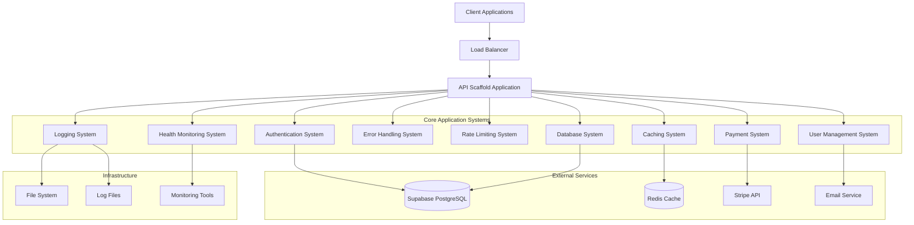
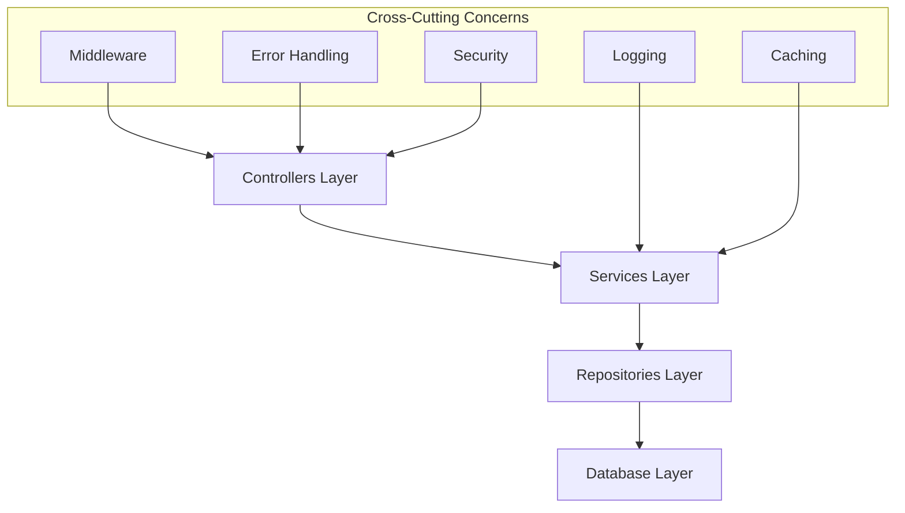
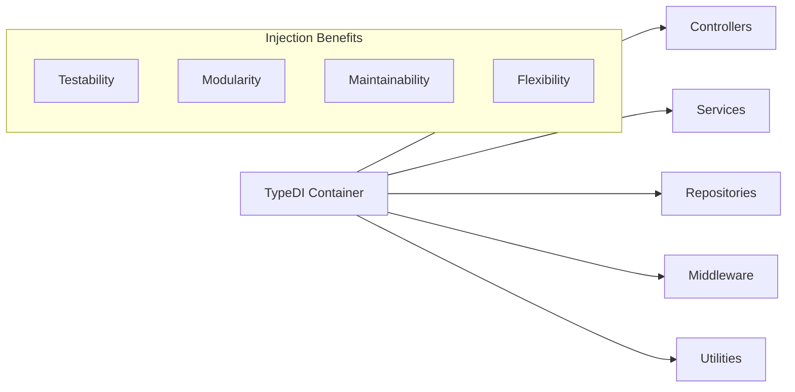
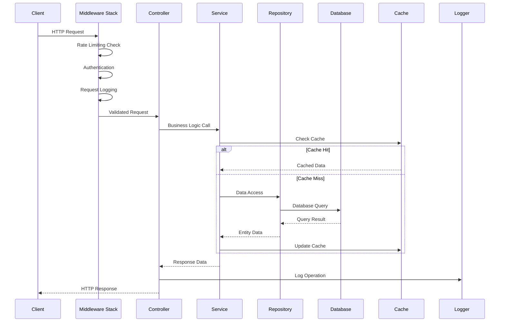
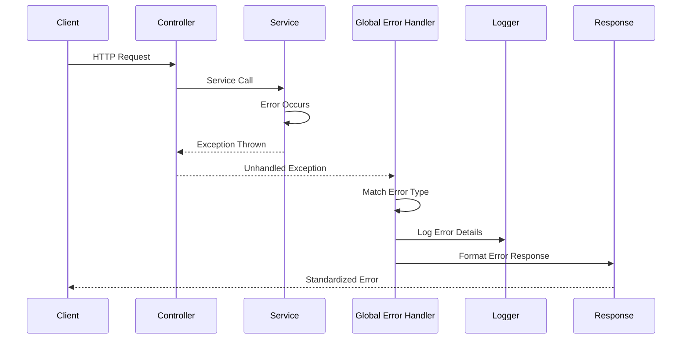
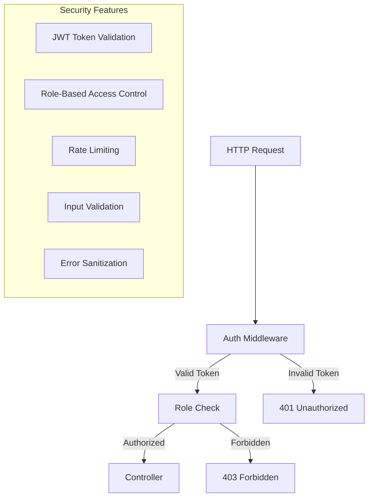
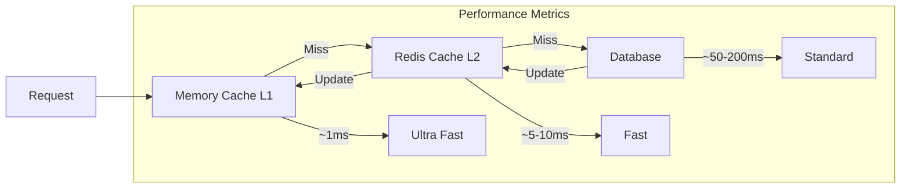
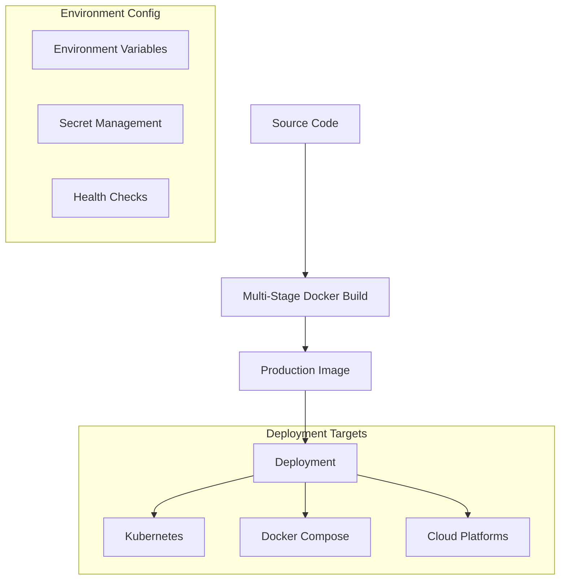
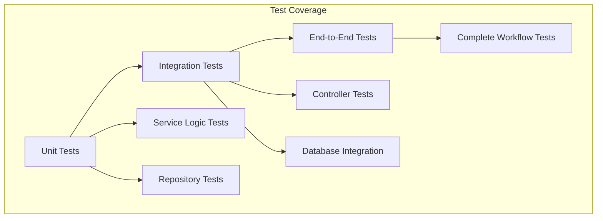

# API Scaffold - Architecture

## System Overview

The API Scaffold is a comprehensive, production-ready backend application built with TypeScript, Express, and a modern architectural approach. It implements clean architecture principles with clear separation of concerns across multiple specialized systems.

## High-Level System Architecture



## Technology Stack

### Core Dependencies

```bash
# Essential framework packages
npm install express routing-controllers typedi reflect-metadata

# DTO validation and transformation
npm install class-validator class-transformer

# Database and external services
npm install @supabase/supabase-js stripe better-sqlite3

# Caching and utilities
npm install ioredis keyv winston winston-daily-rotate-file

# Security and middleware
npm install helmet cors compression bcryptjs jsonwebtoken
```

### Development Dependencies

```bash
# TypeScript support
npm install -D typescript ts-node @types/express @types/node

# Testing framework
npm install -D jest supertest @types/jest

# Development tools
npm install -D nodemon eslint prettier husky lint-staged
```

## Architectural Patterns

### Clean Architecture Implementation



### Dependency Injection Architecture



## System Components

### 1. Authentication System

**Purpose**: Comprehensive user authentication and authorization with multi-provider support.

**Key Features**:

- JWT-based authentication with refresh tokens
- Multi-provider support (Supabase + SQLite fallback)
- Role-based access control (RBAC)
- Email verification and password reset flows
- Secure token management with automatic refresh

**Components**:

- AuthController: 11 authentication endpoints
- AuthService: Multi-provider authentication logic
- AuthMiddleware: JWT verification and user context
- Custom decorators: @Auth(), @RequireRole(), @Public()

### 2. User Management System

**Purpose**: Complete user lifecycle management with profile management and external service integration.

**Key Features**:

- User registration and profile management
- RBAC with hierarchical role system
- Stripe customer integration
- Email verification workflows
- Privacy-compliant user data handling

**Components**:

- UserController: CRUD operations with authorization
- UserService: Business logic for user operations
- UserRepository: Multi-provider data access
- User entities and DTOs with validation

### 3. Payment System (Stripe Integration)

**Purpose**: Comprehensive payment processing with subscription management and webhook handling.

**Key Features**:

- Payment intent creation and processing
- Subscription lifecycle management
- Webhook event processing with idempotency
- Customer management and payment methods
- Comprehensive error handling for payment flows

**Components**:

- Stripe services for payments, customers, subscriptions, webhooks
- Payment controllers and DTOs
- Webhook verification and processing
- Database integration for payment tracking

### 4. Database System

**Purpose**: Multi-provider database abstraction with unified interface and automatic fallback.

**Key Features**:

- Multi-provider support (Supabase PostgreSQL + SQLite)
- Repository pattern with adapter interfaces
- Automatic provider selection and fallback
- CRUD operations with pagination and filtering
- Transaction support and connection management

**Components**:

- BaseRepository: Abstract repository with common operations
- Database adapters: Supabase and SQLite implementations
- Entity definitions and type safety
- Migration and schema management

### 5. Caching System

**Purpose**: Multi-tier caching with automatic fallback and comprehensive cache operations.

**Key Features**:

- Dual-tier caching (Memory L1 + Redis L2)
- Automatic fallback to memory when Redis unavailable
- Advanced cache operations (counters, patterns, TTL)
- Cache decorators for method-level caching
- Health monitoring and graceful degradation

**Components**:

- CacheService: Unified caching interface
- Cache middleware for request-level caching
- Performance optimization with cache warming
- Invalidation strategies and TTL management

### 6. Logging System

**Purpose**: Structured logging with security-conscious sanitization and multi-transport support.

**Key Features**:

- Winston-based logging with multiple transports
- Daily log rotation with compression
- Structured JSON logging for production
- Domain-specific logging methods
- Security header sanitization

**Components**:

- LoggerService: Centralized logging interface
- Request logging middleware
- Specialized logging for auth, database, cache, Stripe events
- Log file management and rotation

### 7. Rate Limiting System

**Purpose**: API protection against abuse with configurable rate limits and graceful degradation.

**Key Features**:

- Sliding window rate limiting
- Cache-based storage with Redis persistence
- Per-endpoint rate limit configuration
- Authentication-specific rate limits
- Standard HTTP headers for client awareness

**Components**:

- RateLimitMiddleware: Core rate limiting logic
- Rate limit decorators for endpoint protection
- Cache integration for distributed rate limiting
- Graceful degradation when cache unavailable

### 8. Error Handling System

**Purpose**: Centralized error management with type-safe exceptions and standardized responses.

**Key Features**:

- Hierarchical exception system with domain-specific errors
- Global error handler with registry pattern
- Standardized error response format
- Security-conscious error sanitization
- Integration with logging for debugging

**Components**:

- Exception hierarchy: HTTP, Auth, Database, Stripe exceptions
- GlobalErrorHandler with extensible registry
- Error response formatting and security filtering
- Validation error transformation

### 9. Health Monitoring System

**Purpose**: Comprehensive application health checks and system observability.

**Key Features**:

- Multi-tier health checks (app, database, cache, external services)
- Kubernetes-compatible health endpoints
- System metrics collection and reporting
- Performance monitoring and alerting
- Circuit breaker patterns for external services

**Components**:

- HealthController: Health check endpoints
- HealthService: System health aggregation
- Individual health checkers for each system
- Metrics collection and monitoring integration

## Data Flow Architecture

### Request Processing Flow



### Error Handling Flow



## Directory Structure

### Complete Directory Layout

```
api-scaffold/
├── src/                           # Source code
│   ├── controllers/               # HTTP route controllers
│   │   ├── auth.controller.ts     # Authentication endpoints
│   │   ├── user.controller.ts     # User CRUD operations
│   │   ├── health.controller.ts   # Health check endpoints
│   │   ├── stripe-customer.controller.ts
│   │   ├── stripe-payment.controller.ts
│   │   ├── stripe-subscription.controller.ts
│   │   ├── stripe-webhook.controller.ts
│   │   └── test-auth.controller.ts
│   ├── services/                  # Business logic layer
│   │   ├── auth.service.ts        # Authentication logic
│   │   ├── user.service.ts        # User business logic
│   │   ├── cache.service.ts       # Caching service
│   │   ├── logger.service.ts      # Logging service
│   │   ├── health.service.ts      # Health monitoring
│   │   ├── stripe-customer.service.ts
│   │   ├── stripe-payment.service.ts
│   │   ├── stripe-subscription.service.ts
│   │   └── stripe-webhook.service.ts
│   ├── repositories/              # Data access layer
│   │   ├── base.repository.ts     # Abstract base repository
│   │   ├── user.repository.ts     # User data operations
│   │   ├── subscription.repository.ts
│   │   ├── sqlite-base.repository.ts
│   │   ├── sqlite-user.repository.ts
│   │   └── adapters/              # Database adapters
│   │       ├── supabase.adapter.ts
│   │       └── sqlite.adapter.ts
│   ├── models/                    # Type definitions & DTOs
│   │   ├── entities/              # Database entities
│   │   │   ├── base.entity.ts     # Base entity interface
│   │   │   └── user.entity.ts     # User entity
│   │   ├── dtos/                  # Data transfer objects
│   │   │   ├── auth/              # Auth DTOs
│   │   │   │   ├── login.dto.ts
│   │   │   │   ├── register.dto.ts
│   │   │   │   └── refresh-token.dto.ts
│   │   │   ├── user/              # User DTOs
│   │   │   │   ├── create-user.dto.ts
│   │   │   │   ├── update-user.dto.ts
│   │   │   │   └── user-response.dto.ts
│   │   │   └── stripe/            # Stripe DTOs
│   │   ├── enums/                 # Application enums
│   │   │   ├── user-roles.enum.ts
│   │   │   └── user-status.enum.ts
│   │   └── interfaces/            # TypeScript interfaces
│   │       ├── auth.interface.ts
│   │       ├── user.interface.ts
│   │       └── database.interface.ts
│   ├── middlewares/               # Custom middleware
│   │   ├── auth.middleware.ts     # Authentication middleware
│   │   ├── error.middleware.ts    # Global error handler
│   │   ├── rbac.middleware.ts     # Role-based access control
│   │   ├── rate-limit.middleware.ts # Rate limiting
│   │   └── request-logger.middleware.ts # Request logging
│   ├── decorators/                # Custom decorators
│   │   ├── auth.decorator.ts      # Authentication decorators
│   │   ├── cache.decorator.ts     # Caching decorators
│   │   └── rate-limit.decorator.ts # Rate limiting decorators
│   ├── config/                    # Configuration files
│   │   ├── env.ts                 # Environment configuration
│   │   ├── supabase.ts            # Supabase client config
│   │   ├── sqlite.ts              # SQLite configuration
│   │   └── database-providers.ts  # Database provider config
│   ├── utils/                     # Utility functions
│   │   ├── error.utils.ts         # Error handling utilities
│   │   ├── response.utils.ts      # Response formatting
│   │   ├── case-conversion.utils.ts # Case conversion
│   │   └── crypto.utils.ts        # Cryptographic utilities
│   ├── exceptions/                # Custom exceptions
│   │   ├── http-exceptions.ts     # HTTP exception hierarchy
│   │   ├── auth.exception.ts      # Auth-specific exceptions
│   │   ├── database.exception.ts  # Database exceptions
│   │   └── stripe.exception.ts    # Stripe exceptions
│   ├── types/                     # Global type definitions
│   │   ├── database.types.ts      # Database type definitions
│   │   ├── stripe.types.ts        # Stripe type definitions
│   │   └── http-status.ts         # HTTP status codes
│   └── app.ts                     # Application entry point
├── tests/                         # Test files
│   ├── factories/                 # Test data factories
│   │   ├── auth.factory.ts
│   │   ├── user.factory.ts
│   │   └── database.factory.ts
│   ├── utils/                     # Test utilities
│   │   ├── setup.helpers.ts
│   │   └── assertion.helpers.ts
│   └── __tests__/                 # Test suites
├── docs/                          # Documentation
│   ├── systems/                   # System documentation
│   │   ├── authentication-system.md
│   │   ├── user-management-system.md
│   │   ├── payment-system.md
│   │   ├── database-system.md
│   │   ├── caching-system.md
│   │   ├── logging-system.md
│   │   ├── rate-limiting-system.md
│   │   ├── error-handling-system.md
│   │   └── health-monitoring-system.md
│   └── architecture.md            # This file
├── data/                          # SQLite database files
├── logs/                          # Application logs
├── http-client/                   # HTTP test files
├── .env.example                   # Environment template
├── tsconfig.json                  # TypeScript configuration
├── package.json                   # Dependencies and scripts
├── yarn.lock                      # Dependency lock file
└── README.md                      # Project documentation
```

## Security Architecture

### Authentication & Authorization



### Data Protection

- **Input Sanitization**: All inputs validated with class-validator
- **SQL Injection Prevention**: Parameterized queries and ORM protection
- **XSS Protection**: Output encoding and CSP headers
- **Rate Limiting**: Configurable rate limits per endpoint
- **Error Sanitization**: No sensitive data exposed in error messages
- **Header Sanitization**: Sensitive headers redacted from logs

## Performance Architecture

### Caching Strategy



### Database Optimization

- **Connection Pooling**: Efficient database connections
- **Query Optimization**: Indexed queries and efficient patterns
- **Repository Pattern**: Consistent data access with caching
- **Multi-Provider Support**: Automatic fallback mechanisms

## Deployment Architecture

### Container Strategy



### Scaling Considerations

- **Horizontal Scaling**: Stateless application design
- **Load Balancing**: Multiple instance support
- **Database Scaling**: Connection pooling and read replicas
- **Cache Distribution**: Redis clustering for high availability

## Monitoring & Observability

### Health Monitoring

```mermaid
graph TD
    HealthController[Health Controller]

    HealthController --> AppHealth[Application Health]
    HealthController --> DatabaseHealth[Database Health]
    HealthController --> CacheHealth[Cache Health]
    HealthController --> ExternalHealth[External Services Health]

    subgraph "Health Endpoints"
        AppHealth --> LivenessProbe[/health/live]
        DatabaseHealth --> ReadinessProbe[/health/ready]
        CacheHealth --> DetailedHealth[/health/detailed]
    end

    subgraph "Monitoring Integration"
        LivenessProbe --> Kubernetes[Kubernetes Probes]
        ReadinessProbe --> LoadBalancer[Load Balancer Health]
        DetailedHealth --> MonitoringSystem[Monitoring Dashboard]
    end
```

### Logging Strategy

- **Structured Logging**: JSON format with consistent fields
- **Log Levels**: Appropriate levels for different environments
- **Log Rotation**: Daily rotation with compression and retention
- **Security Logging**: Sanitized logs without sensitive data
- **Performance Logging**: Request timing and operation metrics

## Testing Strategy

### Testing Pyramid



### Test Architecture

- **Unit Tests**: Service and repository layer testing with mocks
- **Integration Tests**: Controller and database integration testing
- **E2E Tests**: Complete workflow testing with real dependencies
- **Test Utilities**: Factories, helpers, and assertion utilities
- **Coverage**: Comprehensive test coverage with quality metrics

## Configuration Management

### Environment-Based Configuration

```typescript
export const config = {
  server: {
    port: parseInt(process.env.PORT || "3000"),
    environment: process.env.NODE_ENV || "development",
  },
  database: {
    provider: process.env.DATABASE_PROVIDER || "supabase",
    supabase: {
      url: process.env.SUPABASE_URL,
      anonKey: process.env.SUPABASE_ANON_KEY,
    },
    sqlite: {
      path: process.env.SQLITE_PATH || "./data/database.sqlite",
    },
  },
  cache: {
    provider: process.env.CACHE_PROVIDER || "redis",
    redis: {
      url: process.env.REDIS_URL || "redis://localhost:6379",
    },
  },
  stripe: {
    secretKey: process.env.STRIPE_SECRET_KEY,
    webhookSecret: process.env.STRIPE_WEBHOOK_SECRET,
  },
  auth: {
    jwtSecret: process.env.JWT_SECRET,
    jwtExpiresIn: process.env.JWT_EXPIRES_IN || "15m",
    refreshTokenExpiresIn: process.env.REFRESH_TOKEN_EXPIRES_IN || "7d",
  },
  logging: {
    level: process.env.LOG_LEVEL || "info",
    enableFile: process.env.ENABLE_FILE_LOGS === "true",
    enableConsole: process.env.ENABLE_CONSOLE_LOGS !== "false",
  },
};
```

## Development Guidelines

### Adding New Features

1. **Define Models**: Create entities, DTOs, and interfaces
2. **Implement Repository**: Add data access layer with multi-provider support
3. **Build Service**: Implement business logic with error handling
4. **Create Controller**: Add HTTP endpoints with validation
5. **Add Tests**: Unit, integration, and E2E test coverage
6. **Update Documentation**: System documentation and API docs

### Code Quality Standards

- **TypeScript**: Strict type checking and modern ES features
- **ESLint**: Code quality and consistency enforcement
- **Prettier**: Automated code formatting
- **Husky**: Pre-commit hooks for quality gates
- **Jest**: Comprehensive testing framework

## Extension Points

### Custom Middleware

- **Authentication Providers**: Additional auth methods
- **Logging Enhancements**: Custom log formats and transports
- **Performance Monitoring**: APM integration
- **Custom Validators**: Domain-specific validation rules

### Service Integration

- **External APIs**: Additional third-party service integrations
- **Message Queues**: Async processing capabilities
- **File Storage**: Document and media handling
- **Notification Services**: Email, SMS, push notifications

## Best Practices

### Development

1. **Follow Clean Architecture**: Maintain clear separation of concerns
2. **Use Dependency Injection**: Facilitate testing and modularity
3. **Implement Proper Error Handling**: Comprehensive error management
4. **Write Tests**: Maintain high test coverage
5. **Document Systems**: Keep documentation updated

### Production

1. **Monitor Health**: Implement comprehensive health checks
2. **Log Appropriately**: Use structured logging with proper levels
3. **Cache Effectively**: Implement multi-tier caching strategies
4. **Handle Errors Gracefully**: Provide meaningful error responses
5. **Scale Horizontally**: Design for distributed deployment

## Related Documentation

- [Authentication System](./systems/authentication-system.md)
- [User Management System](./systems/user-management-system.md)
- [Payment System](./systems/payment-system.md)
- [Database System](./systems/database-system.md)
- [Caching System](./systems/caching-system.md)
- [Logging System](./systems/logging-system.md)
- [Rate Limiting System](./systems/rate-limiting-system.md)
- [Error Handling System](./systems/error-handling-system.md)
- [Health Monitoring System](./systems/health-monitoring-system.md)
