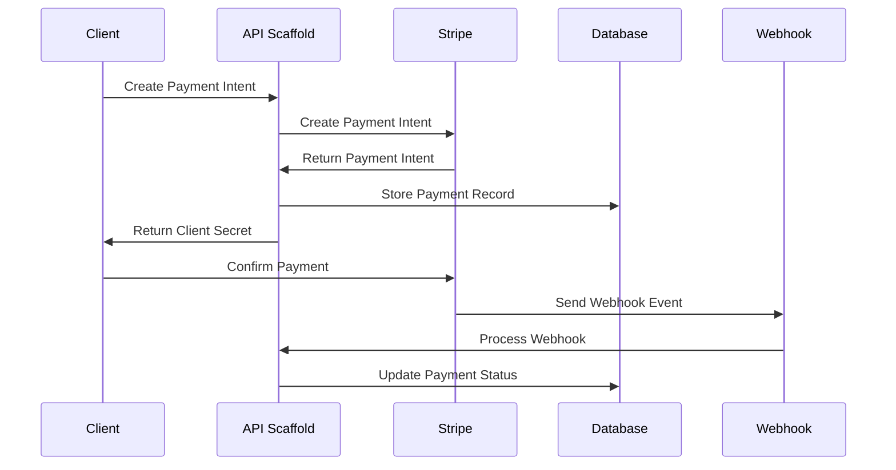
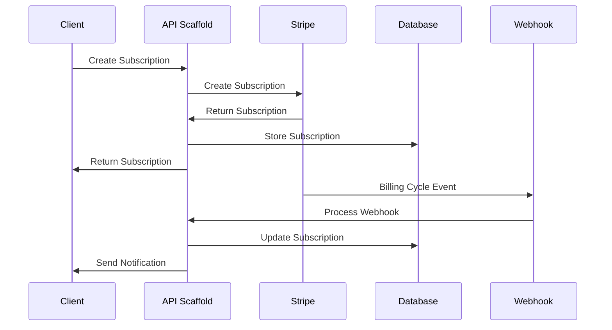

# Stripe Integration Guide

## Overview

This guide explains how Stripe payment processing is integrated into the API scaffold, covering the complete payment infrastructure including customers, payments, subscriptions, and webhooks.

## Architecture Overview

```
┌─────────────────────┐    ┌─────────────────────┐    ┌─────────────────────┐
│   Client/Frontend   │    │   API Scaffold      │    │      Stripe         │
│                     │    │                     │    │                     │
│  ┌───────────────┐  │    │  ┌───────────────┐  │    │  ┌───────────────┐  │
│  │ Payment Forms │  │◄──►│  │ Controllers   │  │◄──►│  │ Payment API   │  │
│  └───────────────┘  │    │  └───────────────┘  │    │  └───────────────┘  │
│                     │    │         │           │    │                     │
│  ┌───────────────┐  │    │  ┌───────────────┐  │    │  ┌───────────────┐  │
│  │ Customer UI   │  │◄──►│  │ Services      │  │◄──►│  │ Customer API  │  │
│  └───────────────┘  │    │  └───────────────┘  │    │  └───────────────┘  │
│                     │    │         │           │    │                     │
│                     │    │  ┌───────────────┐  │    │  ┌───────────────┐  │
│                     │    │  │ Database      │  │    │  │ Webhooks      │  │
│                     │    │  └───────────────┘  │◄───│  └───────────────┘  │
└─────────────────────┘    └─────────────────────┘    └─────────────────────┘
```

## Core Components

### 1. Stripe Service Layer

- **StripeService**: Base Stripe client configuration
- **StripeCustomerService**: Customer management operations
- **StripePaymentService**: Payment processing operations
- **StripeSubscriptionService**: Subscription lifecycle management
- **StripeWebhookService**: Webhook event processing

### 2. Controller Layer

- **StripePaymentController**: Payment API endpoints
- **StripeCustomerController**: Customer management endpoints
- **StripeSubscriptionController**: Subscription management endpoints
- **StripeProductController**: Product and pricing endpoints
- **WebhookController**: Webhook processing endpoints

### 3. Database Integration

- **Payment Entity**: Local payment tracking
- **Subscription Entity**: Subscription state management
- **Webhook Events**: Event processing tracking
- **User Extension**: Stripe customer ID relationship

## Payment Flow

### 1. Customer Registration

```typescript
// User registers → Stripe customer created
User Registration → CreateCustomer → Store Customer ID → Link to User
```

### 2. Payment Processing

```typescript
// Payment intent creation and processing
CreatePaymentIntent → ConfirmPayment → ProcessWebhook → UpdateDatabase
```

### 3. Subscription Management

```typescript
// Subscription lifecycle
CreateSubscription → ProcessBilling → HandleUpdates → ProcessCancellation
```

## Key Features

### Payment Processing

- **Payment Intents**: Secure payment processing with 3D Secure support
- **Multiple Payment Methods**: Cards, bank transfers, digital wallets
- **Automatic Capture**: Configurable payment capture behavior
- **Refunds**: Full and partial refund processing
- **Currency Support**: Multi-currency payment processing

### Customer Management

- **Customer Sync**: Automatic synchronization with user data
- **Payment Methods**: Attach/detach payment methods
- **Customer Portal**: Integration ready for customer self-service
- **Metadata**: Custom data storage for business logic

### Subscription Management

- **Billing Cycles**: Monthly, yearly, custom intervals
- **Plan Changes**: Upgrade/downgrade with proration
- **Trial Periods**: Configurable trial periods
- **Pause/Resume**: Subscription pause and resume functionality
- **Usage Billing**: Support for usage-based billing

### Webhook Processing

- **Event Handling**: Automatic processing of Stripe events
- **Signature Verification**: Secure webhook validation
- **Idempotency**: Duplicate event prevention
- **Retry Logic**: Failed webhook retry mechanism

## Data Flow

### Payment Creation Flow



### Subscription Flow



## Security Model

### Authentication

- **JWT Tokens**: Secure API access
- **User Ownership**: Payment/subscription ownership validation
- **Role-Based Access**: Admin functions for product management

### Data Protection

- **Webhook Signatures**: Cryptographic verification
- **HTTPS Only**: Encrypted communication
- **PCI Compliance**: Secure payment data handling
- **Rate Limiting**: API abuse prevention

### Error Handling

- **Sanitized Errors**: No sensitive data exposure
- **Audit Logging**: Comprehensive operation tracking
- **Fallback Mechanisms**: Graceful degradation

## Configuration

### Environment Variables

```env
# Stripe Configuration
STRIPE_PUBLISHABLE_KEY=pk_test_...
STRIPE_SECRET_KEY=sk_test_...
STRIPE_WEBHOOK_SECRET=whsec_...
STRIPE_API_VERSION=2023-10-16

# Payment Configuration
DEFAULT_CURRENCY=usd
MAX_PAYMENT_AMOUNT=100000
MIN_PAYMENT_AMOUNT=50
AUTO_CAPTURE_PAYMENTS=true

# Subscription Configuration
DEFAULT_TRIAL_DAYS=14
ALLOW_MULTIPLE_SUBSCRIPTIONS=false
PRORATION_BEHAVIOR=create_prorations
```

### Database Configuration

```typescript
// User table extension
ALTER TABLE users ADD COLUMN stripe_customer_id VARCHAR(255) UNIQUE;

// Payment tracking
CREATE TABLE payments (
  id UUID PRIMARY KEY,
  stripe_payment_intent_id VARCHAR(255) UNIQUE,
  user_id UUID REFERENCES users(id),
  amount DECIMAL(10,2),
  currency VARCHAR(3),
  status VARCHAR(50),
  created_at TIMESTAMP DEFAULT CURRENT_TIMESTAMP
);

// Subscription tracking
CREATE TABLE subscriptions (
  id UUID PRIMARY KEY,
  stripe_subscription_id VARCHAR(255) UNIQUE,
  user_id UUID REFERENCES users(id),
  status VARCHAR(50),
  current_period_start TIMESTAMP,
  current_period_end TIMESTAMP,
  created_at TIMESTAMP DEFAULT CURRENT_TIMESTAMP
);
```

## API Endpoints

### Payment Endpoints

```http
POST /api/payments/payment-intent        # Create payment intent
POST /api/payments/payment-intent/:id/confirm  # Confirm payment
POST /api/payments/payment-intent/:id/capture  # Capture payment
POST /api/payments/payment-intent/:id/refund   # Refund payment
GET  /api/payments/payment-intent/:id           # Get payment details
GET  /api/payments/history                      # Payment history
```

### Customer Endpoints

```http
POST /api/customers                      # Create customer
GET  /api/customers/:id                  # Get customer
PUT  /api/customers/:id                  # Update customer
DELETE /api/customers/:id                # Delete customer
GET  /api/customers/:id/payment-methods  # Get payment methods
POST /api/customers/:id/payment-methods  # Attach payment method
```

### Subscription Endpoints

```http
POST /api/subscriptions                  # Create subscription
GET  /api/subscriptions                  # List subscriptions
PUT  /api/subscriptions/:id              # Update subscription
DELETE /api/subscriptions/:id            # Cancel subscription
POST /api/subscriptions/:id/pause        # Pause subscription
POST /api/subscriptions/:id/resume       # Resume subscription
GET  /api/subscriptions/:id/upcoming-invoice  # Preview billing
```

### Webhook Endpoints

```http
POST /api/webhooks/stripe                # Process Stripe webhooks
```

## Error Handling

### Payment Errors

```typescript
// Card declined
{
  "success": false,
  "error": {
    "code": "CARD_DECLINED",
    "message": "Your card was declined.",
    "type": "card_error"
  }
}

// Insufficient funds
{
  "success": false,
  "error": {
    "code": "INSUFFICIENT_FUNDS",
    "message": "Your card has insufficient funds.",
    "type": "card_error"
  }
}
```

### Subscription Errors

```typescript
// Invalid plan
{
  "success": false,
  "error": {
    "code": "INVALID_PLAN",
    "message": "The selected plan is not available.",
    "type": "validation_error"
  }
}
```

## Monitoring and Logging

### Payment Metrics

- Payment success/failure rates
- Average payment amounts
- Payment method distribution
- Geographic payment distribution

### Subscription Metrics

- Monthly Recurring Revenue (MRR)
- Churn rate
- Subscription lifecycle metrics
- Trial conversion rates

### Webhook Monitoring

- Webhook processing success rates
- Event processing latency
- Failed webhook retry rates
- Webhook signature verification failures

## Best Practices

### Development

1. **Use Test Mode**: Always use Stripe test keys during development
2. **Webhook Testing**: Use Stripe CLI for local webhook testing
3. **Error Simulation**: Test various error scenarios
4. **Idempotency**: Implement idempotency keys for critical operations

### Production

1. **Monitor Webhooks**: Set up webhook monitoring and alerting
2. **Backup Webhooks**: Implement backup webhook processing
3. **Rate Limiting**: Protect against API abuse
4. **Audit Logging**: Maintain comprehensive audit trails

### Security

1. **Validate Webhooks**: Always verify webhook signatures
2. **Sanitize Errors**: Never expose sensitive data in error messages
3. **Access Control**: Implement proper authentication and authorization
4. **Data Encryption**: Encrypt sensitive data at rest

## Troubleshooting

### Common Issues

1. **Webhook Failures**: Check signature verification and endpoint accessibility
2. **Payment Failures**: Verify payment method and customer data
3. **Subscription Issues**: Check billing cycle and payment method status
4. **Database Sync**: Ensure webhook processing updates local records

### Debug Steps

1. **Check Logs**: Review application and Stripe dashboard logs
2. **Test Webhooks**: Use Stripe CLI to replay events
3. **Validate Configuration**: Verify environment variables and secrets
4. **Monitor Metrics**: Use monitoring dashboards to identify issues

## Related Documentation

- [Stripe API Reference](./stripe-api-reference.md)
- [Stripe Webhook Guide](./stripe-webhook-guide.md)
- [Stripe Configuration Guide](./stripe-configuration-guide.md)
- [Stripe Testing Guide](./stripe-testing-guide.md)
- [Database Guide](./database-guide.md)
- [Architecture Overview](./architecture.md)
