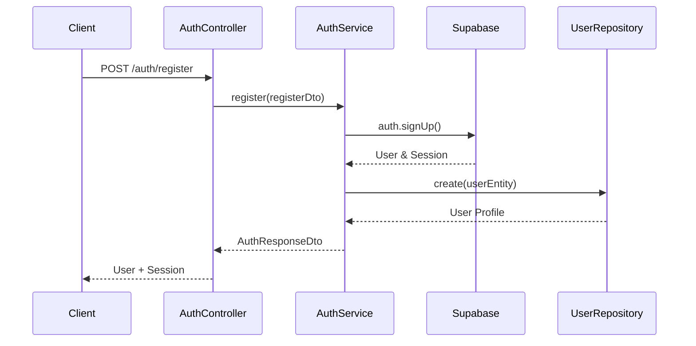
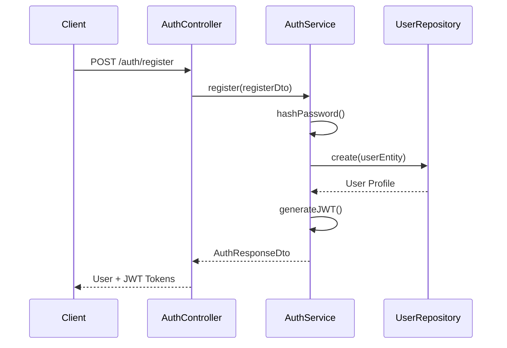
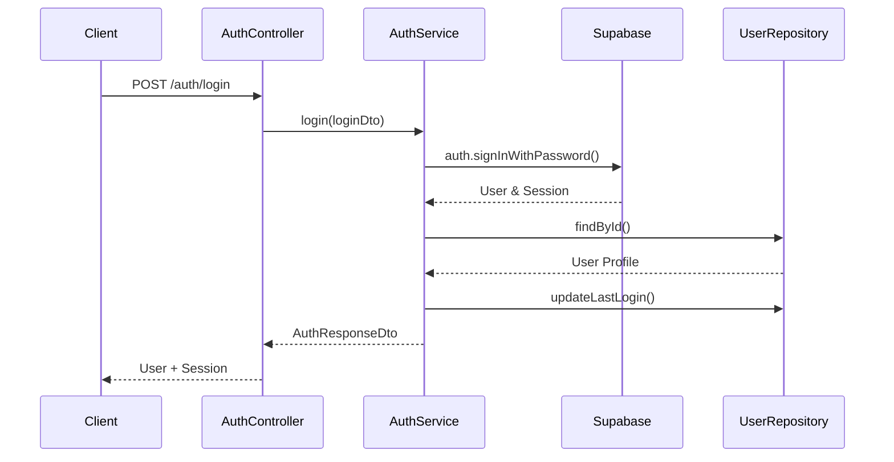
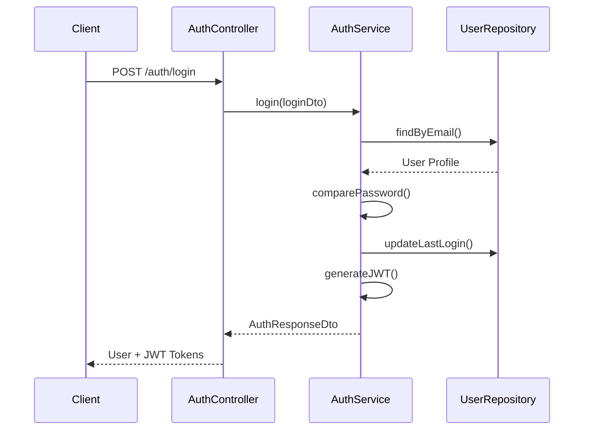

# Authentication System

## Overview

The authentication system provides a comprehensive multi-provider authentication solution supporting both Supabase and SQLite backends. It implements JWT-based authentication with role-based access control (RBAC) and includes features like registration, login, password management, email verification, and token refresh.

## System Architecture

### Core Components

```
┌─────────────────┐    ┌─────────────────┐    ┌─────────────────┐
│   Controllers   │    │   Middlewares   │    │    Services     │
│                 │    │                 │    │                 │
│ AuthController  │───▶│ AuthMiddleware  │───▶│  AuthService    │
│                 │    │ RbacMiddleware  │    │                 │
└─────────────────┘    └─────────────────┘    └─────────────────┘
         │                       │                       │
         │                       │                       │
         ▼                       ▼                       ▼
┌─────────────────┐    ┌─────────────────┐    ┌─────────────────┐
│   Decorators    │    │      DTOs       │    │   Repositories  │
│                 │    │                 │    │                 │
│ @Authenticated  │    │ RegisterDto     │    │ UserRepository  │
│ @RequireRole    │    │ LoginDto        │    │                 │
│ @OptionalAuth   │    │ ...             │    │                 │
└─────────────────┘    └─────────────────┘    └─────────────────┘
```

## Authentication Flow

### Registration Flow

#### Supabase Provider



#### SQLite Provider



### Login Flow

#### Supabase Provider



#### SQLite Provider



## API Endpoints

### Authentication Routes (`/auth`)

| Method | Endpoint               | Description               | Rate Limited | Auth Required |
| ------ | ---------------------- | ------------------------- | ------------ | ------------- |
| POST   | `/register`            | User registration         | ✓            | ✗             |
| POST   | `/login`               | User login                | ✓            | ✗             |
| POST   | `/logout`              | User logout               | ✗            | ✓             |
| POST   | `/refresh`             | Refresh access token      | ✓            | ✗             |
| POST   | `/forgot-password`     | Request password reset    | ✓            | ✗             |
| POST   | `/change-password`     | Change password           | ✗            | ✓             |
| POST   | `/verify-email`        | Verify email address      | ✓            | ✗             |
| POST   | `/resend-verification` | Resend verification email | ✓            | ✗             |
| GET    | `/me`                  | Get current user          | ✗            | ✓             |
| POST   | `/verify-token`        | Verify JWT token          | ✗            | ✗             |
| GET    | `/health`              | Health check              | ✗            | ✗             |

### Request/Response Examples

#### Registration

```typescript
// Request
POST /auth/register
{
  "email": "user@example.com",
  "firstName": "John",
  "lastName": "Doe",
  "password": "SecurePass123!",
  "confirmPassword": "SecurePass123!"
}

// Response
{
  "user": {
    "id": "uuid",
    "email": "user@example.com",
    "firstName": "John",
    "lastName": "Doe",
    "role": "User",
    "status": "Active",
    "emailVerified": false
  },
  "session": {
    "access_token": "jwt_token",
    "refresh_token": "refresh_token",
    "token_type": "bearer",
    "expires_in": 86400
  }
}
```

#### Login

```typescript
// Request
POST /auth/login
{
  "email": "user@example.com",
  "password": "SecurePass123!"
}

// Response (same as registration)
```

## Data Transfer Objects (DTOs)

### Authentication DTOs

Located in `src/models/dtos/auth/`:

#### RegisterDto

```typescript
export class RegisterDto {
  @IsEmail()
  email!: string;

  @IsString()
  @MinLength(2)
  @MaxLength(50)
  firstName!: string;

  @IsString()
  @MinLength(2)
  @MaxLength(50)
  lastName!: string;

  @IsString()
  @MinLength(8)
  @Matches(/^(?=.*[a-z])(?=.*[A-Z])(?=.*\d)(?=.*[@$!%*?&])/)
  password!: string;

  @IsString()
  confirmPassword!: string;
}
```

#### LoginDto

```typescript
export class LoginDto {
  @IsEmail()
  email!: string;

  @IsString()
  password!: string;
}
```

#### Other DTOs

- `ChangePasswordDto` - For password changes
- `RefreshTokenDto` - For token refresh
- `ForgotPasswordDto` - For password reset requests
- `VerifyEmailDto` - For email verification
- `ResendVerificationDto` - For resending verification emails
- `AuthResponseDto` - Standard authentication response

## User Entity & Roles

### User Entity (`src/models/entities/user.entity.ts`)

```typescript
export interface IUserEntity extends IBaseEntity {
  id: string;
  email: string;
  firstName: string;
  lastName: string;
  passwordHash: string;
  role: UserRole;
  status: UserStatus;
  emailVerified: boolean;
  phone?: string;
  avatarUrl?: string;
  lastLogin?: string;
  stripeCustomerId?: string;

  // Computed properties
  get fullName(): string;
  isActive(): boolean;
  isAdmin(): boolean;
  isModerator(): boolean;
  hasRole(role: UserRole): boolean;
  hasAnyRole(...roles: UserRole[]): boolean;
}
```

### User Roles (`src/models/enums/user-roles.enum.ts`)

```typescript
export enum UserRole {
  Admin = "Admin",
  User = "User",
  Moderator = "Moderator",
}
```

### User Status (`src/models/enums/user-status.enum.ts`)

```typescript
export enum UserStatus {
  Active = "Active",
  Inactive = "Inactive",
  Suspended = "Suspended",
  PendingVerification = "PendingVerification",
}
```

## Middleware System

### Authentication Middleware (`src/middlewares/auth.middleware.ts`)

Validates JWT tokens and populates `request.user` with authenticated user data.

**Key Features:**

- Bearer token extraction and validation
- Supabase token verification
- User profile loading from database
- Request object augmentation

### RBAC Middleware (`src/middlewares/rbac.middleware.ts`)

Enforces role-based access control.

**Key Features:**

- Role validation against required roles
- Admin bypass (admin can access everything)
- Factory function for creating role-specific middleware

```typescript
// Usage
export function createRoleMiddleware(...roles: UserRole[]): RbacMiddleware {
  return new RbacMiddleware(roles);
}
```

## Decorators

### Authentication Decorators (`src/decorators/auth.decorator.ts`)

#### @Authenticated()

Requires valid JWT token for endpoint access.

```typescript
@Get("/profile")
@Authenticated()
async getProfile(@Req() req: Request): Promise<UserResponseDto> {
  return await this.userService.getProfile(req.user.id);
}
```

#### @RequireRole(...roles)

Requires specific roles for endpoint access.

```typescript
@Get("/admin/users")
@RequireRole(UserRole.Admin)
async getAllUsers(): Promise<UserResponseDto[]> {
  return await this.userService.getAllUsers();
}
```

#### @OptionalAuth()

Optional authentication - doesn't throw if no token provided.

```typescript
@Get("/public-content")
@OptionalAuth()
async getContent(@Req() req: Request): Promise<ContentDto[]> {
  // req.user will be populated if valid token provided
  return await this.contentService.getContent(req.user?.id);
}
```

#### @CurrentUser()

Parameter decorator to inject authenticated user.

```typescript
@Get("/my-data")
@Authenticated()
async getMyData(@CurrentUser() user: IAuthenticatedUser): Promise<UserDataDto> {
  return await this.userService.getUserData(user.id);
}
```

## Authentication Utilities (`src/utils/auth.utils.ts`)

### Token Extraction

```typescript
// Extract Bearer token (returns null if not found)
export function extractBearerToken(request: {
  headers?: { authorization?: string };
}): string | null;

// Extract Bearer token (throws if not found)
export function extractBearerTokenOrThrow(request: {
  headers?: { authorization?: string };
}): string;
```

## Configuration

### Environment Variables (via `src/config/env.ts`)

```typescript
// Authentication configuration
auth: {
  jwtSecret: string;
  bcryptRounds: string;
}

// Database provider selection
database: {
  provider: "supabase" | "sqlite";
}
```

### Rate Limiting

Authentication endpoints are protected with rate limiting:

```typescript
const authRateLimits = {
  register: { windowMs: 15 * 60 * 1000, max: 5 }, // 5 attempts per 15 minutes
  login: { windowMs: 15 * 60 * 1000, max: 10 }, // 10 attempts per 15 minutes
  refresh: { windowMs: 15 * 60 * 1000, max: 20 }, // 20 attempts per 15 minutes
  forgotPassword: { windowMs: 60 * 60 * 1000, max: 3 }, // 3 attempts per hour
  emailVerification: { windowMs: 60 * 60 * 1000, max: 5 }, // 5 attempts per hour
  resendVerification: { windowMs: 60 * 60 * 1000, max: 3 }, // 3 attempts per hour
};
```

## Multi-Provider Support

### Supabase Provider

- **Features**: Built-in email verification, password reset, OAuth providers
- **Token Management**: Supabase handles token generation and validation
- **Password Security**: Supabase manages password hashing and security
- **User Management**: Integrated with Supabase Auth users

### SQLite Provider

- **Features**: Local authentication with bcrypt password hashing
- **Token Management**: Custom JWT generation with configurable expiration
- **Password Security**: bcrypt with configurable salt rounds
- **User Management**: Local user storage with manual email verification

## Security Features

### Password Security

- **Minimum Requirements**: 8 characters with uppercase, lowercase, number, and special character
- **Hashing**: bcrypt with configurable salt rounds (default: 10)
- **Validation**: Server-side validation with class-validator decorators

### Token Security

- **JWT Secret**: Configurable secret key for token signing
- **Token Expiration**: Access tokens (24h), Refresh tokens (7d)
- **Bearer Token**: Standard Authorization header format

### Account Security

- **Account Status**: Active, Inactive, Suspended, PendingVerification
- **Email Verification**: Support for email verification workflow
- **Rate Limiting**: Protection against brute force attacks
- **Role-Based Access**: Granular permission control

## Error Handling

### Custom Exceptions (`src/exceptions/auth.exception.ts`)

```typescript
export class AuthException extends Error
export class InvalidCredentialsException extends AuthException
export class UserNotFoundException extends AuthException
export class AccountSuspendedException extends AuthException
export class PasswordResetException extends AuthException
```

### HTTP Status Codes

| Scenario                 | Status Code | Exception                   |
| ------------------------ | ----------- | --------------------------- |
| Invalid credentials      | 401         | InvalidCredentialsException |
| Missing token            | 401         | UnauthorizedException       |
| Insufficient permissions | 403         | ForbiddenException          |
| Email already exists     | 409         | AuthException               |
| Account suspended        | 403         | AccountSuspendedException   |
| User not found           | 404         | UserNotFoundException       |

## Testing

### Test Coverage

- Unit tests for AuthService (`src/services/__tests__/auth.service.test.ts`)
- Integration tests for AuthController (`src/controllers/__tests__/auth.controller.test.ts`)
- Middleware tests (`src/middlewares/__tests__/auth.middleware.integration.test.ts`)
- RBAC tests (`src/middlewares/__tests__/rbac.middleware.test.ts`)

### Test Factories

- User factory (`tests/factories/auth.factory.ts`)
- Request mocking utilities (`tests/utils/`)

## Integration Points

### User Management

- Integrates with UserService for profile management
- Supports Stripe customer ID association
- Tracks last login timestamps

### Caching

- Potential for token caching (not currently implemented)
- User profile caching through UserRepository

### Monitoring

- Request logging through LoggerService
- Error tracking for authentication failures
- Performance monitoring for token validation

## Future Enhancements

### Planned Features

- OAuth provider integration (Google, GitHub, etc.)
- Multi-factor authentication (MFA)
- Session management and concurrent login limits
- Password history and complexity policies
- Account lockout after failed attempts

### Security Improvements

- Token blacklisting for logout
- Refresh token rotation
- Suspicious activity detection
- Geographic login restrictions

## Usage Examples

### Basic Authentication Setup

```typescript
// Register a new user
const registerResponse = await fetch("/auth/register", {
  method: "POST",
  headers: { "Content-Type": "application/json" },
  body: JSON.stringify({
    email: "user@example.com",
    firstName: "John",
    lastName: "Doe",
    password: "SecurePass123!",
    confirmPassword: "SecurePass123!",
  }),
});

// Login
const loginResponse = await fetch("/auth/login", {
  method: "POST",
  headers: { "Content-Type": "application/json" },
  body: JSON.stringify({
    email: "user@example.com",
    password: "SecurePass123!",
  }),
});

// Use authenticated endpoints
const userResponse = await fetch("/auth/me", {
  headers: {
    Authorization: `Bearer ${accessToken}`,
  },
});
```

### Protected Controller Example

```typescript
@JsonController("/admin")
@Service()
export class AdminController {
  @Get("/users")
  @RequireRole(UserRole.Admin)
  async getAllUsers(): Promise<UserResponseDto[]> {
    return await this.userService.getAllUsers();
  }

  @Get("/dashboard")
  @Authenticated()
  async getDashboard(
    @CurrentUser() user: IAuthenticatedUser,
  ): Promise<DashboardDto> {
    return await this.dashboardService.getDashboard(user.id);
  }
}
```
