# Caching System

## Overview

The caching system provides a robust multi-tier caching solution with automatic fallback mechanisms. It implements both in-memory and Redis-based caching with a unified interface that gracefully degrades when Redis is unavailable.

## System Architecture

### High-Level Architecture

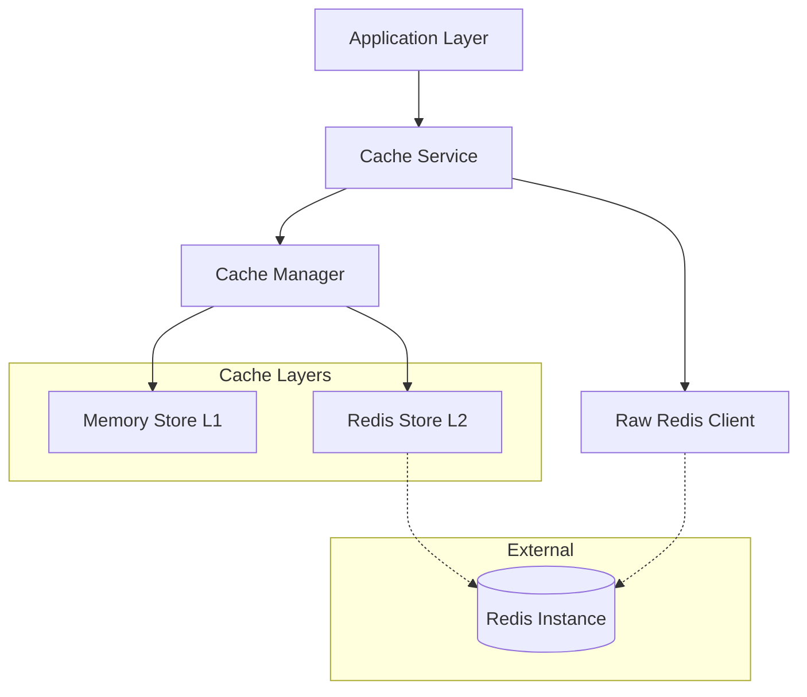

### Multi-Tier Caching Strategy

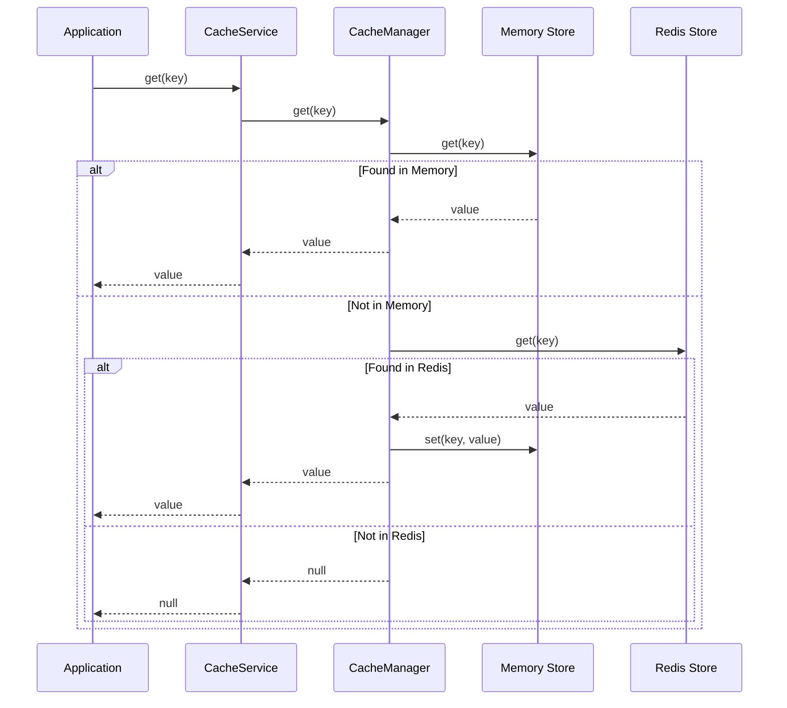

### Fallback Mechanism

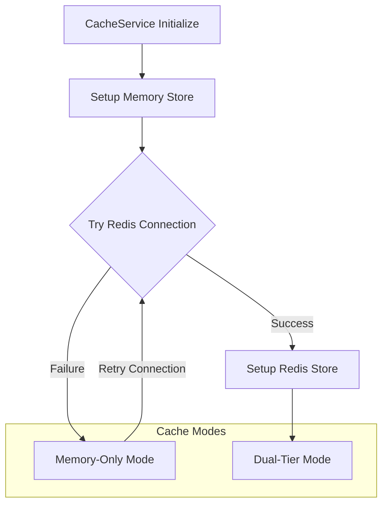

## Core Components

### CacheService Interface

```typescript
export interface ICacheService {
  // Basic Operations
  set(key: string, value: object, ttl?: number): Promise<void>;
  get<T = object>(key: string): Promise<T | null>;
  del(key: string): Promise<void>;
  exists(key: string): Promise<boolean>;
  expire(key: string, ttl: number): Promise<void>;
  ttl(key: string): Promise<number>;

  // Bulk Operations
  mset(keyValuePairs: Record<string, object>): Promise<void>;
  mget<T = object>(keys: string[]): Promise<(T | null)[]>;

  // Counter Operations
  incr(key: string): Promise<number>;
  decr(key: string): Promise<number>;
  incrWithExpire(key: string, ttl: number): Promise<number>;

  // Pattern Operations
  keys(pattern: string): Promise<string[]>;
  clearByPattern(pattern: string): Promise<number>;

  // Advanced Operations
  cache<T>(
    key: string,
    fn: () => Promise<T>,
    options?: ICacheOptions,
  ): Promise<T>;
  invalidateCache(key: string, prefix?: string): Promise<void>;
  invalidateCachePattern(pattern: string, prefix?: string): Promise<number>;

  // Hash Operations (Redis-specific with fallback)
  hset(key: string, field: string, value: object): Promise<number>;
  hget<T = object>(key: string, field: string): Promise<T | null>;
  hdel(key: string, field: string): Promise<number>;
  hgetall<T = object>(key: string): Promise<Record<string, T>>;

  // List Operations (Redis-specific, limited fallback)
  lpush(key: string, ...values: object[]): Promise<number>;
  rpush(key: string, ...values: object[]): Promise<number>;
  lpop<T = object>(key: string): Promise<T | null>;
  rpop<T = object>(key: string): Promise<T | null>;
  llen(key: string): Promise<number>;

  // System Operations
  disconnect(): Promise<void>;
  getHealthStatus(): { redis: boolean; memory: boolean };
  getRedisClient(): Redis | null;
}
```

### Cache Configuration

```typescript
export interface ICacheOptions {
  ttl?: number;        // Time to live in seconds
  prefix?: string;     // Key prefix for organization
}

// Default configuration
private defaultTTL = 300; // 5 minutes
```

## Cache Operations

### Basic Cache Operations

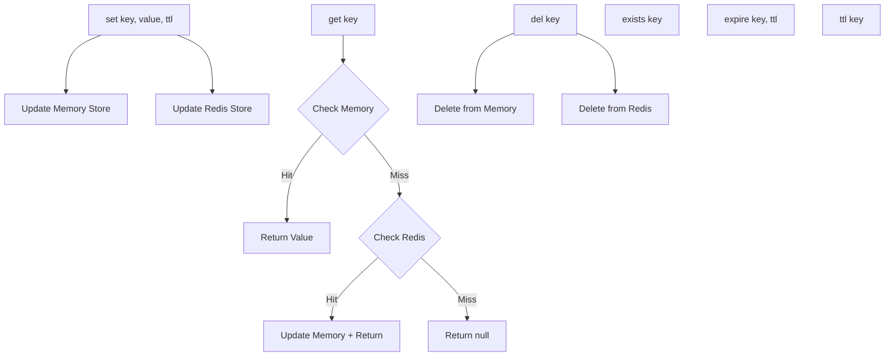

### Cache-Aside Pattern

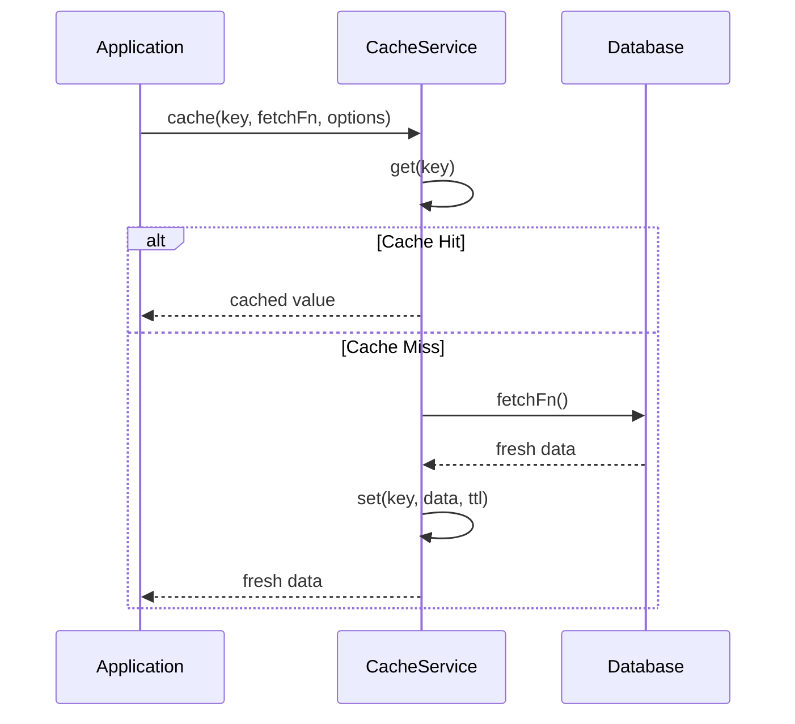

### Counter Operations

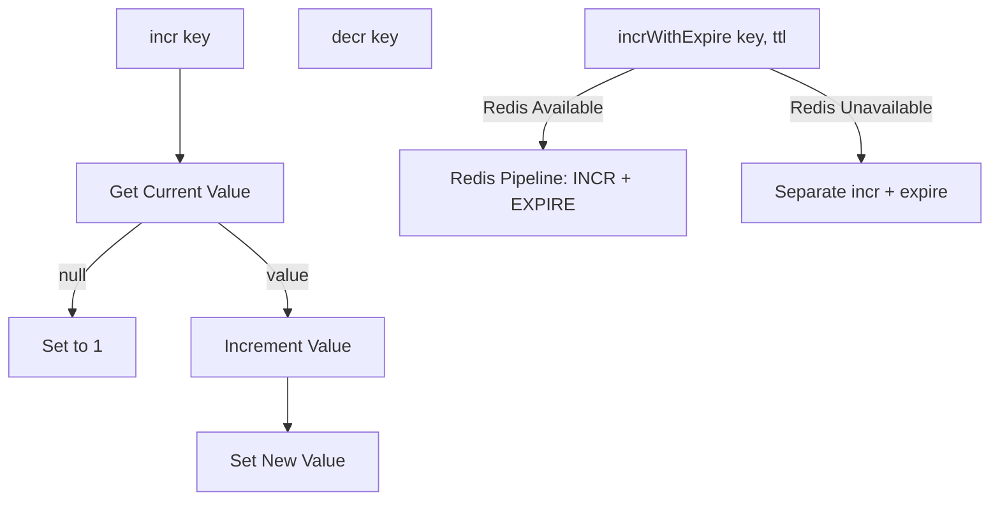

## Cache Decorators

### @Cache Decorator

```typescript
import { CacheService } from "../services/cache.service";

export function Cache(options: ICacheOptions = {}) {
  return function (
    target: any,
    propertyName: string,
    descriptor: PropertyDescriptor,
  ) {
    const method = descriptor.value;

    descriptor.value = async function (...args: any[]) {
      const cacheService = Container.get(CacheService);
      const cacheKey = generateCacheKey(
        target.constructor.name,
        propertyName,
        args,
      );

      return await cacheService.cache(
        cacheKey,
        () => method.apply(this, args),
        options,
      );
    };
  };
}

// Usage example
export class UserService {
  @Cache({ ttl: 300, prefix: "user:" })
  async getUserById(id: string): Promise<User> {
    return await this.userRepository.findById(id);
  }
}
```

### Cache Key Generation

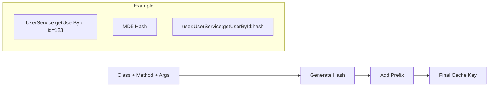

## Redis Integration

### Redis Configuration

```typescript
// src/config/redis.ts
export class RedisConfig {
  private static client: Redis | null = null;

  static getClient(): Redis {
    if (!this.client) {
      this.client = new Redis(config.redis.url, {
        retryDelayOnFailover: 100,
        maxRetriesPerRequest: 3,
        lazyConnect: true,
      });
    }
    return this.client;
  }
}
```

### Redis-Specific Operations

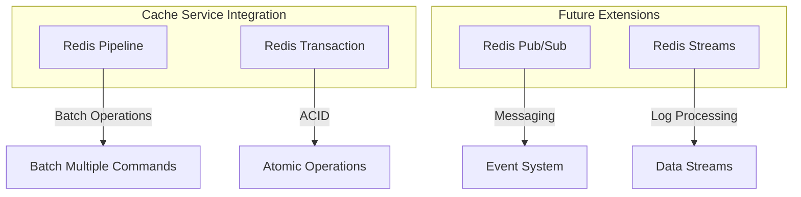

## Cache Middleware

### Request-Level Caching

```typescript
export class CacheMiddleware {
  constructor(private cacheService: CacheService) {}

  async use(req: Request, res: Response, next: NextFunction): Promise<void> {
    const cacheKey = this.generateRequestCacheKey(req);
    const cached = await this.cacheService.get(cacheKey);

    if (cached) {
      res.json(cached);
      return;
    }

    // Intercept response
    const originalJson = res.json;
    res.json = (data: any) => {
      // Cache successful responses
      if (res.statusCode >= 200 && res.statusCode < 300) {
        this.cacheService.set(cacheKey, data, 300); // 5 minutes
      }
      return originalJson.call(res, data);
    };

    next();
  }
}
```

### HTTP Cache Headers

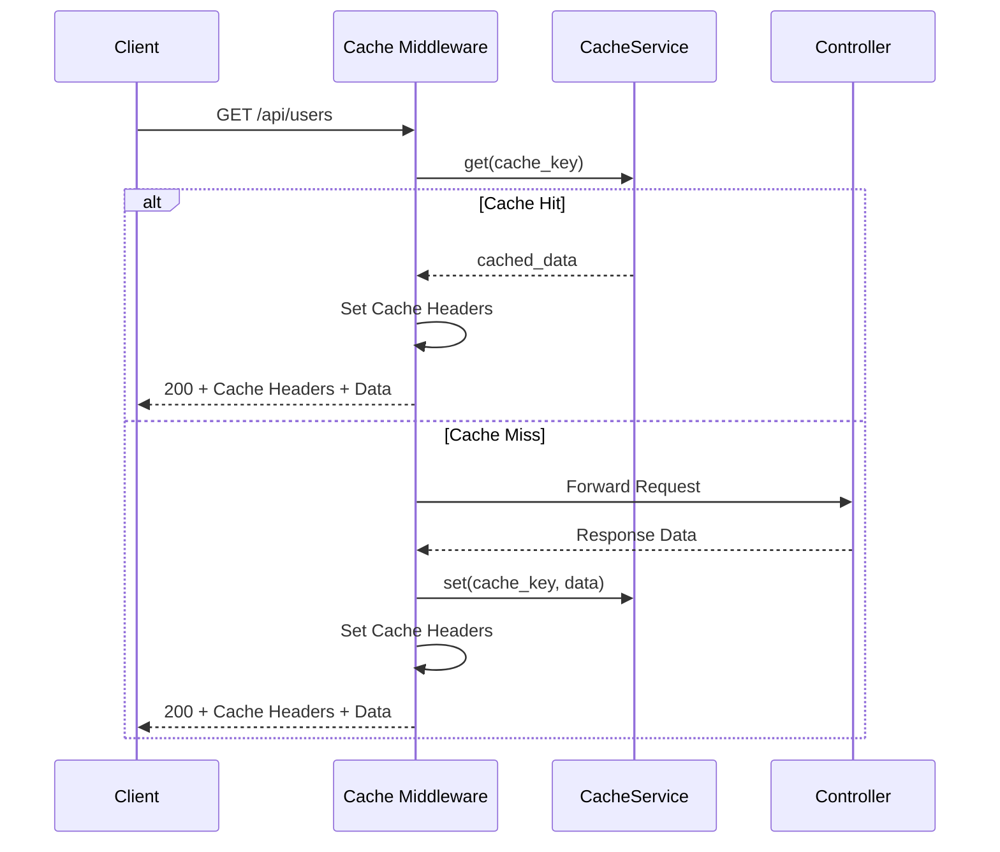

## Performance Optimization

### Cache Warming Strategies

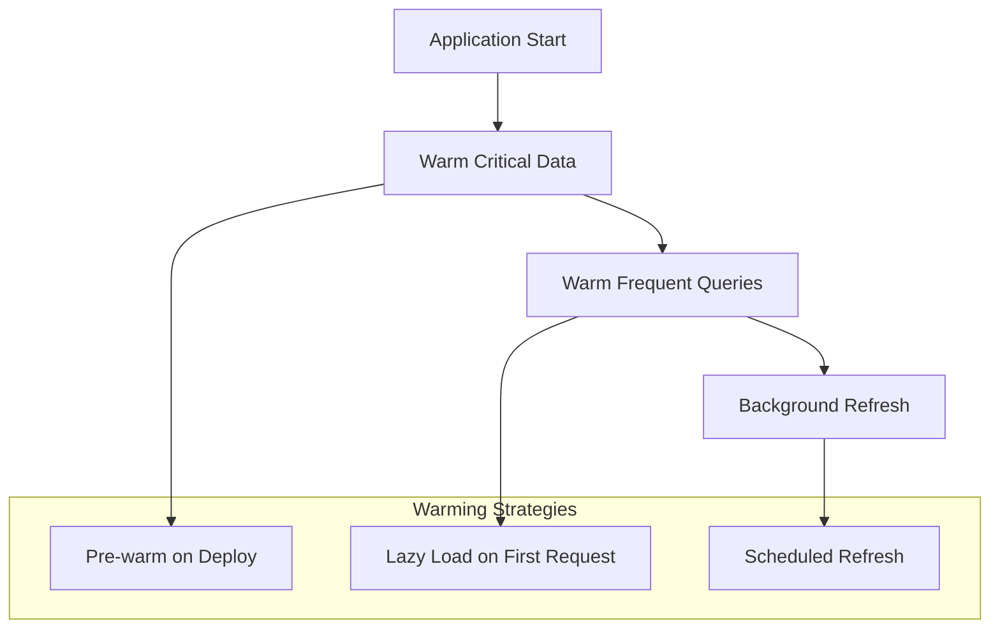

### Cache Invalidation Patterns

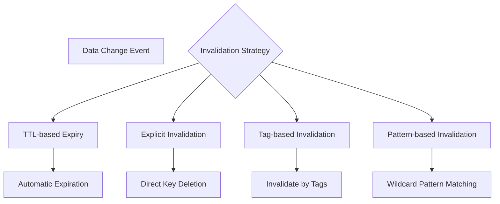

### Cache Layers Performance

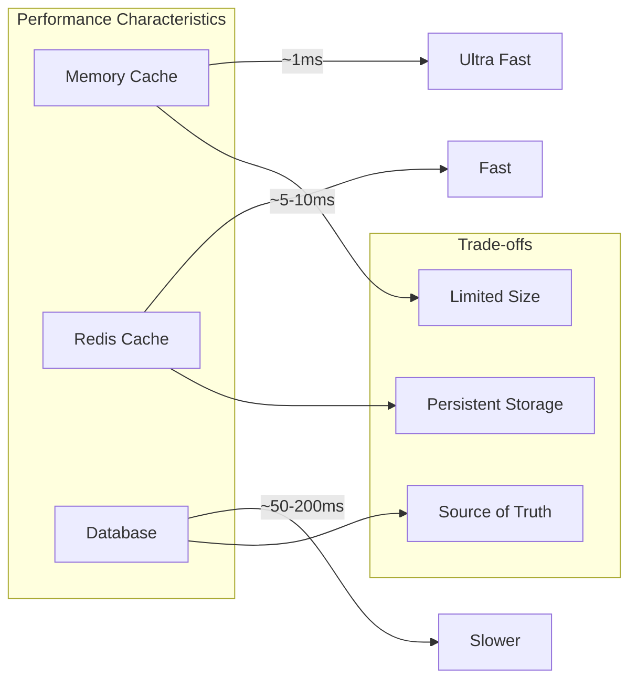

## Error Handling

### Cache Failure Strategies

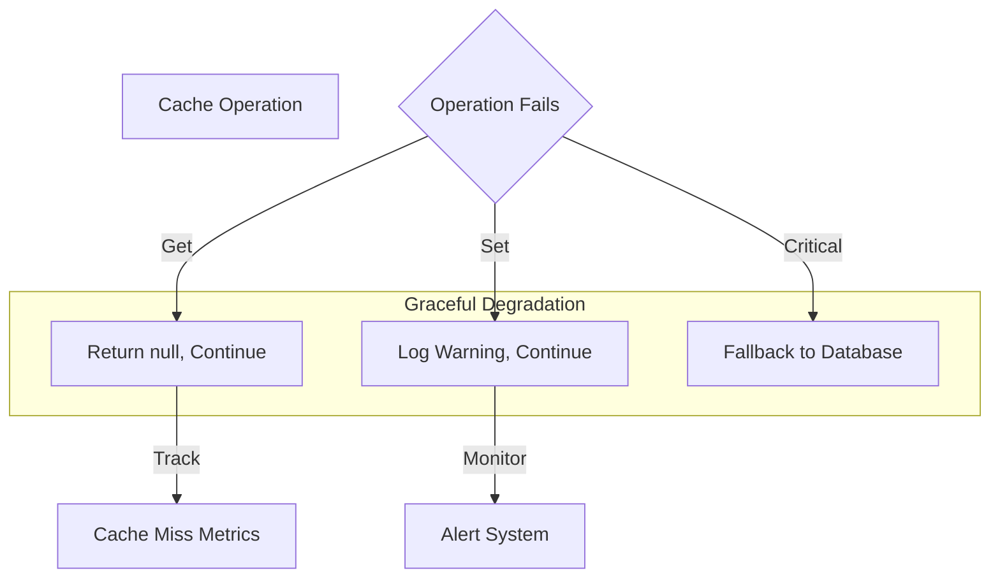

### Redis Connection Management

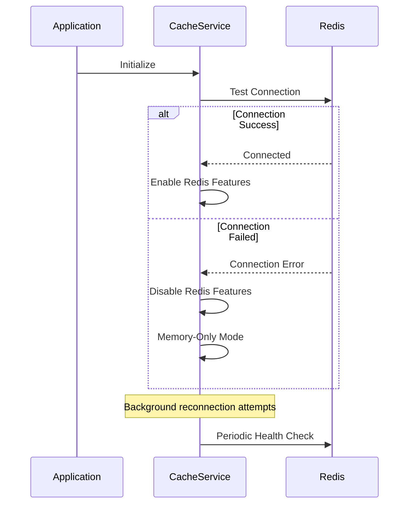

## Monitoring and Observability

### Cache Metrics

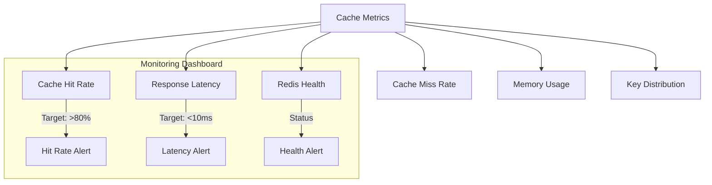

### Health Check Integration

```typescript
export class CacheHealthCheck {
  constructor(private cacheService: CacheService) {}

  async checkHealth(): Promise<HealthStatus> {
    const status = this.cacheService.getHealthStatus();

    return {
      cache: {
        status: status.redis && status.memory ? "healthy" : "degraded",
        details: {
          memory: status.memory ? "operational" : "failed",
          redis: status.redis ? "operational" : "unavailable",
        },
      },
    };
  }
}
```

## Configuration

### Environment Variables

```env
# Redis Configuration
REDIS_URL=redis://localhost:6379
REDIS_PASSWORD=your_password
REDIS_DB=0

# Cache Configuration
CACHE_DEFAULT_TTL=300
CACHE_PREFIX=api_scaffold
CACHE_ENABLE_REDIS=true
CACHE_ENABLE_MEMORY=true

# Health Check
CACHE_HEALTH_CHECK_INTERVAL=30000
```

### Application Configuration

```typescript
export const cacheConfig = {
  redis: {
    url: process.env.REDIS_URL || "redis://localhost:6379",
    password: process.env.REDIS_PASSWORD,
    db: parseInt(process.env.REDIS_DB || "0"),
  },
  cache: {
    defaultTTL: parseInt(process.env.CACHE_DEFAULT_TTL || "300"),
    prefix: process.env.CACHE_PREFIX || "api_scaffold",
    enableRedis: process.env.CACHE_ENABLE_REDIS === "true",
    enableMemory: process.env.CACHE_ENABLE_MEMORY !== "false",
  },
  healthCheck: {
    interval: parseInt(process.env.CACHE_HEALTH_CHECK_INTERVAL || "30000"),
  },
};
```

## Best Practices

### Cache Key Design

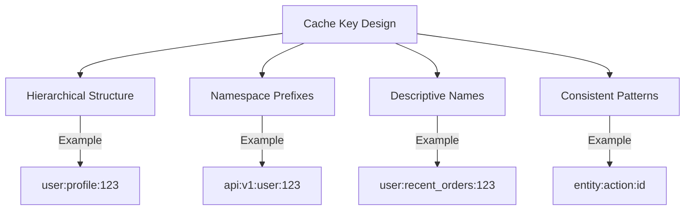

### TTL Strategy

1. **Static Data**: Long TTL (1-24 hours)
2. **Dynamic Data**: Medium TTL (5-60 minutes)
3. **Real-time Data**: Short TTL (30 seconds - 5 minutes)
4. **User Sessions**: Session-based TTL

### Cache Invalidation

1. **Write-Through**: Update cache on data change
2. **Write-Behind**: Asynchronous cache updates
3. **Event-Driven**: Invalidate on specific events
4. **Time-Based**: Regular TTL expiration

## Testing

### Cache Testing Strategies

```typescript
describe("CacheService", () => {
  let cacheService: CacheService;

  beforeEach(() => {
    cacheService = Container.get(CacheService);
  });

  it("should fallback to memory when Redis unavailable", async () => {
    // Mock Redis failure
    jest.spyOn(cacheService, "getRedisClient").mockReturnValue(null);

    await cacheService.set("test", { data: "value" });
    const result = await cacheService.get("test");

    expect(result).toEqual({ data: "value" });
  });

  it("should handle cache misses gracefully", async () => {
    const result = await cacheService.get("nonexistent");
    expect(result).toBeNull();
  });
});
```

### Performance Testing

```typescript
describe("Cache Performance", () => {
  it("should complete operations within latency targets", async () => {
    const start = Date.now();
    await cacheService.get("test_key");
    const latency = Date.now() - start;

    expect(latency).toBeLessThan(10); // 10ms target
  });
});
```

## Related Systems

- **Database System**: Cache layer for database queries
- **Authentication System**: Session and token caching
- **Rate Limiting System**: Request counter storage
- **Health Monitoring**: Cache health metrics
- **Logging System**: Cache operation logging

## Troubleshooting

### Common Issues

1. **Redis Connection Failures**
   - Check Redis server status
   - Verify connection parameters
   - Monitor network connectivity

2. **Memory Leaks**
   - Monitor memory usage
   - Check TTL configurations
   - Implement cache size limits

3. **Cache Inconsistency**
   - Review invalidation patterns
   - Check data update flows
   - Verify cache key generation

4. **Performance Issues**
   - Analyze cache hit rates
   - Review cache key distribution
   - Optimize TTL settings

### Debug Tools

```typescript
// Enable cache debugging
cacheService.enableDebugMode();

// Monitor cache operations
cacheService.onOperation((operation, key, duration) => {
  console.log(`Cache ${operation} for ${key} took ${duration}ms`);
});

// Check cache statistics
const stats = await cacheService.getStatistics();
console.log("Cache Hit Rate:", stats.hitRate);
```
