# Database System

## Overview

The database system implements a multi-provider architecture supporting both Supabase (PostgreSQL) and SQLite databases through a unified repository pattern with adapter interfaces. This design provides database agnostic data access with automatic provider switching and graceful fallbacks.

## System Architecture

### High-Level Architecture

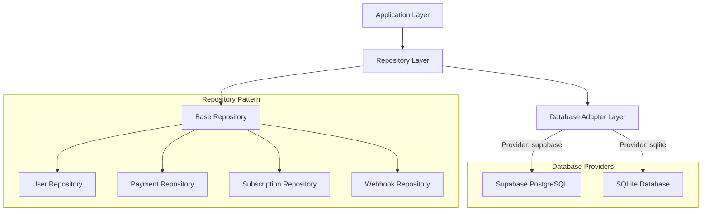

### Adapter Pattern Implementation

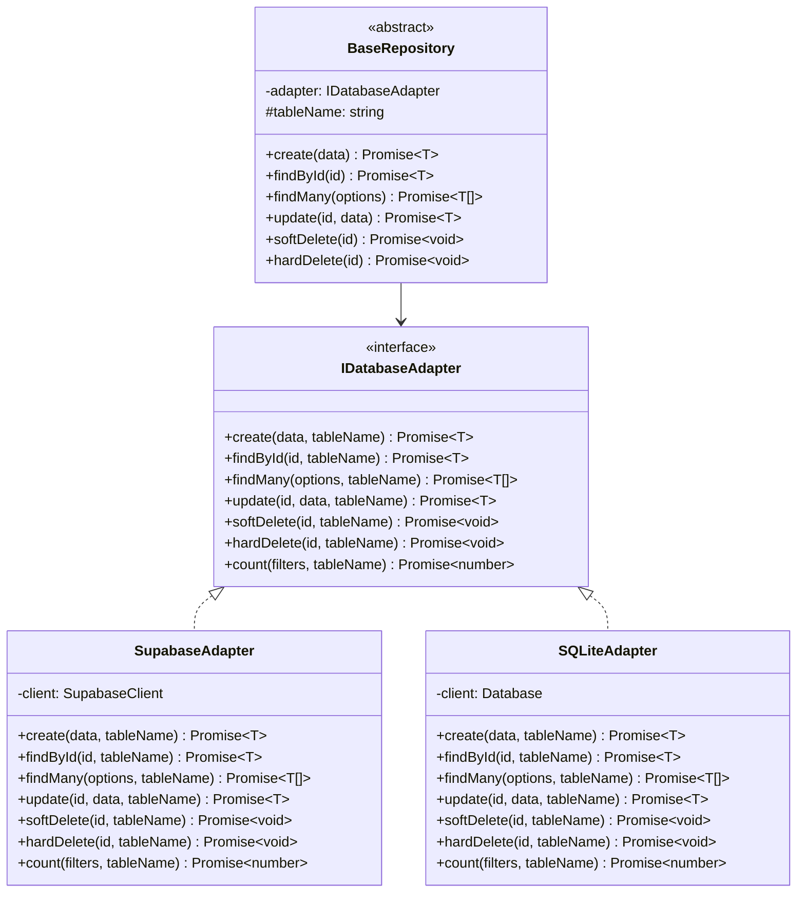

### Provider Selection Flow

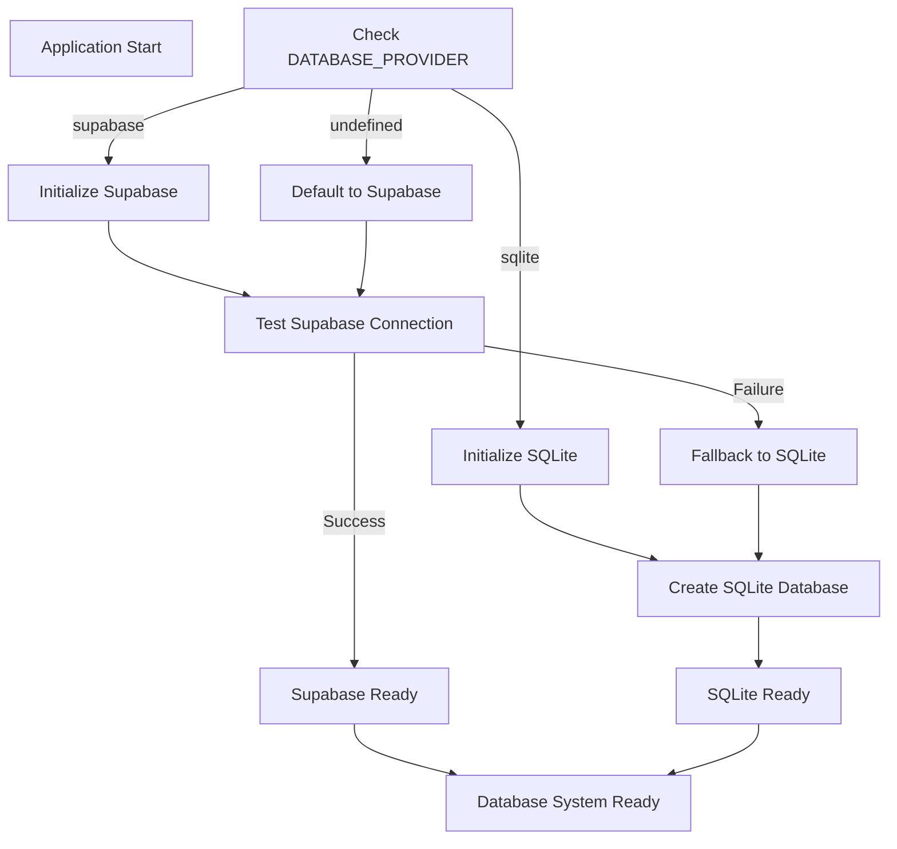

## Database Providers

### Supabase Provider

#### Configuration

```typescript
// src/config/supabase.ts
export interface SupabaseConfig {
  url: string;
  anonKey: string;
  serviceKey?: string;
}

export const supabaseConfig: SupabaseConfig = {
  url: process.env.SUPABASE_URL!,
  anonKey: process.env.SUPABASE_ANON_KEY!,
  serviceKey: process.env.SUPABASE_SERVICE_KEY,
};

export function getSupabaseClient(): SupabaseClient<IDatabase> {
  return createClient<IDatabase>(supabaseConfig.url, supabaseConfig.anonKey, {
    auth: {
      persistSession: false,
    },
    db: {
      schema: "public",
    },
  });
}
```

#### Features

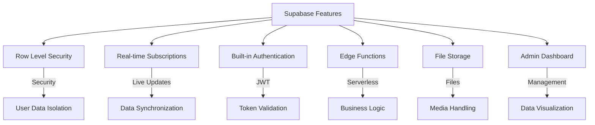

### SQLite Provider

#### Configuration

```typescript
// src/config/sqlite.ts
export class SQLiteConfig {
  private static client: Database | null = null;

  static getClient(): Database {
    if (!this.client) {
      const dbPath = config.database.sqlite.path || "./data/database.sqlite";

      // Ensure directory exists
      const dir = path.dirname(dbPath);
      if (!fs.existsSync(dir)) {
        fs.mkdirSync(dir, { recursive: true });
      }

      this.client = new Database(dbPath, {
        verbose: config.env.isDevelopment ? console.log : undefined,
      });

      // Enable foreign keys
      this.client.pragma("foreign_keys = ON");

      // Performance optimizations
      this.client.pragma("journal_mode = WAL");
      this.client.pragma("synchronous = NORMAL");
      this.client.pragma("cache_size = 1000");
      this.client.pragma("temp_store = memory");
    }

    return this.client;
  }
}
```

#### Features

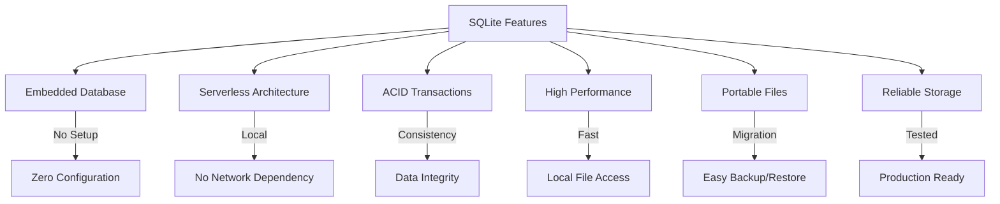

## Repository Layer

### Base Repository

```typescript
export abstract class BaseRepository<T extends IBaseEntity> {
  protected abstract tableName: string;
  private adapter: IDatabaseAdapter<T>;

  constructor(@Inject("supabase") supabase?: SupabaseClient<IDatabase>) {
    if (config.database.provider === "sqlite") {
      this.adapter = new SQLiteAdapter<T>(SQLiteConfig.getClient());
      this.initializeTable();
    } else {
      this.adapter = new SupabaseAdapter<T>(supabase || getSupabaseClient());
    }
  }

  protected abstract initializeTable(): void;

  // CRUD Operations
  async create(data: Omit<T, "id" | "createdAt" | "updatedAt">): Promise<T>;
  async findById(id: string): Promise<T | null>;
  async findMany(options?: FindOptions): Promise<T[]>;
  async findWithPagination(options?: FindOptions): Promise<IPaginatedResult<T>>;
  async update(id: string, data: Partial<T>): Promise<T>;
  async softDelete(id: string): Promise<void>;
  async hardDelete(id: string): Promise<void>;
  async count(filters?: IFilterOptions): Promise<number>;
  async exists(id: string): Promise<boolean>;
  async findFirst(filters?: IFilterOptions): Promise<T | null>;
}
```

### Repository Operations Flow

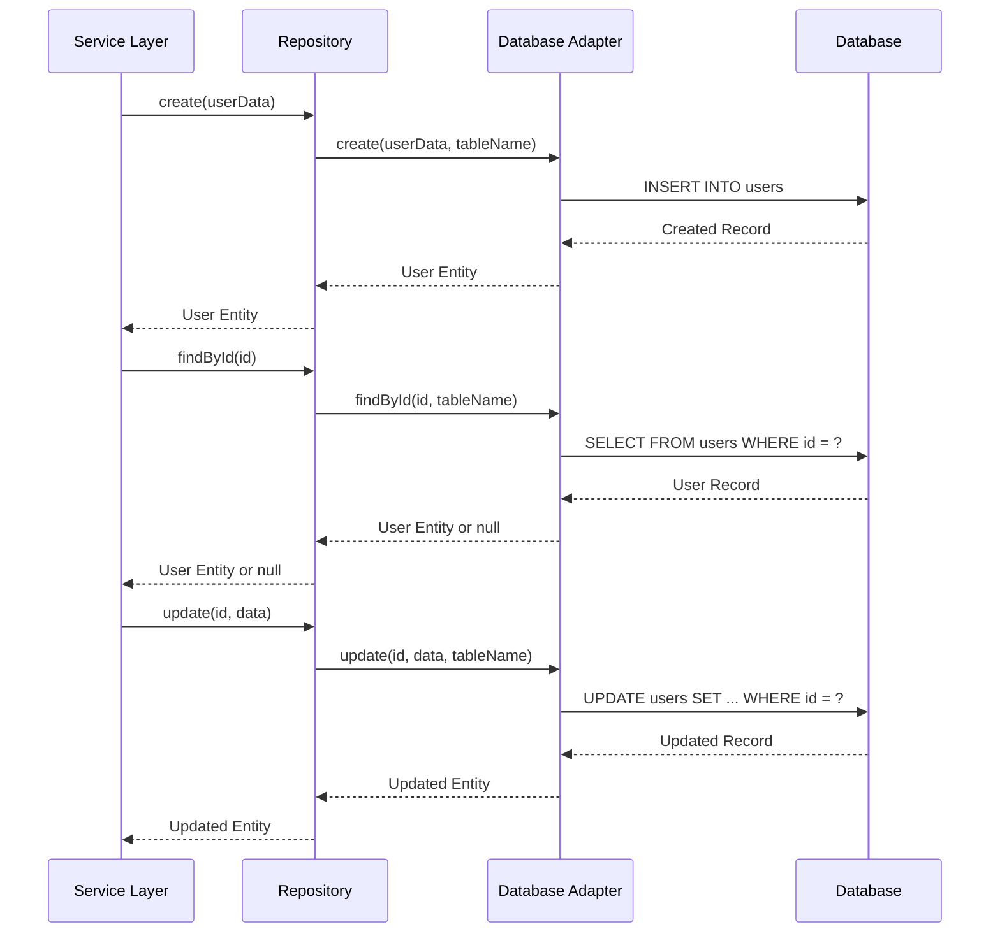

## Database Schema

### Entity Relationships

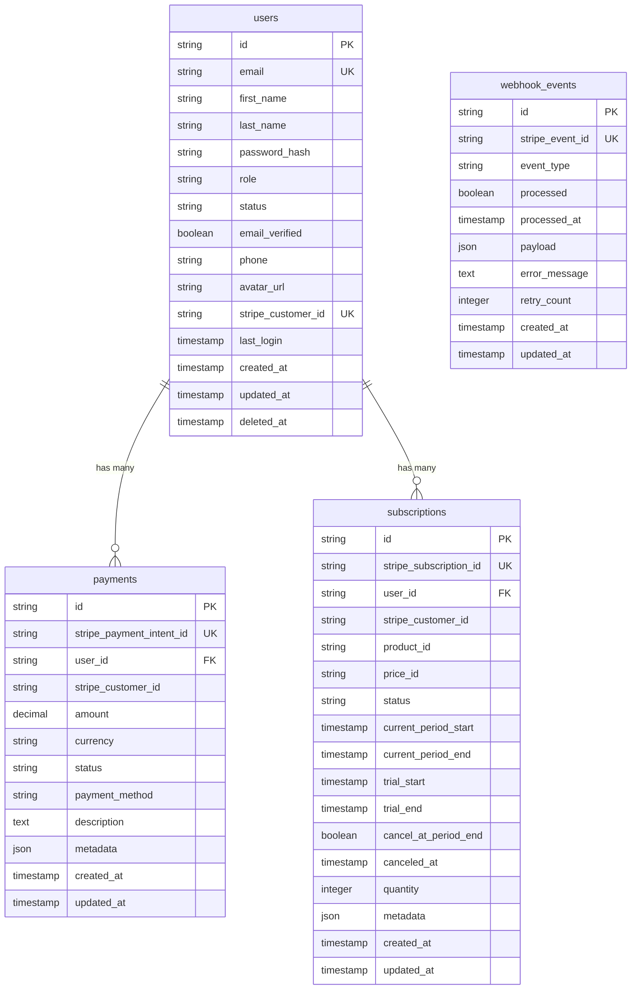

### Schema Migrations

#### Supabase Migrations

```sql
-- Migration: 001_create_users_table.sql
CREATE TABLE IF NOT EXISTS users (
    id UUID PRIMARY KEY DEFAULT gen_random_uuid(),
    email VARCHAR(255) UNIQUE NOT NULL,
    first_name VARCHAR(100) NOT NULL,
    last_name VARCHAR(100) NOT NULL,
    password_hash TEXT,
    role VARCHAR(50) DEFAULT 'User',
    status VARCHAR(50) DEFAULT 'Active',
    email_verified BOOLEAN DEFAULT FALSE,
    phone VARCHAR(20),
    avatar_url TEXT,
    stripe_customer_id VARCHAR(255) UNIQUE,
    last_login TIMESTAMP WITH TIME ZONE,
    created_at TIMESTAMP WITH TIME ZONE DEFAULT NOW(),
    updated_at TIMESTAMP WITH TIME ZONE DEFAULT NOW(),
    deleted_at TIMESTAMP WITH TIME ZONE
);

-- Create indexes
CREATE INDEX idx_users_email ON users(email);
CREATE INDEX idx_users_stripe_customer_id ON users(stripe_customer_id);
CREATE INDEX idx_users_created_at ON users(created_at);
CREATE INDEX idx_users_deleted_at ON users(deleted_at);

-- Enable Row Level Security
ALTER TABLE users ENABLE ROW LEVEL SECURITY;

-- RLS Policies
CREATE POLICY "Users can view own data" ON users
    FOR SELECT USING (auth.uid() = id);

CREATE POLICY "Users can update own data" ON users
    FOR UPDATE USING (auth.uid() = id);
```

#### SQLite Schema Creation

```typescript
export class SQLiteSchemaManager {
  constructor(private db: Database) {}

  async initializeSchema(): Promise<void> {
    await this.createUsersTable();
    await this.createPaymentsTable();
    await this.createSubscriptionsTable();
    await this.createWebhookEventsTable();
    await this.createIndexes();
  }

  private async createUsersTable(): Promise<void> {
    const sql = `
      CREATE TABLE IF NOT EXISTS users (
        id TEXT PRIMARY KEY,
        email TEXT UNIQUE NOT NULL,
        first_name TEXT NOT NULL,
        last_name TEXT NOT NULL,
        password_hash TEXT,
        role TEXT DEFAULT 'User',
        status TEXT DEFAULT 'Active',
        email_verified BOOLEAN DEFAULT 0,
        phone TEXT,
        avatar_url TEXT,
        stripe_customer_id TEXT UNIQUE,
        last_login TEXT,
        created_at TEXT DEFAULT (datetime('now')),
        updated_at TEXT DEFAULT (datetime('now')),
        deleted_at TEXT
      )
    `;
    this.db.exec(sql);
  }

  private async createIndexes(): Promise<void> {
    const indexes = [
      "CREATE INDEX IF NOT EXISTS idx_users_email ON users(email)",
      "CREATE INDEX IF NOT EXISTS idx_users_stripe_customer_id ON users(stripe_customer_id)",
      "CREATE INDEX IF NOT EXISTS idx_users_created_at ON users(created_at)",
      "CREATE INDEX IF NOT EXISTS idx_users_deleted_at ON users(deleted_at)",
    ];

    indexes.forEach((sql) => this.db.exec(sql));
  }
}
```

## Data Access Patterns

### Query Builder Pattern

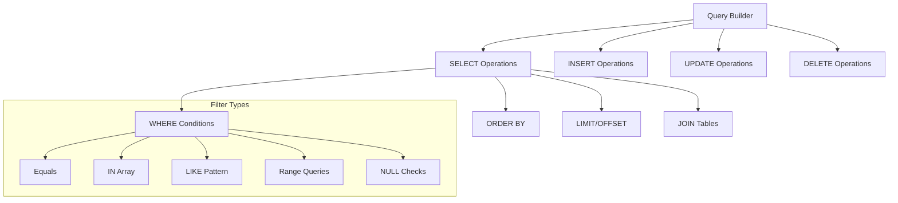

### Repository Query Methods

```typescript
export interface IFilterOptions {
  [key: string]: any;
  search?: string;
  status?: string;
  role?: string;
  createdAfter?: Date;
  createdBefore?: Date;
}

export interface IOrderByOptions {
  field: string;
  direction: "asc" | "desc";
}

export interface IPaginationOptions {
  page: number;
  limit: number;
}

// Usage Example
const users = await userRepository.findMany({
  filters: {
    status: "Active",
    role: "User",
    search: "john",
  },
  orderBy: {
    field: "createdAt",
    direction: "desc",
  },
  pagination: {
    page: 1,
    limit: 10,
  },
});
```

### Transaction Management

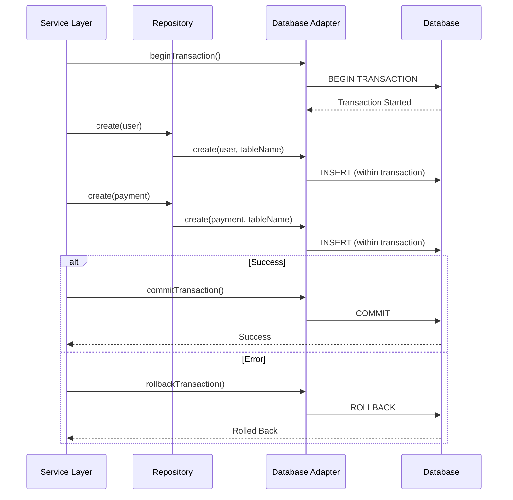

## Database Operations

### CRUD Operations Implementation

```typescript
// Supabase Adapter Implementation
export class SupabaseAdapter<T extends IBaseEntity>
  implements IDatabaseAdapter<T>
{
  constructor(private client: SupabaseClient<IDatabase>) {}

  async create(
    data: Omit<T, "id" | "createdAt" | "updatedAt">,
    tableName: string,
  ): Promise<T> {
    const { data: result, error } = await this.client
      .from(tableName)
      .insert(data as any)
      .select()
      .single();

    if (error) {
      throw new DatabaseException(
        `Failed to create record in ${tableName}: ${error.message}`,
      );
    }

    return result as T;
  }

  async findById(id: string, tableName: string): Promise<T | null> {
    const { data, error } = await this.client
      .from(tableName)
      .select("*")
      .eq("id", id)
      .is("deleted_at", null)
      .single();

    if (error) {
      if (error.code === "PGRST116") return null; // No rows returned
      throw new DatabaseException(
        `Failed to find record in ${tableName}: ${error.message}`,
      );
    }

    return data as T;
  }

  async findMany(options: FindOptions, tableName: string): Promise<T[]> {
    let query = this.client.from(tableName).select("*").is("deleted_at", null);

    // Apply filters
    if (options.filters) {
      query = this.applyFilters(query, options.filters);
    }

    // Apply ordering
    if (options.orderBy) {
      query = query.order(options.orderBy.field, {
        ascending: options.orderBy.direction === "asc",
      });
    }

    // Apply pagination
    if (options.pagination) {
      const offset = (options.pagination.page - 1) * options.pagination.limit;
      query = query.range(offset, offset + options.pagination.limit - 1);
    }

    const { data, error } = await query;

    if (error) {
      throw new DatabaseException(
        `Failed to query ${tableName}: ${error.message}`,
      );
    }

    return data as T[];
  }
}
```

### Soft Delete Implementation

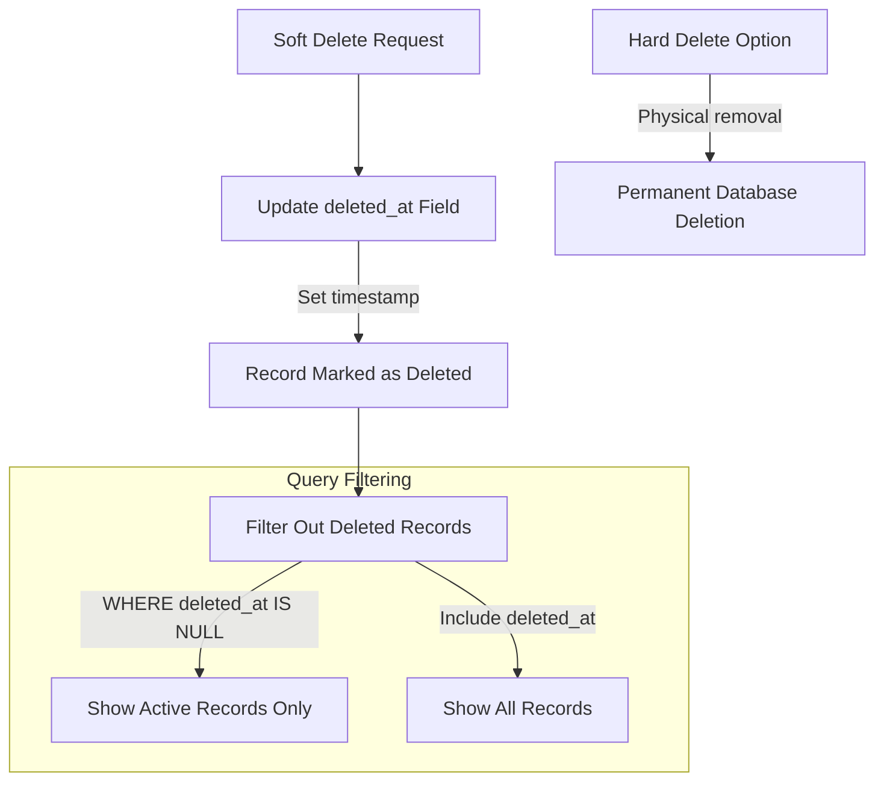

## Performance Optimization

### Database Indexing Strategy

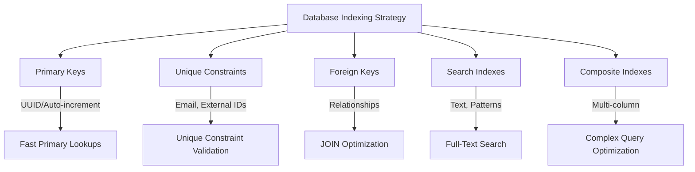

### Query Optimization

```typescript
// Optimized queries with proper indexing
export class OptimizedUserRepository extends BaseRepository<IUserEntity> {
  protected tableName = "users";

  // Use indexes for efficient filtering
  async findActiveUsersByRole(role: UserRole): Promise<IUserEntity[]> {
    return this.findMany({
      filters: {
        status: UserStatus.Active, // Indexed field
        role, // Indexed field
      },
      orderBy: {
        field: "created_at", // Indexed field
        direction: "desc",
      },
    });
  }

  // Efficient pagination with cursor-based approach
  async findUsersWithCursor(
    cursor?: string,
    limit: number = 20,
  ): Promise<{
    users: IUserEntity[];
    nextCursor?: string;
  }> {
    const filters: IFilterOptions = {};

    if (cursor) {
      filters.createdAfter = new Date(cursor);
    }

    const users = await this.findMany({
      filters,
      orderBy: { field: "created_at", direction: "asc" },
      pagination: { page: 1, limit: limit + 1 },
    });

    const hasNext = users.length > limit;
    const result = hasNext ? users.slice(0, -1) : users;
    const nextCursor = hasNext ? users[users.length - 2].createdAt : undefined;

    return { users: result, nextCursor };
  }
}
```

### Connection Pooling

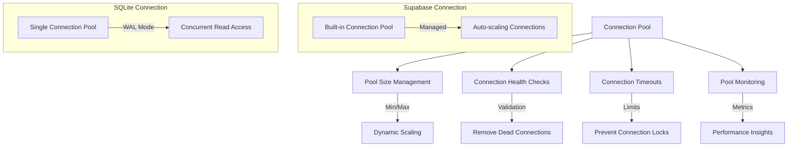

## Data Validation

### Entity Validation

```typescript
export class UserEntity implements IUserEntity {
  @IsUUID()
  id: string;

  @IsEmail()
  @IsNotEmpty()
  email: string;

  @IsString()
  @MinLength(2)
  @MaxLength(50)
  firstName: string;

  @IsString()
  @MinLength(2)
  @MaxLength(50)
  lastName: string;

  @IsEnum(UserRole)
  role: UserRole;

  @IsEnum(UserStatus)
  status: UserStatus;

  @IsBoolean()
  emailVerified: boolean;

  @IsOptional()
  @IsString()
  @IsPhoneNumber()
  phone?: string;

  @IsOptional()
  @IsUrl()
  avatarUrl?: string;

  @IsOptional()
  @IsString()
  stripeCustomerId?: string;

  @IsDateString()
  createdAt: string;

  @IsDateString()
  updatedAt: string;

  @IsOptional()
  @IsDateString()
  deletedAt?: string;
}
```

### Database Constraints

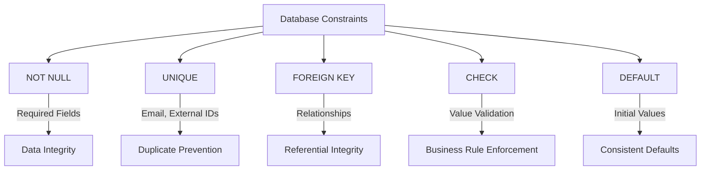

## Error Handling

### Database Error Types

```typescript
export class DatabaseException extends Error {
  constructor(
    message: string,
    public code?: string,
    public details?: any,
  ) {
    super(message);
    this.name = "DatabaseException";
  }
}

export class ConnectionException extends DatabaseException {
  constructor(message: string, details?: any) {
    super(message, "CONNECTION_ERROR", details);
    this.name = "ConnectionException";
  }
}

export class QueryException extends DatabaseException {
  constructor(message: string, query?: string, details?: any) {
    super(message, "QUERY_ERROR", { query, ...details });
    this.name = "QueryException";
  }
}

export class ValidationException extends DatabaseException {
  constructor(message: string, field?: string, details?: any) {
    super(message, "VALIDATION_ERROR", { field, ...details });
    this.name = "ValidationException";
  }
}
```

### Error Recovery Strategies

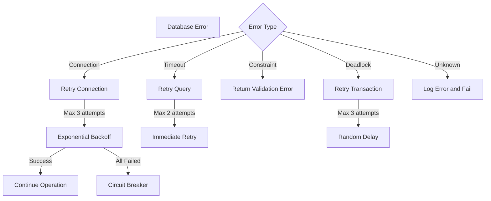

## Monitoring and Observability

### Database Metrics

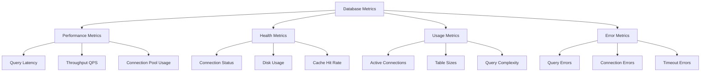

### Health Checks

```typescript
export class DatabaseHealthService {
  constructor(
    private userRepository: UserRepository,
    private cacheService: CacheService,
  ) {}

  async checkHealth(): Promise<DatabaseHealthStatus> {
    const checks = await Promise.allSettled([
      this.checkConnection(),
      this.checkQueryPerformance(),
      this.checkDiskSpace(),
    ]);

    return {
      status: checks.every((check) => check.status === "fulfilled")
        ? "healthy"
        : "degraded",
      checks: {
        connection: checks[0].status === "fulfilled",
        performance: checks[1].status === "fulfilled",
        storage: checks[2].status === "fulfilled",
      },
      timestamp: new Date(),
    };
  }

  private async checkConnection(): Promise<boolean> {
    try {
      await this.userRepository.count();
      return true;
    } catch {
      return false;
    }
  }

  private async checkQueryPerformance(): Promise<boolean> {
    const start = Date.now();
    try {
      await this.userRepository.findFirst();
      const latency = Date.now() - start;
      return latency < 1000; // Under 1 second
    } catch {
      return false;
    }
  }
}
```

## Testing

### Repository Testing

```typescript
describe("UserRepository", () => {
  let userRepository: UserRepository;
  let testUser: IUserEntity;

  beforeEach(async () => {
    userRepository = Container.get(UserRepository);
    testUser = await createTestUser();
  });

  afterEach(async () => {
    await cleanupTestData();
  });

  describe("CRUD Operations", () => {
    it("should create user successfully", async () => {
      const userData = {
        email: "test@example.com",
        firstName: "Test",
        lastName: "User",
        passwordHash: "hashed_password",
        role: UserRole.User,
        status: UserStatus.Active,
        emailVerified: false,
      };

      const user = await userRepository.create(userData);

      expect(user.id).toBeDefined();
      expect(user.email).toBe(userData.email);
      expect(user.createdAt).toBeDefined();
    });

    it("should find user by id", async () => {
      const user = await userRepository.findById(testUser.id);

      expect(user).toBeDefined();
      expect(user!.id).toBe(testUser.id);
    });

    it("should update user", async () => {
      const updatedData = { firstName: "Updated" };
      const user = await userRepository.update(testUser.id, updatedData);

      expect(user.firstName).toBe("Updated");
      expect(user.updatedAt).not.toBe(testUser.updatedAt);
    });

    it("should soft delete user", async () => {
      await userRepository.softDelete(testUser.id);
      const user = await userRepository.findById(testUser.id);

      expect(user).toBeNull();
    });
  });

  describe("Query Operations", () => {
    it("should find users with filters", async () => {
      const users = await userRepository.findMany({
        filters: { status: UserStatus.Active },
        orderBy: { field: "createdAt", direction: "desc" },
        pagination: { page: 1, limit: 10 },
      });

      expect(users).toBeInstanceOf(Array);
      expect(users.every((user) => user.status === UserStatus.Active)).toBe(
        true,
      );
    });

    it("should count users with filters", async () => {
      const count = await userRepository.count({
        status: UserStatus.Active,
      });

      expect(typeof count).toBe("number");
      expect(count).toBeGreaterThanOrEqual(0);
    });
  });
});
```

### Database Integration Testing

```typescript
describe("Database Integration", () => {
  it("should handle concurrent operations", async () => {
    const operations = Array.from({ length: 10 }, (_, i) =>
      userRepository.create({
        email: `user${i}@example.com`,
        firstName: `User${i}`,
        lastName: "Test",
        passwordHash: "password",
        role: UserRole.User,
        status: UserStatus.Active,
        emailVerified: false,
      }),
    );

    const results = await Promise.all(operations);

    expect(results).toHaveLength(10);
    expect(results.every((user) => user.id)).toBe(true);
  });

  it("should handle transaction rollback", async () => {
    const adapter = Container.get(SupabaseAdapter);

    try {
      await adapter.beginTransaction();

      await userRepository.create(validUserData);

      // Simulate error
      throw new Error("Simulated error");

      await adapter.commitTransaction();
    } catch {
      await adapter.rollbackTransaction();
    }

    const users = await userRepository.findMany();
    expect(users.find((u) => u.email === validUserData.email)).toBeUndefined();
  });
});
```

## Best Practices

### Repository Design Patterns

1. **Single Responsibility**: Each repository manages one entity type
2. **Interface Segregation**: Separate read and write operations when needed
3. **Dependency Inversion**: Depend on abstractions, not concretions
4. **Consistent Error Handling**: Standardized exception types and messages

### Query Optimization Guidelines

1. **Use Indexes**: Ensure frequently queried fields are indexed
2. **Limit Results**: Always use pagination for large datasets
3. **Avoid N+1 Queries**: Use joins or batch loading
4. **Cache Results**: Cache frequently accessed data
5. **Monitor Performance**: Track slow queries and optimize

### Data Migration Strategies

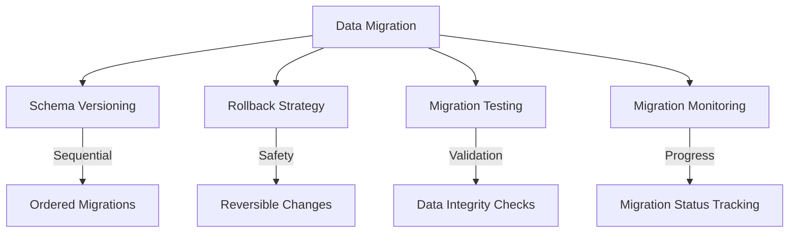

## Related Systems

- **Authentication System**: User data storage and retrieval
- **Payment System**: Payment and subscription data persistence
- **Caching System**: Database query result caching
- **Logging System**: Database operation logging
- **Health Monitoring**: Database health status tracking

## Troubleshooting

### Common Issues

1. **Connection Timeouts**
   - Check database server status
   - Verify connection parameters
   - Monitor connection pool usage

2. **Query Performance**
   - Analyze slow query logs
   - Check index usage
   - Optimize query patterns

3. **Data Consistency**
   - Verify transaction boundaries
   - Check constraint violations
   - Review concurrent access patterns

4. **Migration Failures**
   - Validate migration scripts
   - Check database permissions
   - Verify schema compatibility

### Debug Tools

```typescript
// Enable query logging
if (config.env.isDevelopment) {
  // Log all Supabase queries
  supabaseClient.from("*").select("*").then(console.log);

  // Log SQLite queries
  const db = SQLiteConfig.getClient();
  db.on("trace", (sql) => console.log("SQLite Query:", sql));
}

// Performance monitoring
const queryStart = Date.now();
const result = await repository.findMany(options);
const queryTime = Date.now() - queryStart;
logger.debug(`Query completed in ${queryTime}ms`);
```
