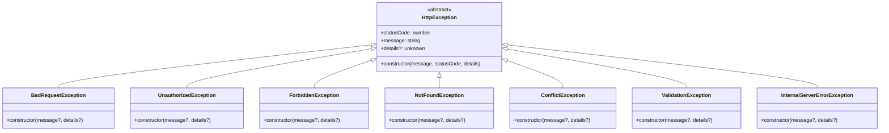

# Error Handling System

## Overview

The error handling system provides comprehensive, centralized error management with type-safe exception hierarchies, standardized error responses, and seamless integration with logging and monitoring systems. It implements a registry-based architecture for extensible error handling while maintaining security and performance standards.

## System Architecture

### High-Level Architecture


### Error Flow Sequence


## Exception Hierarchy

### Base Exception Classes



### Domain-Specific Exceptions


## Global Error Handler

### Handler Implementation

```typescript
export class GlobalErrorHandler {
  private static registry = new ErrorHandlerRegistry();

  static handle(
    error: Error,
    request: Request,
    response: Response,
    next: NextFunction,
  ): void {
    const errorObject = this.registry.handle(error);
    const path = request.path;
    const timestamp = new Date().toISOString();

    // Log error with context
    logError(errorObject, path, timestamp);

    // Send standardized error response
    response.status(errorObject.statusCode).json({
      success: false,
      error: {
        status: errorObject.statusCode,
        message: errorObject.message,
        timestamp,
        path,
        ...(errorObject.details && { details: errorObject.details }),
      },
    });
  }
}
```

### Error Handler Registry


### Registry Implementation

```typescript
export class ErrorHandlerRegistry {
  private handlers: Array<{
    matcher: (error: Error) => boolean;
    handler: (error: Error) => IErrorObject;
  }> = [];

  constructor() {
    this.registerDefaultHandlers();
  }

  register(
    matcher: (error: Error) => boolean,
    handler: (error: Error) => IErrorObject,
  ): void {
    this.handlers.push({ matcher, handler });
  }

  handle(error: Error): IErrorObject {
    const handler = this.handlers.find((h) => h.matcher(error));
    return handler ? handler.handler(error) : this.handleGenericError(error);
  }

  private registerDefaultHandlers(): void {
    // HTTP Exception handler
    this.register(
      (error): error is HttpException => error instanceof HttpException,
      (error: HttpException) => ({
        statusCode: error.statusCode,
        message: error.message,
        details: error.details,
      }),
    );

    // Validation error handler
    this.register(
      (error): error is ValidationError => error instanceof ValidationError,
      (error: ValidationError) => ({
        statusCode: HttpStatus.BAD_REQUEST,
        message: "Validation failed",
        details: this.formatValidationErrors([error]),
      }),
    );

    // JWT error handlers
    this.register(
      (error): error is JsonWebTokenError => error.name === "JsonWebTokenError",
      () => ({
        statusCode: HttpStatus.UNAUTHORIZED,
        message: "Invalid token",
      }),
    );
  }
}
```

## Error Response Format

### Standardized Error Response

```typescript
interface IErrorResponse {
  success: false;
  error: {
    status: HttpStatus;
    message: string;
    timestamp: string;
    path: string;
    details?: unknown;
  };
}
```

### Error Response Examples


### Example Error Responses

```json
// Validation Error
{
  "success": false,
  "error": {
    "status": 400,
    "message": "Validation failed",
    "timestamp": "2024-01-01T12:00:00.000Z",
    "path": "/api/users",
    "details": [
      {
        "property": "email",
        "constraints": {
          "isEmail": "email must be an email"
        }
      }
    ]
  }
}

// Authentication Error
{
  "success": false,
  "error": {
    "status": 401,
    "message": "Invalid credentials",
    "timestamp": "2024-01-01T12:00:00.000Z",
    "path": "/api/auth/login"
  }
}

// Database Error
{
  "success": false,
  "error": {
    "status": 503,
    "message": "Database connection failed",
    "timestamp": "2024-01-01T12:00:00.000Z",
    "path": "/api/users/123"
  }
}
```

## Validation Error Handling

### Class-Validator Integration


### Validation Error Transformation

```typescript
private formatValidationErrors(errors: ValidationError[]): any[] {
  return errors.map(error => ({
    property: error.property,
    value: error.value,
    constraints: error.constraints,
    children: error.children?.length
      ? this.formatValidationErrors(error.children)
      : undefined
  }));
}
```

## Database Error Handling

### Multi-Provider Error Handling


### Supabase Error Code Mapping

```typescript
const supabaseErrorHandler = (error: any): IErrorObject => {
  const code = error.code;
  const message = error.message;

  switch (code) {
    case "PGRST116": // Row not found
      return {
        statusCode: HttpStatus.NOT_FOUND,
        message: "Resource not found",
      };
    case "PGRST301": // Singular response expected
      return {
        statusCode: HttpStatus.CONFLICT,
        message: "Multiple resources found",
      };
    case "23505": // Unique violation
      return {
        statusCode: HttpStatus.CONFLICT,
        message: "Resource already exists",
      };
    case "23503": // Foreign key violation
      return {
        statusCode: HttpStatus.BAD_REQUEST,
        message: "Invalid reference",
      };
    default:
      return {
        statusCode: HttpStatus.INTERNAL_SERVER_ERROR,
        message: "Database operation failed",
      };
  }
};
```

## Authentication Error Handling

### JWT Error Handling


### Authentication Exception Types

```typescript
export class InvalidCredentialsException extends UnauthorizedException {
  constructor(message: string = "Invalid credentials") {
    super(message);
    this.name = "InvalidCredentialsException";
  }
}

export class TokenExpiredException extends UnauthorizedException {
  constructor(message: string = "Token has expired") {
    super(message);
    this.name = "TokenExpiredException";
  }
}

export class AccountSuspendedException extends ForbiddenException {
  constructor(message: string = "Account has been suspended") {
    super(message);
    this.name = "AccountSuspendedException";
  }
}

export class EmailNotVerifiedException extends ForbiddenException {
  constructor(message: string = "Email address not verified") {
    super(message);
    this.name = "EmailNotVerifiedException";
  }
}
```

## External API Error Handling

### Stripe Error Handling


### Stripe Exception Implementation

```typescript
export class StripeCardException extends BadRequestException {
  constructor(
    message: string = "Card error",
    public declineCode?: string,
    public param?: string,
  ) {
    super(message, { declineCode, param });
    this.name = "StripeCardException";
  }
}

export class StripeAuthenticationException extends UnauthorizedException {
  constructor(message: string = "Stripe authentication failed") {
    super(message);
    this.name = "StripeAuthenticationException";
  }
}

export class StripeRateLimitException extends TooManyRequestsException {
  constructor(message: string = "Stripe rate limit exceeded") {
    super(message);
    this.name = "StripeRateLimitException";
  }
}
```

## Async Error Handling

### Promise-Based Error Propagation


### Async Error Boundary Pattern

```typescript
// Service layer - errors bubble up naturally
export class UserService {
  async createUser(userData: CreateUserDto): Promise<User> {
    // No try-catch needed - let errors bubble up
    const existingUser = await this.userRepository.findByEmail(userData.email);

    if (existingUser) {
      throw new ValidationException("Email already exists");
    }

    return await this.userRepository.create(userData);
  }
}

// Controller layer - errors are caught by global handler
@Controller("/api/users")
export class UserController {
  // No try-catch needed - global error handler catches everything
  @Post("/")
  async createUser(
    @Body() createUserDto: CreateUserDto,
  ): Promise<UserResponseDto> {
    return await this.userService.createUser(createUserDto);
  }
}
```

## Security Considerations

### Information Disclosure Prevention


### Sensitive Data Sanitization

```typescript
function sanitizeError(error: Error): IErrorObject {
  // Remove stack traces from client responses
  const sanitized = {
    statusCode: error.statusCode || HttpStatus.INTERNAL_SERVER_ERROR,
    message: error.message || "Internal server error",
  };

  // Don't expose internal system details
  if (sanitized.statusCode >= 500) {
    sanitized.message = "Internal server error";
  }

  return sanitized;
}

function sanitizeHeaders(
  headers: Record<string, string>,
): Record<string, string> {
  const sensitiveHeaders = [
    "authorization",
    "cookie",
    "x-api-key",
    "x-auth-token",
    "stripe-signature",
  ];

  return Object.keys(headers).reduce(
    (sanitized, key) => {
      const lowerKey = key.toLowerCase();
      sanitized[key] = sensitiveHeaders.includes(lowerKey)
        ? "[REDACTED]"
        : headers[key];
      return sanitized;
    },
    {} as Record<string, string>,
  );
}
```

## Logging Integration

### Error Logging Strategy


### Error Logging Implementation

```typescript
export function logError(
  error: IErrorObject,
  path?: string,
  timestamp?: string,
): void {
  const errorInfo = {
    message: error.message,
    statusCode: error.statusCode,
    path,
    timestamp: timestamp || new Date().toISOString(),
    details: error.details,
  };

  // Use different log levels based on error type
  if (error.statusCode >= 500) {
    // Server errors - full logging
    console.error(
      "Server Error:",
      JSON.stringify(
        {
          ...errorInfo,
          stack: (error as any).stack,
          name: (error as any).name,
        },
        null,
        2,
      ),
    );
  } else {
    // Client errors - limited logging
    console.warn("Client Error:", JSON.stringify(errorInfo, null, 2));
  }
}
```

## Performance Considerations

### Error Handler Performance


### Memory Management

```typescript
export class OptimizedErrorHandler {
  // Pre-allocated error objects for common errors
  private static readonly COMMON_ERRORS = {
    UNAUTHORIZED: Object.freeze({
      statusCode: HttpStatus.UNAUTHORIZED,
      message: "Authentication required",
    }),
    NOT_FOUND: Object.freeze({
      statusCode: HttpStatus.NOT_FOUND,
      message: "Resource not found",
    }),
    VALIDATION_FAILED: Object.freeze({
      statusCode: HttpStatus.BAD_REQUEST,
      message: "Validation failed",
    }),
  };

  // Reuse common error objects to reduce GC pressure
  static getCommonError(
    type: keyof typeof OptimizedErrorHandler.COMMON_ERRORS,
  ): IErrorObject {
    return OptimizedErrorHandler.COMMON_ERRORS[type];
  }
}
```

## Testing Strategies

### Error Testing Patterns


### Test Implementation Examples

```typescript
describe("Error Handling", () => {
  describe("Validation Errors", () => {
    it("should return 400 for validation errors", async () => {
      const invalidData = { email: "invalid-email" };

      const response = await request(app)
        .post("/api/users")
        .send(invalidData)
        .expect(400);

      expect(response.body).toMatchObject({
        success: false,
        error: {
          status: 400,
          message: "Validation failed",
          details: expect.arrayContaining([
            expect.objectContaining({
              property: "email",
              constraints: expect.objectContaining({
                isEmail: expect.any(String),
              }),
            }),
          ]),
        },
      });
    });
  });

  describe("Authentication Errors", () => {
    it("should return 401 for invalid credentials", async () => {
      const invalidCredentials = {
        email: "test@example.com",
        password: "wrong-password",
      };

      const response = await request(app)
        .post("/api/auth/login")
        .send(invalidCredentials)
        .expect(401);

      expect(response.body.error.message).toBe("Invalid credentials");
    });
  });

  describe("Database Errors", () => {
    it("should handle database connection errors", async () => {
      // Mock database connection failure
      jest
        .spyOn(mockDatabase, "connect")
        .mockRejectedValue(new Error("Connection failed"));

      const response = await request(app).get("/api/users").expect(503);

      expect(response.body.error.message).toBe(
        "Service temporarily unavailable",
      );
    });
  });
});
```

## Best Practices

### Error Handling Guidelines


### Implementation Guidelines

1. **Exception Design**
   - Use specific exception types for different error categories
   - Include relevant context in exception details
   - Follow consistent naming conventions

2. **Error Response Format**
   - Maintain consistent response structure
   - Include actionable error messages
   - Provide appropriate HTTP status codes

3. **Logging Strategy**
   - Log errors with sufficient context for debugging
   - Use appropriate log levels
   - Sanitize sensitive information

4. **Performance**
   - Minimize error handling overhead
   - Use efficient error matching algorithms
   - Avoid deep stack traces in production

## Monitoring and Alerting

### Error Metrics Collection


### Health Check Integration

```typescript
export class ErrorHandlingHealthCheck {
  constructor(private errorRegistry: ErrorHandlerRegistry) {}

  async checkHealth(): Promise<HealthStatus> {
    try {
      // Test error handler registration
      const handlerCount = this.errorRegistry.getHandlerCount();

      // Test common error scenarios
      const testErrors = [
        new ValidationException("Test validation error"),
        new UnauthorizedException("Test auth error"),
        new NotFoundException("Test not found error"),
      ];

      for (const error of testErrors) {
        const handled = this.errorRegistry.handle(error);
        if (!handled.statusCode || !handled.message) {
          throw new Error(`Failed to handle ${error.constructor.name}`);
        }
      }

      return {
        status: "healthy",
        details: {
          handlerCount,
          testedHandlers: testErrors.length,
        },
      };
    } catch (error) {
      return {
        status: "unhealthy",
        error: error.message,
      };
    }
  }
}
```

## Troubleshooting

### Common Issues

1. **Unhandled Promise Rejections**
   - Ensure all async functions are properly awaited
   - Use global unhandled rejection handlers
   - Implement proper error boundaries

2. **Memory Leaks in Error Handling**
   - Avoid creating large error objects
   - Clean up error listeners
   - Monitor error handler memory usage

3. **Information Disclosure**
   - Review error messages for sensitive data
   - Implement proper error sanitization
   - Audit error logging output

4. **Performance Issues**
   - Profile error handling performance
   - Optimize error matching algorithms
   - Consider error handler caching

### Debug Tools

```typescript
// Error handling debug utilities
export class ErrorHandlingDebugger {
  static enableDebugMode(): void {
    process.env.ERROR_DEBUG = "true";
  }

  static logErrorHandlerPerformance(
    error: Error,
    startTime: number,
    endTime: number,
  ): void {
    if (process.env.ERROR_DEBUG === "true") {
      console.debug(
        `Error handling took ${endTime - startTime}ms for ${error.constructor.name}`,
      );
    }
  }

  static validateErrorHandlerRegistry(registry: ErrorHandlerRegistry): void {
    // Validate all handlers are properly registered
    // Check for handler conflicts
    // Verify error type coverage
  }
}
```

## Related Systems

- **Logging System**: Error logging and audit trails
- **Authentication System**: Authentication error handling
- **Database System**: Database error management
- **Rate Limiting System**: Rate limit error responses
- **Health Monitoring**: Error health checks and alerting
- **Caching System**: Cache error handling and fallbacks

## Future Enhancements

1. **Distributed Tracing**: Error correlation across services
2. **Circuit Breaker**: Automatic error-based circuit breaking
3. **Error Recovery**: Automatic retry and recovery mechanisms
4. **Machine Learning**: Intelligent error pattern detection
5. **Real-time Monitoring**: Live error tracking and alerting
6. **Error Analytics**: Advanced error analysis and reporting
