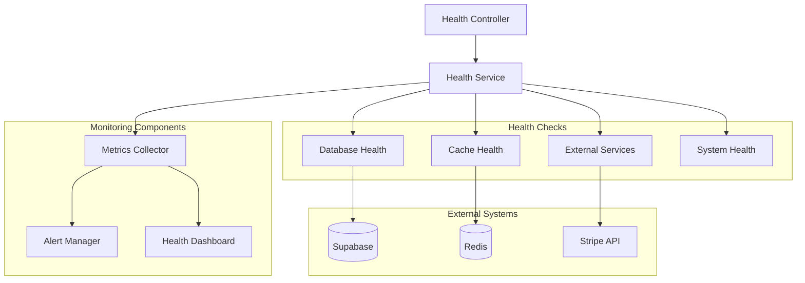
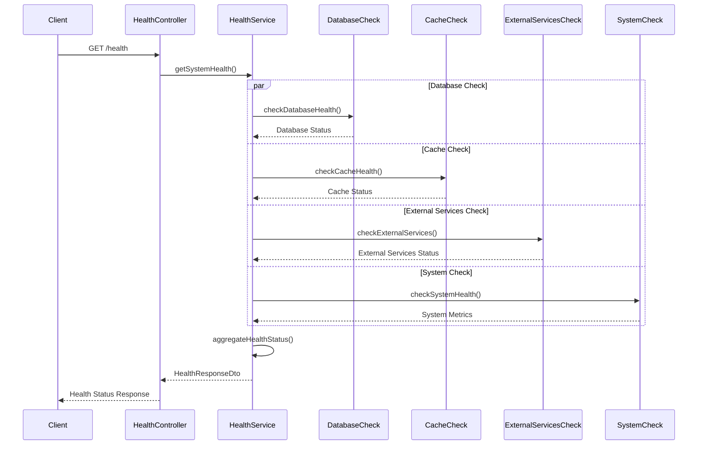
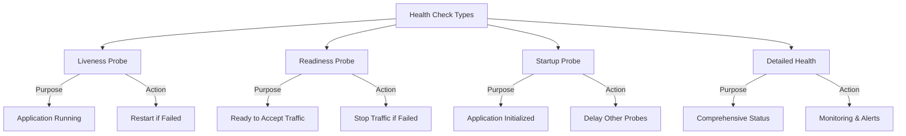
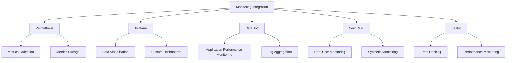
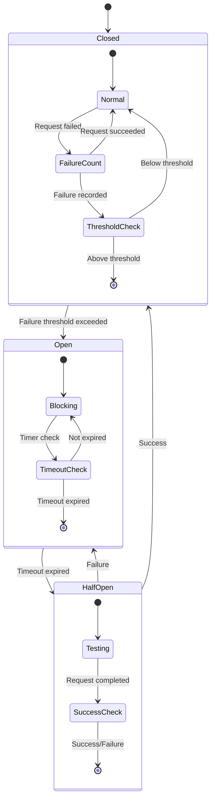

# Health Monitoring System

## Overview

The health monitoring system provides comprehensive application health checks, performance monitoring, and system observability. It includes endpoint health checks, database connectivity monitoring, cache status verification, and detailed system metrics reporting.

## System Architecture

### High-Level Architecture



### Health Check Flow



## Core Components

### Health Service

```typescript
export interface IHealthResponseDto {
  status: "healthy" | "degraded" | "unhealthy";
  timestamp: Date;
  uptime: number;
  version: string;
  environment: string;
  services: {
    database: IDatabaseHealthDto;
    cache?: ICacheHealthDto;
    external?: IExternalServicesHealthDto;
  };
  system: {
    memory: IMemoryHealthDto;
    cpu?: ICpuHealthDto;
    disk?: IDiskHealthDto;
  };
}

export interface IDatabaseHealthDto {
  status: "healthy" | "unhealthy";
  responseTime: number;
  message: string;
  setupInstructions?: string;
}

export interface ICacheHealthDto {
  status: "healthy" | "degraded" | "unavailable";
  redis: boolean;
  memory: boolean;
  responseTime: number;
}

export interface IMemoryHealthDto {
  used: number;
  total: number;
  external: number;
  usage: number; // percentage
}
```

### Health Check Implementation

```typescript
@Service()
export class HealthService {
  constructor(
    @Inject("supabase") private supabase?: SupabaseClient,
    private cacheService?: CacheService,
    private stripeService?: StripeService,
  ) {}

  async getSystemHealth(): Promise<IHealthResponseDto> {
    const startTime = Date.now();

    // Run all health checks in parallel
    const [
      databaseHealth,
      cacheHealth,
      externalHealth,
      memoryHealth,
      cpuHealth,
      diskHealth,
    ] = await Promise.allSettled([
      this.checkDatabaseHealth(),
      this.checkCacheHealth(),
      this.checkExternalServicesHealth(),
      this.checkMemoryHealth(),
      this.checkCpuHealth(),
      this.checkDiskHealth(),
    ]);

    const overallStatus = this.calculateOverallStatus({
      database: this.getSettledValue(databaseHealth),
      cache: this.getSettledValue(cacheHealth),
      external: this.getSettledValue(externalHealth),
    });

    return {
      status: overallStatus,
      timestamp: new Date(),
      uptime: process.uptime(),
      version: process.env.npm_package_version || "1.0.0",
      environment: process.env.NODE_ENV || "development",
      services: {
        database: this.getSettledValue(databaseHealth),
        cache: this.getSettledValue(cacheHealth),
        external: this.getSettledValue(externalHealth),
      },
      system: {
        memory: this.getSettledValue(memoryHealth),
        cpu: this.getSettledValue(cpuHealth),
        disk: this.getSettledValue(diskHealth),
      },
      responseTime: Date.now() - startTime,
    };
  }

  private async checkDatabaseHealth(): Promise<IDatabaseHealthDto> {
    const startTime = Date.now();

    try {
      if (config.database.provider === "supabase") {
        return await this.checkSupabaseHealth(startTime);
      } else {
        return await this.checkSQLiteHealth(startTime);
      }
    } catch (error) {
      return {
        status: "unhealthy",
        responseTime: Date.now() - startTime,
        message:
          error instanceof Error
            ? error.message
            : "Database health check failed",
        setupInstructions: this.getDatabaseSetupInstructions(),
      };
    }
  }

  private async checkSupabaseHealth(
    startTime: number,
  ): Promise<IDatabaseHealthDto> {
    if (!this.supabase) {
      return {
        status: "unhealthy",
        responseTime: 1,
        message: "Supabase client not configured",
        setupInstructions: this.getDatabaseSetupInstructions(),
      };
    }

    const { error } = await this.supabase
      .from("health_check")
      .select("1 as result")
      .limit(1);

    const responseTime = Date.now() - startTime;

    if (error) {
      return {
        status: "unhealthy",
        responseTime,
        message: `Database error: ${error.message}`,
        setupInstructions: this.getDatabaseSetupInstructions(),
      };
    }

    return {
      status: responseTime > 1000 ? "degraded" : "healthy",
      responseTime,
      message:
        responseTime > 1000
          ? `Database responding slowly: ${responseTime}ms`
          : "Database connection healthy",
    };
  }

  private async checkCacheHealth(): Promise<ICacheHealthDto> {
    const startTime = Date.now();

    try {
      if (!this.cacheService) {
        return {
          status: "unavailable",
          redis: false,
          memory: false,
          responseTime: 0,
        };
      }

      const healthStatus = this.cacheService.getHealthStatus();
      const responseTime = Date.now() - startTime;

      let status: "healthy" | "degraded" | "unavailable";
      if (healthStatus.redis && healthStatus.memory) {
        status = "healthy";
      } else if (healthStatus.memory) {
        status = "degraded"; // Memory-only fallback
      } else {
        status = "unavailable";
      }

      return {
        status,
        redis: healthStatus.redis,
        memory: healthStatus.memory,
        responseTime,
      };
    } catch (error) {
      return {
        status: "unavailable",
        redis: false,
        memory: false,
        responseTime: Date.now() - startTime,
      };
    }
  }

  private async checkExternalServicesHealth(): Promise<IExternalServicesHealthDto> {
    const checks = await Promise.allSettled([
      this.checkStripeHealth(),
      this.checkEmailServiceHealth(),
    ]);

    return {
      stripe: this.getSettledValue(checks[0]) || {
        status: "unknown",
        responseTime: 0,
      },
      email: this.getSettledValue(checks[1]) || {
        status: "unknown",
        responseTime: 0,
      },
    };
  }

  private async checkStripeHealth(): Promise<IExternalServiceHealthDto> {
    const startTime = Date.now();

    try {
      if (!this.stripeService) {
        return {
          status: "unavailable",
          responseTime: 0,
          message: "Stripe service not configured",
        };
      }

      // Simple health check - retrieve account info
      await this.stripeService.getAccountInfo();
      const responseTime = Date.now() - startTime;

      return {
        status: responseTime > 5000 ? "degraded" : "healthy",
        responseTime,
        message: "Stripe API accessible",
      };
    } catch (error) {
      return {
        status: "unhealthy",
        responseTime: Date.now() - startTime,
        message:
          error instanceof Error ? error.message : "Stripe API check failed",
      };
    }
  }

  private checkMemoryHealth(): IMemoryHealthDto {
    const memoryUsage = process.memoryUsage();
    const used = memoryUsage.heapUsed;
    const total = memoryUsage.heapTotal;
    const external = memoryUsage.external;
    const usage = (used / total) * 100;

    return {
      used,
      total,
      external,
      usage: Math.round(usage * 100) / 100,
    };
  }

  private calculateOverallStatus(healthChecks: {
    database: IDatabaseHealthDto;
    cache?: ICacheHealthDto;
    external?: IExternalServicesHealthDto;
  }): "healthy" | "degraded" | "unhealthy" {
    // Database is critical
    if (healthChecks.database.status === "unhealthy") {
      return "unhealthy";
    }

    // Check for any degraded services
    const hasDegradedServices = [
      healthChecks.database.status === "degraded",
      healthChecks.cache?.status === "degraded",
      healthChecks.external?.stripe?.status === "degraded",
    ].some(Boolean);

    if (hasDegradedServices) {
      return "degraded";
    }

    return "healthy";
  }
}
```

## Health Check Endpoints

### Basic Health Endpoint

```typescript
@JsonController("/health")
@Service()
export class HealthController {
  constructor(private healthService: HealthService) {}

  @Get("/")
  async getHealth(): Promise<IBasicHealthResponse> {
    const basicHealth = await this.healthService.getBasicHealth();
    return basicHealth;
  }

  @Get("/detailed")
  async getDetailedHealth(): Promise<IHealthResponseDto> {
    const detailedHealth = await this.healthService.getSystemHealth();
    return detailedHealth;
  }

  @Get("/ready")
  async getReadiness(): Promise<IReadinessResponse> {
    const readiness = await this.healthService.checkReadiness();
    return readiness;
  }

  @Get("/live")
  async getLiveness(): Promise<ILivenessResponse> {
    const liveness = await this.healthService.checkLiveness();
    return liveness;
  }
}
```

### Health Check Types



### Kubernetes Health Checks

```yaml
# deployment.yaml
apiVersion: apps/v1
kind: Deployment
metadata:
  name: api-scaffold
spec:
  template:
    spec:
      containers:
        - name: api-scaffold
          image: api-scaffold:latest
          ports:
            - containerPort: 3000

          # Liveness probe - restart container if fails
          livenessProbe:
            httpGet:
              path: /health/live
              port: 3000
            initialDelaySeconds: 30
            periodSeconds: 10
            timeoutSeconds: 5
            failureThreshold: 3

          # Readiness probe - stop traffic if fails
          readinessProbe:
            httpGet:
              path: /health/ready
              port: 3000
            initialDelaySeconds: 10
            periodSeconds: 5
            timeoutSeconds: 3
            failureThreshold: 3

          # Startup probe - delay other probes during startup
          startupProbe:
            httpGet:
              path: /health/live
              port: 3000
            initialDelaySeconds: 10
            periodSeconds: 5
            timeoutSeconds: 3
            failureThreshold: 10
```

## Metrics Collection

### Performance Metrics

```mermaid
graph TD
    MetricsCollection[Metrics Collection]

    MetricsCollection --> ApplicationMetrics[Application Metrics]
    MetricsCollection --> SystemMetrics[System Metrics]
    MetricsCollection --> BusinessMetrics[Business Metrics]
    MetricsCollection --> ExternalMetrics[External Service Metrics]

    ApplicationMetrics --> RequestLatency[Request Latency]
    ApplicationMetrics --> RequestCount[Request Count]
    ApplicationMetrics --> ErrorRate[Error Rate]
    ApplicationMetrics --> ActiveConnections[Active Connections]

    SystemMetrics --> CPUUsage[CPU Usage]
    SystemMetrics --> MemoryUsage[Memory Usage]
    SystemMetrics --> DiskUsage[Disk Usage]
    SystemMetrics --> NetworkIO[Network I/O]

    BusinessMetrics --> UserRegistrations[User Registrations]
    BusinessMetrics --> PaymentVolume[Payment Volume]
    BusinessMetrics --> APIUsage[API Usage]

    ExternalMetrics --> DatabaseLatency[Database Latency]
    ExternalMetrics --> CacheHitRate[Cache Hit Rate]
    ExternalMetrics --> ExternalAPILatency[External API Latency]
```



### Metrics Service

```typescript
export interface IApplicationMetrics {
  requests: {
    total: number;
    perSecond: number;
    avgLatency: number;
    errorRate: number;
  };
  database: {
    connections: number;
    avgQueryTime: number;
    slowQueries: number;
  };
  cache: {
    hitRate: number;
    operations: number;
    avgLatency: number;
  };
  memory: {
    heapUsed: number;
    heapTotal: number;
    external: number;
    usage: number;
  };
}

@Service()
export class MetricsService {
  private metrics: IApplicationMetrics = {
    requests: { total: 0, perSecond: 0, avgLatency: 0, errorRate: 0 },
    database: { connections: 0, avgQueryTime: 0, slowQueries: 0 },
    cache: { hitRate: 0, operations: 0, avgLatency: 0 },
    memory: { heapUsed: 0, heapTotal: 0, external: 0, usage: 0 },
  };

  private requestTimes: number[] = [];
  private requestErrors: number = 0;
  private requestTotal: number = 0;

  recordRequest(duration: number, success: boolean): void {
    this.requestTimes.push(duration);
    this.requestTotal++;

    if (!success) {
      this.requestErrors++;
    }

    // Keep only last 1000 requests for rolling averages
    if (this.requestTimes.length > 1000) {
      this.requestTimes.shift();
    }

    this.updateRequestMetrics();
  }

  recordDatabaseQuery(duration: number, isSlowQuery: boolean): void {
    // Update database metrics
    this.metrics.database.avgQueryTime =
      (this.metrics.database.avgQueryTime + duration) / 2;

    if (isSlowQuery) {
      this.metrics.database.slowQueries++;
    }
  }

  recordCacheOperation(hit: boolean, duration: number): void {
    this.metrics.cache.operations++;

    // Update hit rate
    const hitCount = hit ? 1 : 0;
    this.metrics.cache.hitRate = (this.metrics.cache.hitRate + hitCount) / 2;

    // Update latency
    this.metrics.cache.avgLatency =
      (this.metrics.cache.avgLatency + duration) / 2;
  }

  getMetrics(): IApplicationMetrics {
    this.updateSystemMetrics();
    return { ...this.metrics };
  }

  private updateRequestMetrics(): void {
    const recentRequests = this.requestTimes.slice(-100); // Last 100 requests

    this.metrics.requests.total = this.requestTotal;
    this.metrics.requests.avgLatency =
      recentRequests.reduce((sum, time) => sum + time, 0) /
        recentRequests.length || 0;
    this.metrics.requests.errorRate =
      (this.requestErrors / this.requestTotal) * 100;
  }

  private updateSystemMetrics(): void {
    const memoryUsage = process.memoryUsage();

    this.metrics.memory = {
      heapUsed: memoryUsage.heapUsed,
      heapTotal: memoryUsage.heapTotal,
      external: memoryUsage.external,
      usage: (memoryUsage.heapUsed / memoryUsage.heapTotal) * 100,
    };
  }
}
```

## Alerting System

### Alert Configuration

```mermaid
graph TD
    AlertSystem[Alert System]

    AlertSystem --> Thresholds[Alert Thresholds]
    AlertSystem --> Channels[Alert Channels]
    AlertSystem --> Escalation[Escalation Rules]
    AlertSystem --> Suppression[Alert Suppression]

    Thresholds --> MemoryUsage[Memory > 80%]
    Thresholds --> ErrorRate[Error Rate > 5%]
    Thresholds --> ResponseTime[Response Time > 2s]
    Thresholds --> DatabaseLatency[DB Latency > 1s]

    Channels --> Email[Email Notifications]
    Channels --> Slack[Slack Integration]
    Channels --> SMS[SMS Alerts]
    Channels --> Webhook[Webhook Endpoints]

    Escalation --> L1Support[L1 Support]
    Escalation --> L2Engineering[L2 Engineering]
    Escalation --> OnCall[On-Call Engineer]

    Suppression --> MaintenanceMode[Maintenance Mode]
    Suppression --> DuplicateAlerts[Duplicate Filtering]
    Suppression --> BusinessHours[Business Hours Only]
```



### Alert Rules

```typescript
export interface IAlertRule {
  id: string;
  name: string;
  metric: string;
  condition: "greater_than" | "less_than" | "equals";
  threshold: number;
  duration: number; // seconds
  severity: "low" | "medium" | "high" | "critical";
  channels: string[];
  enabled: boolean;
}

export interface IAlert {
  id: string;
  ruleId: string;
  ruleName: string;
  severity: string;
  message: string;
  value: number;
  threshold: number;
  timestamp: Date;
  resolved: boolean;
  resolvedAt?: Date;
}

@Service()
export class AlertService {
  private activeAlerts = new Map<string, IAlert>();
  private alertRules: IAlertRule[] = [
    {
      id: "memory-high",
      name: "High Memory Usage",
      metric: "memory.usage",
      condition: "greater_than",
      threshold: 80,
      duration: 300, // 5 minutes
      severity: "high",
      channels: ["email", "slack"],
      enabled: true,
    },
    {
      id: "error-rate-high",
      name: "High Error Rate",
      metric: "requests.errorRate",
      condition: "greater_than",
      threshold: 5,
      duration: 60, // 1 minute
      severity: "critical",
      channels: ["email", "slack", "sms"],
      enabled: true,
    },
    {
      id: "database-slow",
      name: "Slow Database Queries",
      metric: "database.avgQueryTime",
      condition: "greater_than",
      threshold: 1000, // 1 second
      duration: 120, // 2 minutes
      severity: "medium",
      channels: ["email"],
      enabled: true,
    },
  ];

  async checkAlerts(metrics: IApplicationMetrics): Promise<void> {
    for (const rule of this.alertRules) {
      if (!rule.enabled) continue;

      const metricValue = this.getMetricValue(metrics, rule.metric);
      const isTriggered = this.evaluateCondition(
        metricValue,
        rule.condition,
        rule.threshold,
      );

      const alertId = `${rule.id}-${Date.now()}`;

      if (isTriggered && !this.activeAlerts.has(rule.id)) {
        // New alert
        const alert: IAlert = {
          id: alertId,
          ruleId: rule.id,
          ruleName: rule.name,
          severity: rule.severity,
          message: this.generateAlertMessage(rule, metricValue),
          value: metricValue,
          threshold: rule.threshold,
          timestamp: new Date(),
          resolved: false,
        };

        this.activeAlerts.set(rule.id, alert);
        await this.sendAlert(alert, rule.channels);
      } else if (!isTriggered && this.activeAlerts.has(rule.id)) {
        // Alert resolved
        const alert = this.activeAlerts.get(rule.id)!;
        alert.resolved = true;
        alert.resolvedAt = new Date();

        await this.sendAlertResolution(alert, rule.channels);
        this.activeAlerts.delete(rule.id);
      }
    }
  }

  private getMetricValue(
    metrics: IApplicationMetrics,
    metricPath: string,
  ): number {
    const path = metricPath.split(".");
    let value: any = metrics;

    for (const segment of path) {
      value = value[segment];
      if (value === undefined) return 0;
    }

    return typeof value === "number" ? value : 0;
  }

  private evaluateCondition(
    value: number,
    condition: string,
    threshold: number,
  ): boolean {
    switch (condition) {
      case "greater_than":
        return value > threshold;
      case "less_than":
        return value < threshold;
      case "equals":
        return value === threshold;
      default:
        return false;
    }
  }

  private async sendAlert(alert: IAlert, channels: string[]): Promise<void> {
    for (const channel of channels) {
      try {
        await this.sendToChannel(channel, alert);
      } catch (error) {
        console.error(`Failed to send alert to ${channel}:`, error);
      }
    }
  }

  private async sendToChannel(channel: string, alert: IAlert): Promise<void> {
    switch (channel) {
      case "email":
        await this.emailService.sendAlert(alert);
        break;
      case "slack":
        await this.slackService.sendAlert(alert);
        break;
      case "sms":
        await this.smsService.sendAlert(alert);
        break;
      case "webhook":
        await this.webhookService.sendAlert(alert);
        break;
    }
  }
}
```

## Health Dashboard

### Dashboard Components

```mermaid
graph TD
    HealthDashboard[Health Dashboard]

    HealthDashboard --> StatusOverview[Status Overview]
    HealthDashboard --> ServiceHealth[Service Health]
    HealthDashboard --> Metrics[Real-time Metrics]
    HealthDashboard --> Alerts[Active Alerts]
    HealthDashboard --> History[Historical Data]

    StatusOverview --> OverallStatus[Overall Status]
    StatusOverview --> Uptime[System Uptime]
    StatusOverview --> Version[Application Version]

    ServiceHealth --> DatabaseStatus[Database Status]
    ServiceHealth --> CacheStatus[Cache Status]
    ServiceHealth --> ExternalStatus[External Services]

    Metrics --> RequestMetrics[Request Metrics]
    Metrics --> PerformanceMetrics[Performance Metrics]
    Metrics --> ResourceUsage[Resource Usage]

    Alerts --> ActiveAlerts[Active Alerts]
    Alerts --> AlertHistory[Alert History]
    Alerts --> AlertRules[Alert Rules]

    History --> UptimeHistory[Uptime History]
    History --> PerformanceHistory[Performance Trends]
    History --> IncidentHistory[Incident History]
```



### Dashboard API

```typescript
@JsonController("/api/monitoring")
@Service()
export class MonitoringController {
  constructor(
    private healthService: HealthService,
    private metricsService: MetricsService,
    private alertService: AlertService,
  ) {}

  @Get("/dashboard")
  async getDashboard(): Promise<IDashboardData> {
    const [health, metrics, alerts] = await Promise.all([
      this.healthService.getSystemHealth(),
      this.metricsService.getMetrics(),
      this.alertService.getActiveAlerts(),
    ]);

    return {
      health,
      metrics,
      alerts,
      timestamp: new Date(),
    };
  }

  @Get("/metrics")
  async getMetrics(): Promise<IApplicationMetrics> {
    return this.metricsService.getMetrics();
  }

  @Get("/alerts")
  async getAlerts(): Promise<IAlert[]> {
    return this.alertService.getActiveAlerts();
  }

  @Get("/uptime")
  async getUptimeData(
    @QueryParam("period") period: string = "24h",
  ): Promise<IUptimeData> {
    return this.healthService.getUptimeData(period);
  }

  @Post("/test-alert")
  @RequireRole(UserRole.Admin)
  async testAlert(
    @Body() alertData: { type: string; message: string },
  ): Promise<void> {
    await this.alertService.sendTestAlert(alertData);
  }
}
```

## Monitoring Integration

### External Monitoring Services



### Prometheus Integration

```typescript
// Prometheus metrics endpoint
@Get('/metrics')
async getPrometheusMetrics(): Promise<string> {
  const metrics = await this.metricsService.getMetrics();

  const prometheusMetrics = [
    `# HELP api_requests_total Total number of API requests`,
    `# TYPE api_requests_total counter`,
    `api_requests_total ${metrics.requests.total}`,
    ``,
    `# HELP api_request_duration_seconds Request duration in seconds`,
    `# TYPE api_request_duration_seconds histogram`,
    `api_request_duration_seconds ${metrics.requests.avgLatency / 1000}`,
    ``,
    `# HELP memory_usage_bytes Memory usage in bytes`,
    `# TYPE memory_usage_bytes gauge`,
    `memory_usage_bytes{type="heap_used"} ${metrics.memory.heapUsed}`,
    `memory_usage_bytes{type="heap_total"} ${metrics.memory.heapTotal}`,
    ``,
    `# HELP cache_hit_rate Cache hit rate percentage`,
    `# TYPE cache_hit_rate gauge`,
    `cache_hit_rate ${metrics.cache.hitRate}`,
  ].join('\n');

  return prometheusMetrics;
}
```

## Circuit Breaker Pattern

### Circuit Breaker Implementation



### Circuit Breaker Service

```typescript
export interface ICircuitBreakerConfig {
  failureThreshold: number;
  timeoutMs: number;
  resetTimeoutMs: number;
}

export enum CircuitBreakerState {
  CLOSED = "closed",
  OPEN = "open",
  HALF_OPEN = "half_open",
}

@Service()
export class CircuitBreakerService {
  private circuits = new Map<string, ICircuitBreaker>();

  createCircuit(name: string, config: ICircuitBreakerConfig): ICircuitBreaker {
    const circuit: ICircuitBreaker = {
      name,
      state: CircuitBreakerState.CLOSED,
      failureCount: 0,
      lastFailureTime: null,
      config,
    };

    this.circuits.set(name, circuit);
    return circuit;
  }

  async execute<T>(
    circuitName: string,
    operation: () => Promise<T>,
  ): Promise<T> {
    const circuit = this.circuits.get(circuitName);
    if (!circuit) {
      throw new Error(`Circuit breaker ${circuitName} not found`);
    }

    // Check circuit state
    this.updateCircuitState(circuit);

    if (circuit.state === CircuitBreakerState.OPEN) {
      throw new Error(`Circuit breaker ${circuitName} is open`);
    }

    try {
      const result = await operation();
      this.onSuccess(circuit);
      return result;
    } catch (error) {
      this.onFailure(circuit);
      throw error;
    }
  }

  private updateCircuitState(circuit: ICircuitBreaker): void {
    if (circuit.state === CircuitBreakerState.OPEN) {
      const timeSinceLastFailure = Date.now() - (circuit.lastFailureTime || 0);

      if (timeSinceLastFailure >= circuit.config.resetTimeoutMs) {
        circuit.state = CircuitBreakerState.HALF_OPEN;
      }
    }
  }

  private onSuccess(circuit: ICircuitBreaker): void {
    circuit.failureCount = 0;
    if (circuit.state === CircuitBreakerState.HALF_OPEN) {
      circuit.state = CircuitBreakerState.CLOSED;
    }
  }

  private onFailure(circuit: ICircuitBreaker): void {
    circuit.failureCount++;
    circuit.lastFailureTime = Date.now();

    if (circuit.failureCount >= circuit.config.failureThreshold) {
      circuit.state = CircuitBreakerState.OPEN;
    }
  }
}
```

## Performance Monitoring

### Request Performance Tracking

```typescript
export class PerformanceMiddleware {
  constructor(
    private metricsService: MetricsService,
    private logger: LoggerService,
  ) {}

  async use(req: Request, res: Response, next: NextFunction): Promise<void> {
    const startTime = Date.now();
    const originalSend = res.send;

    res.send = function (data: any) {
      const endTime = Date.now();
      const duration = endTime - startTime;
      const success = res.statusCode < 400;

      // Record metrics
      metricsService.recordRequest(duration, success);

      // Log slow requests
      if (duration > 2000) {
        // > 2 seconds
        logger.warn("Slow request detected", {
          method: req.method,
          url: req.url,
          duration,
          statusCode: res.statusCode,
          userAgent: req.get("user-agent"),
          ip: req.ip,
        });
      }

      return originalSend.call(this, data);
    };

    next();
  }
}
```

### Database Performance Monitoring

```typescript
export class DatabasePerformanceMonitor {
  constructor(private metricsService: MetricsService) {}

  async wrapQuery<T>(queryName: string, query: () => Promise<T>): Promise<T> {
    const startTime = Date.now();

    try {
      const result = await query();
      const duration = Date.now() - startTime;
      const isSlowQuery = duration > 1000; // > 1 second

      this.metricsService.recordDatabaseQuery(duration, isSlowQuery);

      if (isSlowQuery) {
        this.logger.warn("Slow database query detected", {
          queryName,
          duration,
        });
      }

      return result;
    } catch (error) {
      const duration = Date.now() - startTime;
      this.metricsService.recordDatabaseQuery(duration, false);
      throw error;
    }
  }
}
```

## Testing

### Health Check Testing

```typescript
describe("HealthService", () => {
  let healthService: HealthService;
  let mockSupabase: jest.Mocked<SupabaseClient>;
  let mockCacheService: jest.Mocked<CacheService>;

  beforeEach(() => {
    mockSupabase = createMockSupabaseClient();
    mockCacheService = createMockCacheService();
    healthService = new HealthService(mockSupabase, mockCacheService);
  });

  describe("Database Health Check", () => {
    it("should return healthy status for responsive database", async () => {
      mockSupabase.from.mockReturnValue({
        select: jest.fn().mockReturnValue({
          limit: jest.fn().mockResolvedValue({ error: null }),
        }),
      } as any);

      const health = await healthService.getSystemHealth();

      expect(health.services.database.status).toBe("healthy");
      expect(health.services.database.responseTime).toBeLessThan(1000);
    });

    it("should return degraded status for slow database", async () => {
      mockSupabase.from.mockReturnValue({
        select: jest.fn().mockReturnValue({
          limit: jest
            .fn()
            .mockImplementation(
              () =>
                new Promise((resolve) =>
                  setTimeout(() => resolve({ error: null }), 1500),
                ),
            ),
        }),
      } as any);

      const health = await healthService.getSystemHealth();

      expect(health.services.database.status).toBe("degraded");
      expect(health.services.database.responseTime).toBeGreaterThan(1000);
    });

    it("should return unhealthy status for database errors", async () => {
      mockSupabase.from.mockReturnValue({
        select: jest.fn().mockReturnValue({
          limit: jest.fn().mockResolvedValue({
            error: { message: "Connection failed" },
          }),
        }),
      } as any);

      const health = await healthService.getSystemHealth();

      expect(health.services.database.status).toBe("unhealthy");
      expect(health.services.database.message).toContain("Connection failed");
    });
  });

  describe("Cache Health Check", () => {
    it("should return healthy status for Redis + Memory", async () => {
      mockCacheService.getHealthStatus.mockReturnValue({
        redis: true,
        memory: true,
      });

      const health = await healthService.getSystemHealth();

      expect(health.services.cache?.status).toBe("healthy");
      expect(health.services.cache?.redis).toBe(true);
      expect(health.services.cache?.memory).toBe(true);
    });

    it("should return degraded status for memory-only cache", async () => {
      mockCacheService.getHealthStatus.mockReturnValue({
        redis: false,
        memory: true,
      });

      const health = await healthService.getSystemHealth();

      expect(health.services.cache?.status).toBe("degraded");
      expect(health.services.cache?.redis).toBe(false);
      expect(health.services.cache?.memory).toBe(true);
    });
  });
});
```

### Metrics Testing

```typescript
describe("MetricsService", () => {
  let metricsService: MetricsService;

  beforeEach(() => {
    metricsService = new MetricsService();
  });

  it("should record request metrics correctly", () => {
    metricsService.recordRequest(100, true);
    metricsService.recordRequest(200, true);
    metricsService.recordRequest(150, false);

    const metrics = metricsService.getMetrics();

    expect(metrics.requests.total).toBe(3);
    expect(metrics.requests.avgLatency).toBe(150);
    expect(metrics.requests.errorRate).toBe(33.33);
  });

  it("should record cache operation metrics", () => {
    metricsService.recordCacheOperation(true, 5);
    metricsService.recordCacheOperation(false, 10);
    metricsService.recordCacheOperation(true, 3);

    const metrics = metricsService.getMetrics();

    expect(metrics.cache.operations).toBe(3);
    expect(metrics.cache.hitRate).toBeCloseTo(66.67, 1);
    expect(metrics.cache.avgLatency).toBeCloseTo(6, 1);
  });
});
```

## Configuration

### Health Check Configuration

```typescript
export const healthConfig = {
  database: {
    timeout: parseInt(process.env.DB_HEALTH_TIMEOUT || "5000"),
    retries: parseInt(process.env.DB_HEALTH_RETRIES || "3"),
  },
  cache: {
    timeout: parseInt(process.env.CACHE_HEALTH_TIMEOUT || "2000"),
  },
  external: {
    timeout: parseInt(process.env.EXTERNAL_HEALTH_TIMEOUT || "10000"),
    stripe: {
      enabled: process.env.STRIPE_HEALTH_CHECK === "true",
    },
  },
  alerts: {
    enabled: process.env.ALERTS_ENABLED !== "false",
    channels: {
      email: process.env.ALERT_EMAIL_ENABLED === "true",
      slack: process.env.ALERT_SLACK_ENABLED === "true",
      sms: process.env.ALERT_SMS_ENABLED === "true",
    },
  },
  metrics: {
    retention: parseInt(process.env.METRICS_RETENTION_HOURS || "24"),
    collection_interval: parseInt(process.env.METRICS_INTERVAL || "60000"),
  },
};
```

## Best Practices

### Health Check Design

1. **Lightweight Checks**: Keep health checks simple and fast
2. **Dependency Isolation**: Test each dependency independently
3. **Graceful Degradation**: System should continue operating with degraded services
4. **Meaningful Responses**: Provide actionable information in health check responses
5. **Consistent Format**: Use standardized health check response formats

### Monitoring Strategy

1. **Proactive Monitoring**: Monitor trends, not just current state
2. **Alert Fatigue**: Avoid excessive alerting with proper thresholds
3. **Business Metrics**: Include business-relevant metrics alongside technical ones
4. **Historical Data**: Maintain historical data for trend analysis
5. **Documentation**: Document all metrics and alert thresholds

## Related Systems

- **Logging System**: Health events and performance metrics logging
- **Database System**: Database connectivity and performance monitoring
- **Caching System**: Cache performance and availability monitoring
- **Authentication System**: Authentication service health checks
- **Payment System**: External payment service monitoring

## Troubleshooting

### Common Issues

1. **False Positive Alerts**: Adjust thresholds based on normal operating patterns
2. **Health Check Timeouts**: Optimize health check queries and increase timeouts
3. **Memory Leaks**: Monitor memory usage trends and implement proper cleanup
4. **Database Connection Issues**: Monitor connection pool usage and limits
5. **External Service Dependencies**: Implement circuit breakers for external services

### Debug Tools

```typescript
// Enable detailed health logging
export const debugHealth = process.env.DEBUG_HEALTH === "true";

if (debugHealth) {
  console.log("Health check debug mode enabled");

  // Log all health check operations
  healthService.onHealthCheck((check, result, duration) => {
    console.log(`Health check ${check} completed in ${duration}ms:`, result);
  });

  // Log all metric updates
  metricsService.onMetricUpdate((metric, value) => {
    console.log(`Metric ${metric} updated to ${value}`);
  });
}
```
