# Logging System

## Overview

The logging system provides comprehensive, structured logging capabilities built on Winston with domain-specific logging methods, automatic log rotation, and security-conscious sanitization. It implements a centralized logging pattern with dependency injection for clean integration across the application.

## System Architecture

### High-Level Architecture

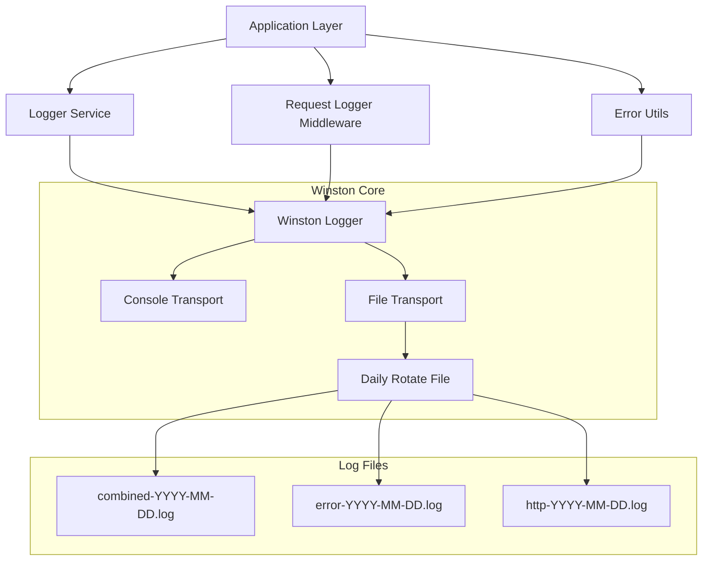

### Component Interaction Flow

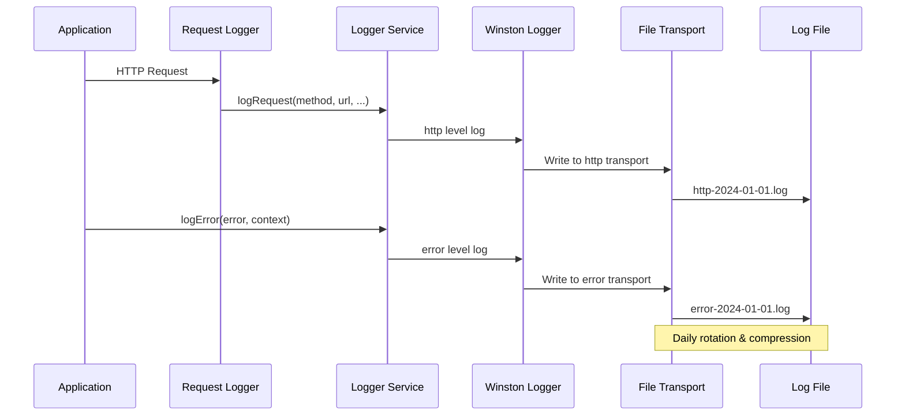

## Core Components

### Logger Service

```typescript
@Service()
export class LoggerService {
  private logger: Logger;

  constructor() {
    this.logger = this.createLogger();
  }

  // Core logging methods
  error(message: string, meta?: object): void;
  warn(message: string, meta?: object): void;
  info(message: string, meta?: object): void;
  http(message: string, meta?: object): void;
  debug(message: string, meta?: object): void;

  // Specialized logging methods
  logError(error: Error, context?: string): void;
  logRequest(
    method: string,
    url: string,
    statusCode: number,
    responseTime: number,
    userAgent?: string,
    ip?: string,
  ): void;
  logStripeEvent(eventType: string, eventId: string, processed: boolean): void;
  logDatabaseOperation(
    operation: string,
    table: string,
    success: boolean,
    duration?: number,
  ): void;
  logCacheOperation(
    operation: string,
    key: string,
    hit: boolean,
    duration?: number,
  ): void;
  logAuthEvent(
    event: string,
    userId?: string,
    success?: boolean,
    details?: object,
  ): void;
}
```

### Custom Log Levels

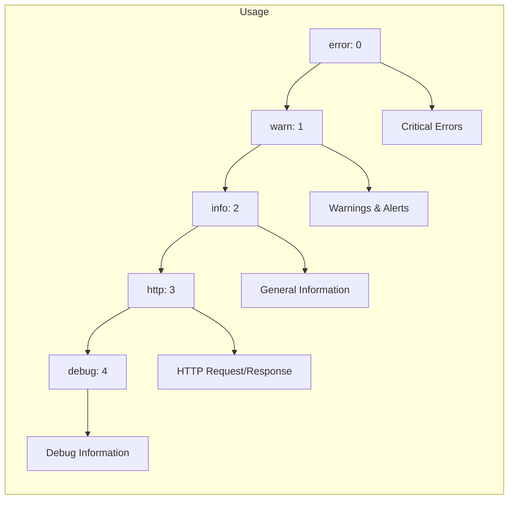

### Configuration System

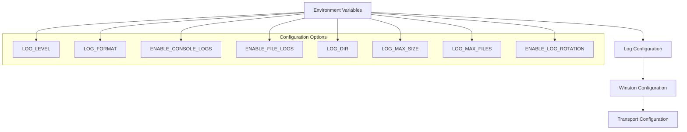

## Transport Configuration

### Console Transport

```typescript
interface ConsoleTransportConfig {
  level: string;
  handleExceptions: boolean;
  json: boolean;
  colorize: boolean;
  format: winston.Logform.Format;
}

// Console output format
const consoleFormat = winston.format.combine(
  winston.format.timestamp({ format: "YYYY-MM-DD HH:mm:ss" }),
  winston.format.colorize({ all: true }),
  winston.format.printf((info) => {
    return `${info.timestamp} ${info.level}: ${info.message}`;
  }),
);
```

### File Transport Configuration

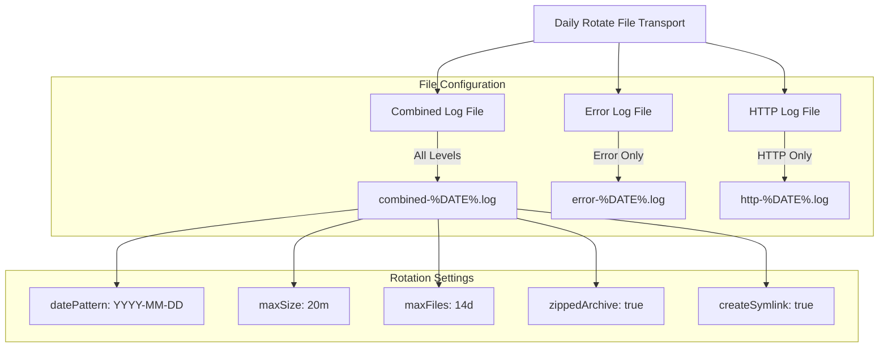

### File Transport Implementation

```typescript
const fileTransportConfig = {
  level: "info",
  filename: path.join(logDir, "combined-%DATE%.log"),
  datePattern: "YYYY-MM-DD",
  maxSize: config.logging.maxSize,
  maxFiles: config.logging.maxFiles,
  zippedArchive: true,
  createSymlink: true,
  format: winston.format.combine(
    winston.format.timestamp(),
    winston.format.json(),
  ),
};
```

## Specialized Logging Methods

### Error Logging

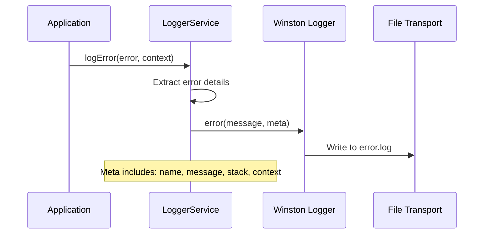

### HTTP Request Logging

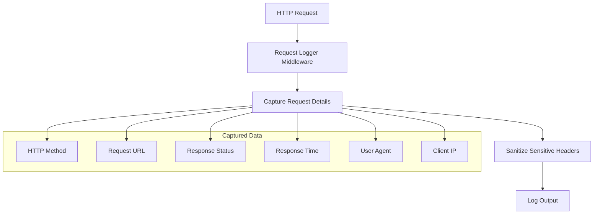

### Header Sanitization

```typescript
const sensitiveHeaders = [
  "authorization",
  "cookie",
  "x-api-key",
  "x-auth-token",
  "stripe-signature",
];

function sanitizeHeaders(
  headers: Record<string, string>,
): Record<string, string> {
  return Object.keys(headers).reduce(
    (sanitized, key) => {
      const lowerKey = key.toLowerCase();
      sanitized[key] = sensitiveHeaders.includes(lowerKey)
        ? "[REDACTED]"
        : headers[key];
      return sanitized;
    },
    {} as Record<string, string>,
  );
}
```

### Domain-Specific Logging

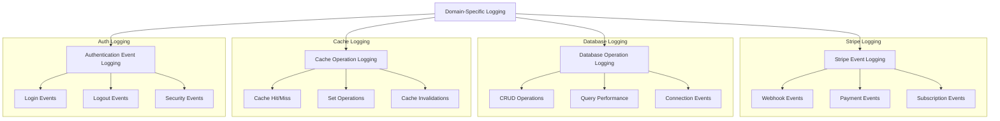

## Request Logging Middleware

### Middleware Implementation

```typescript
export class RequestLoggerMiddleware {
  static create(): RequestHandler {
    return (req: Request, res: Response, next: NextFunction) => {
      const start = Date.now();

      res.on("finish", () => {
        const duration = Date.now() - start;
        const logger = Container.get(LoggerService);

        logger.logRequest(
          req.method,
          req.originalUrl,
          res.statusCode,
          duration,
          req.get("User-Agent"),
          req.ip,
        );
      });

      next();
    };
  }
}
```

### Request Logging Flow

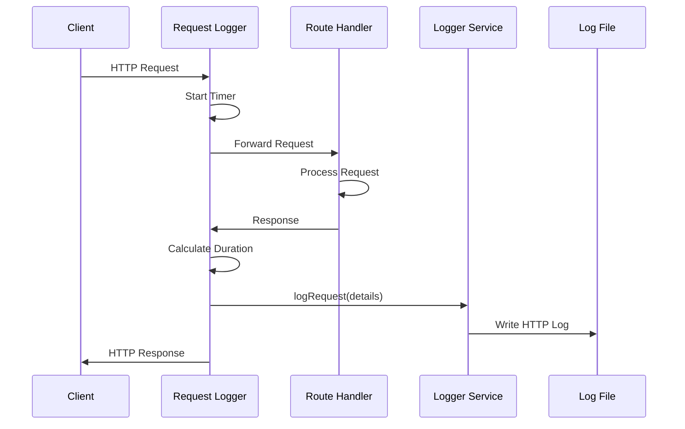

## Error Handling Integration

### Error Logging Strategy

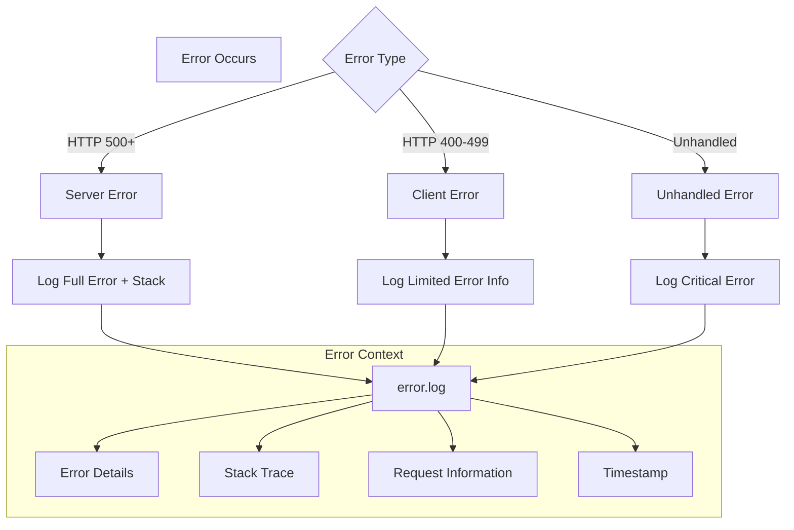

### Error Utilities Integration

```typescript
export function logError(
  error: IErrorObject,
  path?: string,
  timestamp?: string,
): void {
  const errorInfo = {
    message: error.message,
    stack: error.stack,
    name: error.name,
    path,
    timestamp: timestamp || new Date().toISOString(),
    statusCode: error.statusCode,
  };

  // Use console.log to avoid circular dependency with LoggerService
  if (error.statusCode >= 500) {
    console.error("Server Error:", JSON.stringify(errorInfo, null, 2));
  } else {
    console.warn("Client Error:", JSON.stringify(errorInfo, null, 2));
  }
}
```

## Configuration Management

### Environment-Based Configuration

```mermaid
graph TD
    Environment[Environment]

    Environment --> Development[Development]
    Environment --> Testing[Testing]
    Environment --> Staging[Staging]
    Environment --> Production[Production]

    subgraph "Development Config"
        Development --> DevLevel[LOG_LEVEL=debug]
        Development --> DevConsole[ENABLE_CONSOLE_LOGS=true]
        Development --> DevFile[ENABLE_FILE_LOGS=false]
    end

    subgraph "Production Config"
        Production --> ProdLevel[LOG_LEVEL=info]
        Production --> ProdConsole[ENABLE_CONSOLE_LOGS=false]
        Production --> ProdFile[ENABLE_FILE_LOGS=true]
        Production --> ProdDir[LOG_DIR=/var/log/app]
        Production --> ProdRotation[ENABLE_LOG_ROTATION=true]
    end

    subgraph "Testing Config"
        Testing --> TestLevel[LOG_LEVEL=error]
        Testing --> TestConsole[ENABLE_CONSOLE_LOGS=false]
        Testing --> TestFile[ENABLE_FILE_LOGS=false]
    end
```

### Configuration Schema

```typescript
interface LoggingConfig {
  level: "error" | "warn" | "info" | "http" | "debug";
  format: "combined" | "simple" | "json";
  enableConsole: boolean;
  enableFile: boolean;
  dir: string;
  maxSize: string;
  maxFiles: number;
  enableRotation: boolean;
}

const loggingConfig: LoggingConfig = {
  level: process.env.LOG_LEVEL || "info",
  format: process.env.LOG_FORMAT || "combined",
  enableConsole: process.env.ENABLE_CONSOLE_LOGS !== "false",
  enableFile: process.env.ENABLE_FILE_LOGS === "true",
  dir: process.env.LOG_DIR || "logs",
  maxSize: process.env.LOG_MAX_SIZE || "20m",
  maxFiles: parseInt(process.env.LOG_MAX_FILES || "14", 10),
  enableRotation: process.env.ENABLE_LOG_ROTATION !== "false",
};
```

## Security Features

### Sensitive Data Protection

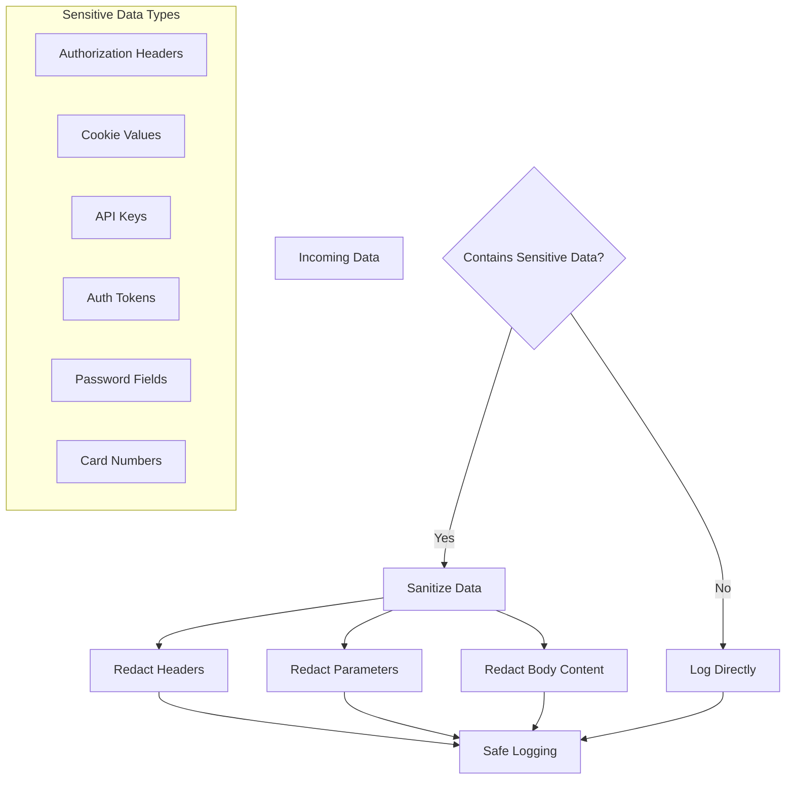

### Security Implementation

```typescript
const sensitivePatterns = {
  headers: [
    "authorization",
    "cookie",
    "x-api-key",
    "x-auth-token",
    "stripe-signature",
  ],
  params: ["password", "token", "secret", "key"],
  body: ["password", "card_number", "cvv", "ssn"],
};

function sanitizeLogData(data: any): any {
  if (typeof data === "object" && data !== null) {
    const sanitized = { ...data };

    Object.keys(sanitized).forEach((key) => {
      const lowerKey = key.toLowerCase();
      if (
        sensitivePatterns.headers.includes(lowerKey) ||
        sensitivePatterns.params.includes(lowerKey) ||
        sensitivePatterns.body.includes(lowerKey)
      ) {
        sanitized[key] = "[REDACTED]";
      }
    });

    return sanitized;
  }

  return data;
}
```

## Performance Monitoring

### Request Performance Tracking

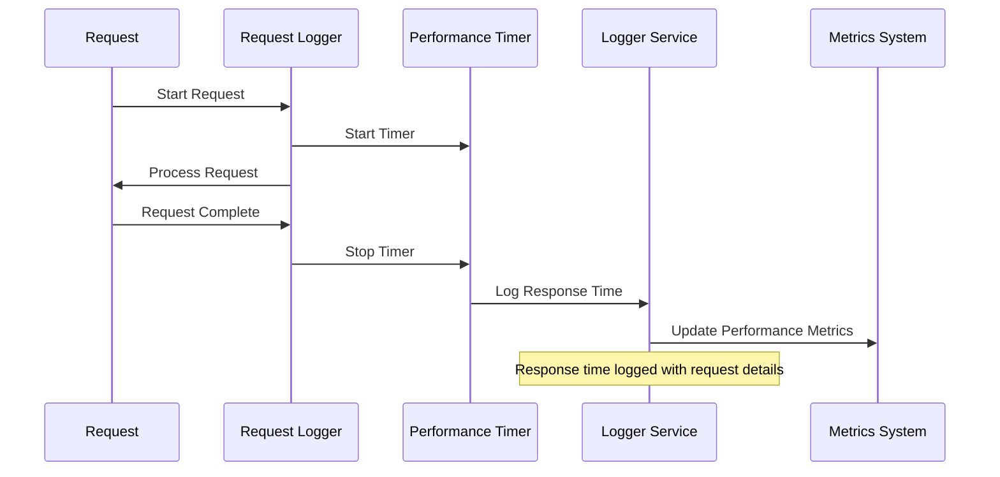

### Performance Logging Format

```typescript
interface PerformanceLogEntry {
  method: string;
  url: string;
  statusCode: number;
  responseTime: number;
  userAgent?: string;
  ip?: string;
  timestamp: string;
  service: string;
}

// Example log entry
{
  "method": "GET",
  "url": "/api/users/123",
  "statusCode": 200,
  "responseTime": 45,
  "userAgent": "Mozilla/5.0...",
  "ip": "192.168.1.100",
  "timestamp": "2024-01-01T12:00:00.000Z",
  "service": "http",
  "level": "http"
}
```

## Log Rotation and Archival

### Rotation Strategy

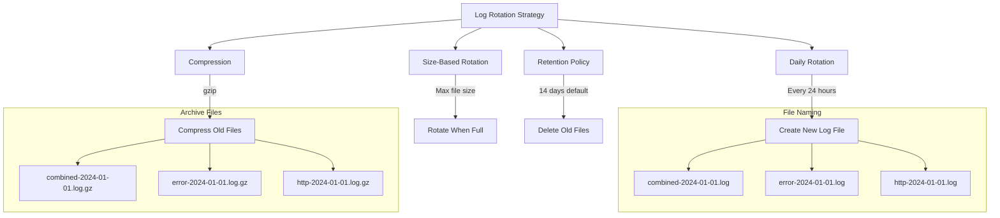

### Symlink Management

```typescript
const transportConfig = {
  createSymlink: true, // Creates symlinks to current log files
  symlinkName: "current.log",
  auditFile: path.join(logDir, "audit.json"),
  handleExceptions: true,
  handleRejections: true,
};

// Results in:
// logs/combined-2024-01-01.log (actual file)
// logs/current-combined.log -> combined-2024-01-01.log (symlink)
```

## Integration with Other Systems

### Service Integration Pattern

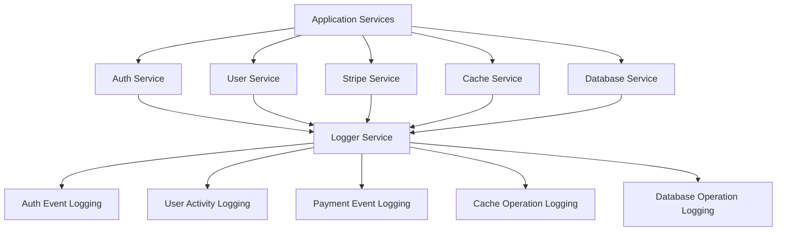

### Dependency Injection Integration

```typescript
// Service constructor injection
@Service()
export class UserService {
  constructor(
    private userRepository: UserRepository,
    private logger: LoggerService,
  ) {}

  async createUser(userData: CreateUserDto): Promise<User> {
    try {
      const user = await this.userRepository.create(userData);
      this.logger.info("User created successfully", { userId: user.id });
      return user;
    } catch (error) {
      this.logger.logError(error as Error, "UserService.createUser");
      throw error;
    }
  }
}
```

## Monitoring and Observability

### Log Analysis Dashboard

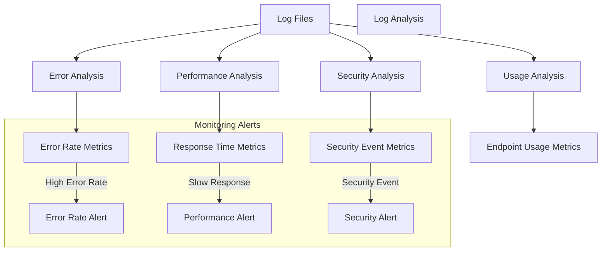

### Health Check Integration

```typescript
export class LoggingHealthCheck {
  constructor(private logger: LoggerService) {}

  async checkHealth(): Promise<HealthStatus> {
    try {
      // Test logging functionality
      this.logger.info("Health check test log");

      // Check log file accessibility
      const logDir = config.logging.dir;
      const logFiles = await fs.promises.readdir(logDir);

      return {
        status: "healthy",
        details: {
          logDir,
          logFiles: logFiles.length,
          transports: ["console", "file"].filter((t) =>
            this.isTransportEnabled(t),
          ),
        },
      };
    } catch (error) {
      return {
        status: "unhealthy",
        error: error.message,
      };
    }
  }
}
```

## Best Practices

### Logging Guidelines

1. **Structured Logging**: Use consistent JSON format for file logs
2. **Contextual Information**: Include relevant context with each log entry
3. **Security First**: Always sanitize sensitive data
4. **Performance Conscious**: Avoid excessive logging in hot paths
5. **Environment Appropriate**: Different log levels for different environments

### Message Format Standards

```typescript
// Good logging practices
this.logger.info("User login successful", {
  userId: user.id,
  email: user.email,
  timestamp: new Date().toISOString(),
  service: "auth",
});

// Avoid
this.logger.info("User logged in"); // Not enough context
this.logger.info("User login", { password: "123" }); // Security risk
```

### Error Logging Best Practices

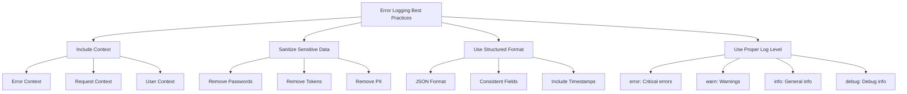

## Testing

### Logging Test Strategy

```typescript
describe("LoggerService", () => {
  let logger: LoggerService;
  let mockTransport: MockTransport;

  beforeEach(() => {
    mockTransport = new MockTransport();
    logger = new LoggerService();
    logger.addTransport(mockTransport);
  });

  it("should log errors with proper format", () => {
    const error = new Error("Test error");
    logger.logError(error, "test context");

    expect(mockTransport.logs).toHaveLength(1);
    expect(mockTransport.logs[0]).toMatchObject({
      level: "error",
      message: expect.stringContaining("Test error"),
      context: "test context",
    });
  });

  it("should sanitize sensitive headers", () => {
    const headers = {
      authorization: "Bearer token",
      "x-api-key": "secret-key",
      "content-type": "application/json",
    };

    const sanitized = logger.sanitizeHeaders(headers);

    expect(sanitized).toEqual({
      authorization: "[REDACTED]",
      "x-api-key": "[REDACTED]",
      "content-type": "application/json",
    });
  });
});
```

### Integration Testing

```typescript
describe("Request Logging Integration", () => {
  it("should log HTTP requests", async () => {
    const response = await request(app).get("/api/users").expect(200);

    // Verify request was logged
    const logEntries = await getLogEntries("http");
    expect(logEntries).toContainEqual(
      expect.objectContaining({
        method: "GET",
        url: "/api/users",
        statusCode: 200,
      }),
    );
  });
});
```

## Troubleshooting

### Common Issues

1. **Log Files Not Created**
   - Check log directory permissions
   - Verify `ENABLE_FILE_LOGS` environment variable
   - Ensure sufficient disk space

2. **Missing Log Entries**
   - Check log level configuration
   - Verify transport configuration
   - Review error handling in services

3. **Performance Issues**
   - Monitor log file sizes
   - Check rotation configuration
   - Review logging frequency

4. **Security Concerns**
   - Audit log files for sensitive data
   - Verify sanitization functions
   - Review access permissions

### Debug Tools

```typescript
// Enable debug logging
process.env.LOG_LEVEL = "debug";

// Check logger configuration
const logger = Container.get(LoggerService);
console.log("Logger transports:", logger.transports);
console.log("Logger level:", logger.level);

// Test logging functionality
logger.info("Test log entry", { test: true });
```

## Related Systems

- **Authentication System**: User activity and security event logging
- **Database System**: Database operation and performance logging
- **Caching System**: Cache operation and performance logging
- **Health Monitoring**: System health and status logging
- **Error Handling**: Error tracking and debugging
- **Rate Limiting**: Request tracking and rate limit logging

## Future Enhancements

1. **Distributed Tracing**: Implement correlation IDs for request tracking
2. **Log Aggregation**: Integration with ELK stack or similar systems
3. **Metrics Integration**: Direct integration with monitoring systems
4. **Real-time Monitoring**: Live log streaming and alerting
5. **Log Analytics**: Built-in log analysis and reporting tools
6. **Structured Querying**: Advanced log search and filtering capabilities
