# Payment System

## Overview

The payment system provides comprehensive payment processing, subscription management, and customer billing functionality powered by Stripe. It supports multiple payment methods, recurring subscriptions, webhook processing, and real-time synchronization with the local database.

## System Architecture

### High-Level Architecture

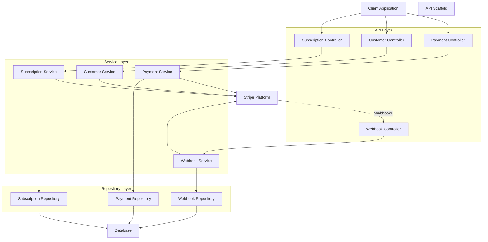

### Core Components

#### Controllers Layer

- **PaymentController**: Payment intent creation, confirmation, refunds
- **CustomerController**: Customer management and payment methods
- **SubscriptionController**: Subscription lifecycle management
- **WebhookController**: Stripe event processing

#### Services Layer

- **StripeService**: Base Stripe client configuration
- **StripePaymentService**: Payment processing operations
- **StripeCustomerService**: Customer management operations
- **StripeSubscriptionService**: Subscription lifecycle management
- **StripeWebhookService**: Webhook event processing

#### Repository Layer

- **PaymentRepository**: Local payment tracking
- **SubscriptionRepository**: Subscription state management
- **WebhookEventRepository**: Event processing tracking

## Payment Processing Flow

### Payment Intent Flow

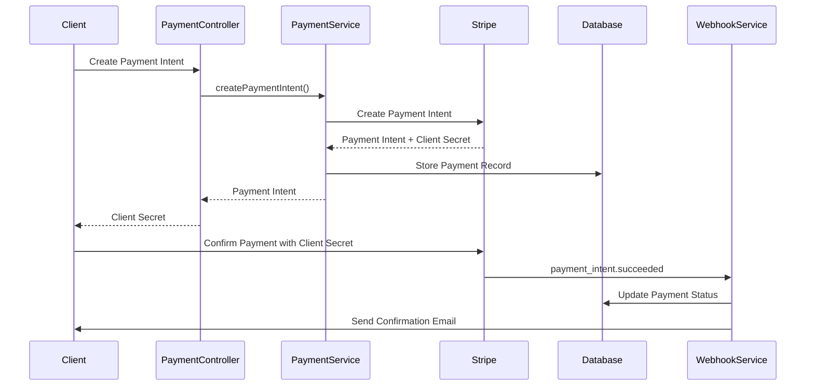

### Subscription Flow

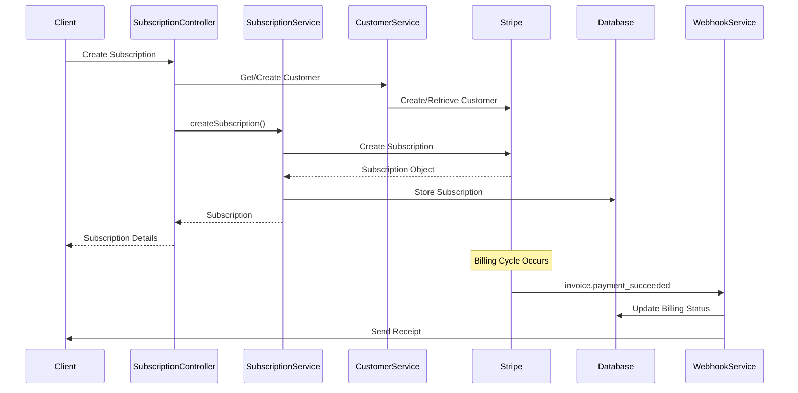

### Webhook Processing Flow

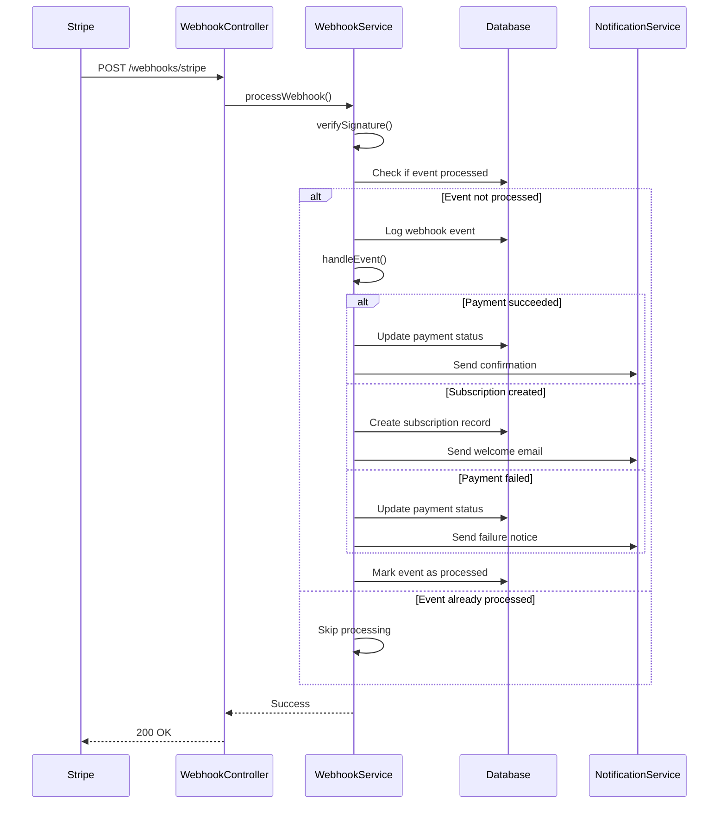

## Database Schema

### Payment Tables

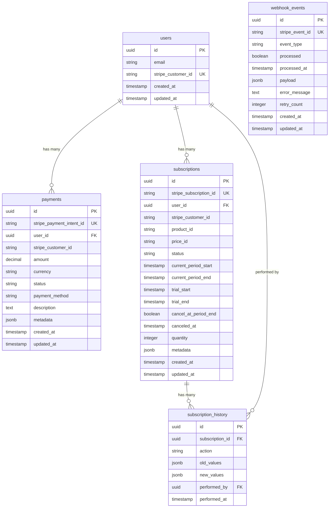

## API Endpoints

### Payment Endpoints

| Method | Endpoint                                   | Description           | Auth Required |
| ------ | ------------------------------------------ | --------------------- | ------------- |
| POST   | `/api/payments/payment-intent`             | Create payment intent | ✓             |
| POST   | `/api/payments/payment-intent/:id/confirm` | Confirm payment       | ✓             |
| POST   | `/api/payments/payment-intent/:id/capture` | Capture payment       | ✓             |
| POST   | `/api/payments/payment-intent/:id/refund`  | Refund payment        | ✓             |
| GET    | `/api/payments/payment-intent/:id`         | Get payment details   | ✓             |
| GET    | `/api/payments/history`                    | Payment history       | ✓             |

### Customer Endpoints

| Method | Endpoint                             | Description           | Auth Required |
| ------ | ------------------------------------ | --------------------- | ------------- |
| POST   | `/api/customers`                     | Create customer       | ✓             |
| GET    | `/api/customers/:id`                 | Get customer          | ✓             |
| PUT    | `/api/customers/:id`                 | Update customer       | ✓             |
| DELETE | `/api/customers/:id`                 | Delete customer       | ✓             |
| GET    | `/api/customers/:id/payment-methods` | Get payment methods   | ✓             |
| POST   | `/api/customers/:id/payment-methods` | Attach payment method | ✓             |

### Subscription Endpoints

| Method | Endpoint                                  | Description         | Auth Required |
| ------ | ----------------------------------------- | ------------------- | ------------- |
| POST   | `/api/subscriptions`                      | Create subscription | ✓             |
| GET    | `/api/subscriptions`                      | List subscriptions  | ✓             |
| PUT    | `/api/subscriptions/:id`                  | Update subscription | ✓             |
| DELETE | `/api/subscriptions/:id`                  | Cancel subscription | ✓             |
| POST   | `/api/subscriptions/:id/pause`            | Pause subscription  | ✓             |
| POST   | `/api/subscriptions/:id/resume`           | Resume subscription | ✓             |
| GET    | `/api/subscriptions/:id/upcoming-invoice` | Preview billing     | ✓             |

### Product Endpoints

| Method | Endpoint                   | Description            | Auth Required |
| ------ | -------------------------- | ---------------------- | ------------- |
| GET    | `/api/products`            | List products          | ✗             |
| GET    | `/api/products/:id`        | Get product            | ✗             |
| GET    | `/api/products/:id/prices` | Get product prices     | ✗             |
| POST   | `/api/products`            | Create product (Admin) | ✓             |

### Webhook Endpoints

| Method | Endpoint               | Description             | Auth Required |
| ------ | ---------------------- | ----------------------- | ------------- |
| POST   | `/api/webhooks/stripe` | Process Stripe webhooks | Signature     |

## Configuration

### Environment Variables

```env
# Stripe Configuration
STRIPE_PUBLISHABLE_KEY=pk_test_51234567890abcdef...
STRIPE_SECRET_KEY=sk_test_51234567890abcdef...
STRIPE_WEBHOOK_SECRET=whsec_1234567890abcdef...
STRIPE_API_VERSION=2023-10-16

# Payment Configuration
DEFAULT_CURRENCY=usd
MAX_PAYMENT_AMOUNT=100000
MIN_PAYMENT_AMOUNT=50
AUTO_CAPTURE_PAYMENTS=true

# Subscription Configuration
DEFAULT_TRIAL_DAYS=14
ALLOW_MULTIPLE_SUBSCRIPTIONS=false
PRORATION_BEHAVIOR=create_prorations
GRACE_PERIOD_DAYS=3
MAX_RETRY_ATTEMPTS=3

# Webhook Configuration
WEBHOOK_MAX_RETRIES=3
WEBHOOK_RETRY_DELAY=1000
```

### Application Configuration

```typescript
// src/config/env.ts
export const config = {
  stripe: {
    publishableKey: getEnvVar("STRIPE_PUBLISHABLE_KEY"),
    secretKey: getEnvVar("STRIPE_SECRET_KEY"),
    webhookSecret: getEnvVar("STRIPE_WEBHOOK_SECRET"),
    apiVersion: "2023-10-16" as Stripe.LatestApiVersion,
  },
  payment: {
    defaultCurrency: process.env.DEFAULT_CURRENCY || "usd",
    maxPaymentAmount: parseInt(process.env.MAX_PAYMENT_AMOUNT || "100000"),
    minPaymentAmount: parseInt(process.env.MIN_PAYMENT_AMOUNT || "50"),
    autoCapture: process.env.AUTO_CAPTURE_PAYMENTS === "true",
  },
  subscription: {
    defaultTrialDays: parseInt(process.env.DEFAULT_TRIAL_DAYS || "14"),
    allowMultipleSubscriptions:
      process.env.ALLOW_MULTIPLE_SUBSCRIPTIONS === "true",
    prorationBehavior: process.env.PRORATION_BEHAVIOR || "create_prorations",
    gracePeriodDays: parseInt(process.env.GRACE_PERIOD_DAYS || "3"),
    maxRetryAttempts: parseInt(process.env.MAX_RETRY_ATTEMPTS || "3"),
  },
  webhook: {
    maxRetries: parseInt(process.env.WEBHOOK_MAX_RETRIES || "3"),
    retryDelay: parseInt(process.env.WEBHOOK_RETRY_DELAY || "1000"),
  },
};
```

## Webhook Events

### Payment Events

```mermaid
graph TD
    PaymentIntentCreated[payment_intent.created]
    PaymentIntentSucceeded[payment_intent.succeeded]
    PaymentIntentFailed[payment_intent.payment_failed]
    PaymentIntentCanceled[payment_intent.canceled]

    PaymentIntentCreated --> UpdateDB1[Update Payment Status: requires_payment_method]
    PaymentIntentSucceeded --> UpdateDB2[Update Payment Status: succeeded]
    PaymentIntentSucceeded --> SendEmail1[Send Payment Confirmation]
    PaymentIntentSucceeded --> BusinessLogic1[Handle Successful Payment]

    PaymentIntentFailed --> UpdateDB3[Update Payment Status: failed]
    PaymentIntentFailed --> SendEmail2[Send Payment Failure Notice]
    PaymentIntentFailed --> RetryLogic[Handle Payment Retry]

    PaymentIntentCanceled --> UpdateDB4[Update Payment Status: canceled]
    PaymentIntentCanceled --> Cleanup[Handle Cleanup]
```

### Subscription Events

```mermaid
graph TD
    SubCreated[customer.subscription.created]
    SubUpdated[customer.subscription.updated]
    SubDeleted[customer.subscription.deleted]
    InvoicePaid[invoice.payment_succeeded]
    InvoiceFailed[invoice.payment_failed]
    TrialEnding[customer.subscription.trial_will_end]

    SubCreated --> CreateRecord[Create Subscription Record]
    SubCreated --> SendWelcome[Send Welcome Email]
    SubCreated --> ActivateFeatures[Activate User Features]

    SubUpdated --> UpdateRecord[Update Subscription Record]
    SubUpdated --> HandleChanges[Handle Status Changes]

    SubDeleted --> CancelRecord[Mark Subscription Canceled]
    SubDeleted --> SendConfirmation[Send Cancellation Confirmation]
    SubDeleted --> DeactivateFeatures[Deactivate User Features]

    InvoicePaid --> UpdateBilling[Update Billing Status: paid]
    InvoicePaid --> SendReceipt[Send Invoice Receipt]
    InvoicePaid --> ExtendPeriod[Extend Subscription Period]

    InvoiceFailed --> UpdateBilling2[Update Billing Status: past_due]
    InvoiceFailed --> SendNotice[Send Payment Failure Notice]
    InvoiceFailed --> DunningManagement[Handle Dunning Management]

    TrialEnding --> SendReminder[Send Trial Expiration Notice]
```

### Customer Events

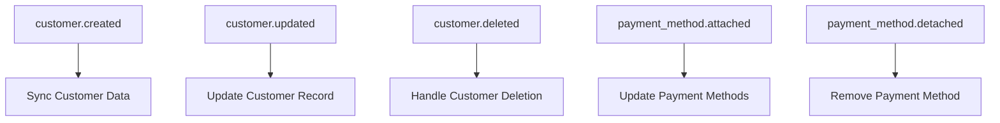

## Security Features

### Authentication & Authorization

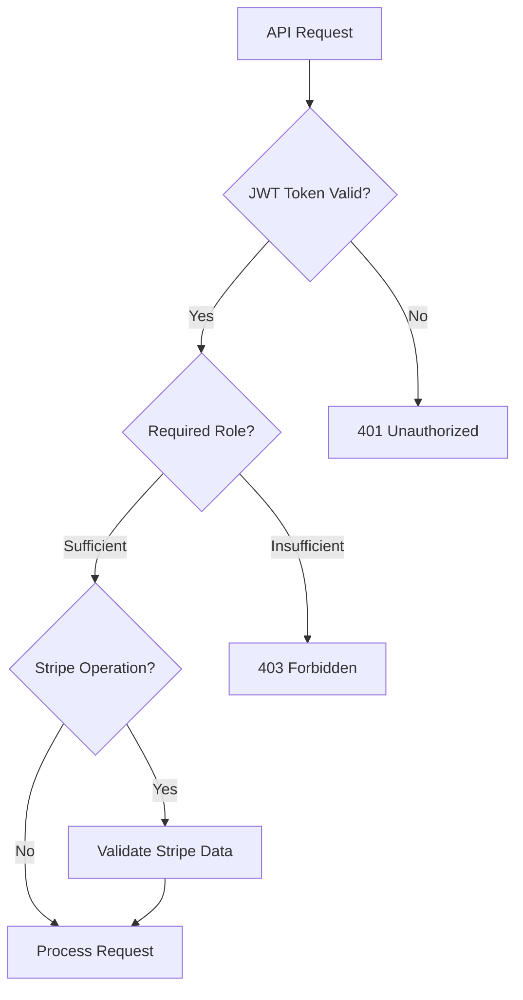

### Webhook Security

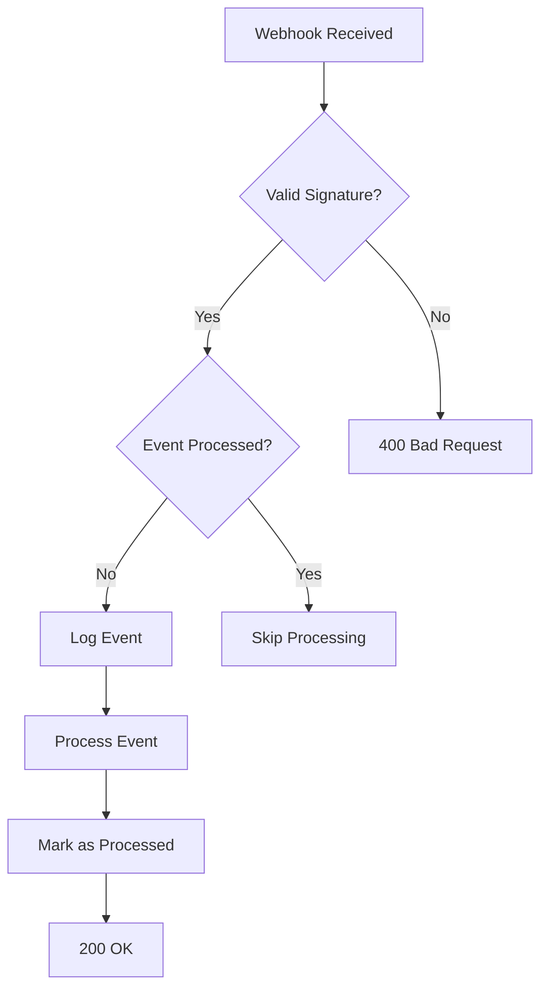

### Data Protection

- **Webhook Signatures**: Cryptographic verification of webhook authenticity
- **HTTPS Only**: All communication encrypted in transit
- **PCI Compliance**: Secure payment data handling through Stripe
- **Rate Limiting**: Protection against API abuse
- **Input Validation**: Comprehensive request validation
- **Error Sanitization**: No sensitive data exposure in error messages

## Error Handling

### Payment Errors

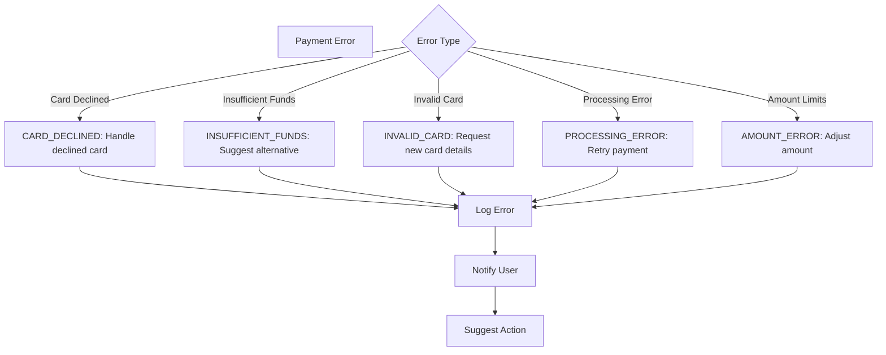

### Webhook Error Handling

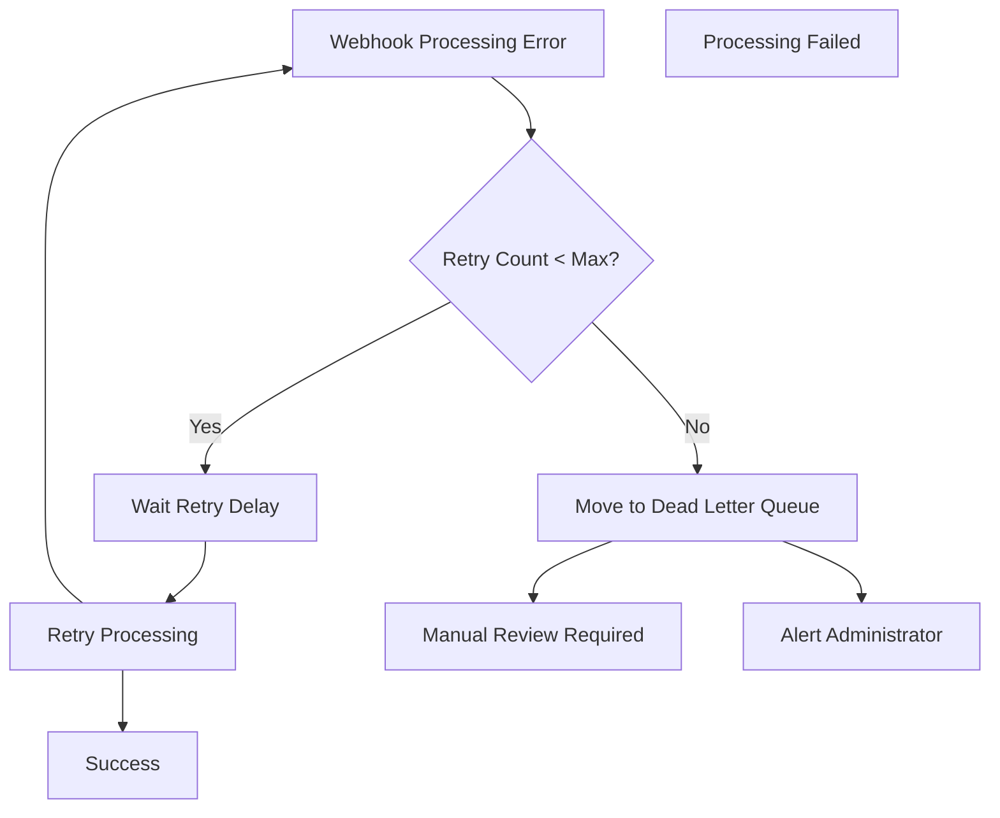

## Testing Strategy

### Test Card Numbers

```typescript
// Test cards for different scenarios
export const testCards = {
  // Successful payments
  visa: "4242424242424242",
  visaDebit: "4000056655665556",
  mastercard: "5555555555554444",
  amex: "378282246310005",

  // Declined cards
  genericDeclined: "4000000000000002",
  insufficientFunds: "4000000000009995",
  lostCard: "4000000000009987",
  stolenCard: "4000000000009979",
  expiredCard: "4000000000000069",
  incorrectCvc: "4000000000000127",
  processingError: "4000000000000119",

  // 3D Secure cards
  threeDSecureRequired: "4000002500003155",
  threeDSecureOptional: "4000002760003184",
};
```

### Testing Flow

```mermaid
graph TD
    UnitTests[Unit Tests]
    IntegrationTests[Integration Tests]
    WebhookTests[Webhook Tests]
    E2ETests[End-to-End Tests]
    LoadTests[Performance Tests]

    UnitTests --> Services[Test Services]
    UnitTests --> Controllers[Test Controllers]
    UnitTests --> Repositories[Test Repositories]

    IntegrationTests --> PaymentFlow[Payment Flow Tests]
    IntegrationTests --> SubscriptionFlow[Subscription Flow Tests]
    IntegrationTests --> CustomerFlow[Customer Flow Tests]

    WebhookTests --> SignatureValidation[Signature Validation]
    WebhookTests --> EventProcessing[Event Processing]
    WebhookTests --> Idempotency[Idempotency Tests]

    E2ETests --> UIFlow[UI Payment Flow]
    E2ETests --> APIFlow[API Integration Flow]

    LoadTests --> ConcurrentPayments[Concurrent Payments]
    LoadTests --> WebhookLoad[Webhook Processing Load]
```

## Monitoring & Observability

### Key Metrics

```mermaid
graph TD
    PaymentMetrics[Payment Metrics]
    SubscriptionMetrics[Subscription Metrics]
    WebhookMetrics[Webhook Metrics]

    PaymentMetrics --> PaymentSuccess[Payment Success Rate]
    PaymentMetrics --> PaymentVolume[Payment Volume]
    PaymentMetrics --> PaymentLatency[Payment Latency]
    PaymentMetrics --> DeclineRate[Decline Rate]

    SubscriptionMetrics --> MRR[Monthly Recurring Revenue]
    SubscriptionMetrics --> ChurnRate[Churn Rate]
    SubscriptionMetrics --> TrialConversion[Trial Conversion Rate]
    SubscriptionMetrics --> ARPU[Average Revenue Per User]

    WebhookMetrics --> WebhookSuccess[Webhook Success Rate]
    WebhookMetrics --> WebhookLatency[Processing Latency]
    WebhookMetrics --> RetryRate[Retry Rate]
    WebhookMetrics --> FailureRate[Failure Rate]
```

### Alerting

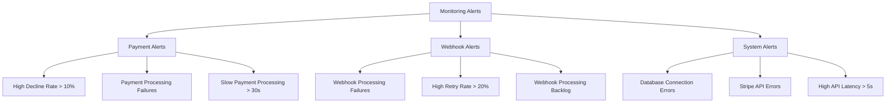

## Best Practices

### Payment Processing

1. **Idempotency**: Use idempotency keys for critical operations
2. **Error Handling**: Implement comprehensive error handling and user feedback
3. **Security**: Always validate webhook signatures and sanitize errors
4. **Testing**: Use Stripe test mode extensively before going live
5. **Monitoring**: Track payment metrics and set up alerts

### Subscription Management

1. **Proration**: Handle subscription changes with proper proration
2. **Grace Periods**: Implement grace periods for failed payments
3. **Dunning Management**: Handle failed subscription payments gracefully
4. **Customer Communication**: Keep customers informed of billing events
5. **Data Synchronization**: Maintain consistency between Stripe and local data

### Webhook Processing

1. **Signature Verification**: Always verify webhook signatures
2. **Idempotency**: Prevent duplicate event processing
3. **Error Recovery**: Implement retry logic with exponential backoff
4. **Database Transactions**: Use transactions for webhook processing
5. **Monitoring**: Monitor webhook processing success rates

### Development Workflow

1. **Environment Separation**: Use separate Stripe accounts for test/production
2. **Configuration Management**: Use environment variables for configuration
3. **Testing Strategy**: Implement comprehensive test coverage
4. **Documentation**: Maintain up-to-date API documentation
5. **Deployment**: Use gradual rollouts for payment-related changes

## Troubleshooting

### Common Issues

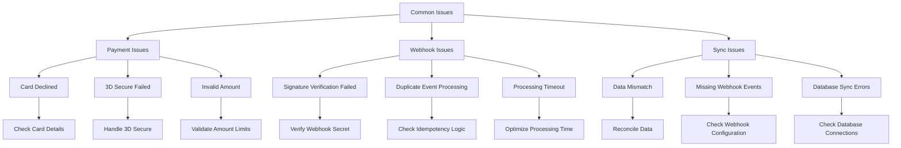

### Debug Tools

1. **Stripe Dashboard**: Monitor events and logs
2. **Stripe CLI**: Test webhooks locally
3. **Application Logs**: Comprehensive logging
4. **Database Queries**: Verify data consistency
5. **Monitoring Dashboards**: Real-time metrics

## Migration & Deployment

### Deployment Checklist

1. **Environment Variables**: Configure all required environment variables
2. **Database Migration**: Run database migrations
3. **Webhook Endpoints**: Configure webhook endpoints in Stripe
4. **API Keys**: Update to production API keys
5. **Rate Limits**: Configure appropriate rate limits
6. **Monitoring**: Set up monitoring and alerting
7. **Testing**: Verify all functionality with test transactions

### Zero-Downtime Deployment

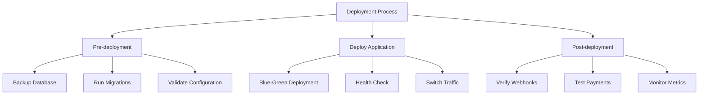

## Related Resources

### External Documentation

- [Stripe API Documentation](https://stripe.com/docs/api)
- [Stripe Webhooks Guide](https://stripe.com/docs/webhooks)
- [Stripe Testing Guide](https://stripe.com/docs/testing)
- [Stripe Security Best Practices](https://stripe.com/docs/security)

### Internal Documentation

- [Authentication System](./authentication-system.md)
- [Database Guide](../database-guide.md)
- [Architecture Overview](../architecture.md)
- [Project Overview](../project-overview.md)

### Development Tools

- [Stripe CLI](https://stripe.com/docs/stripe-cli)
- [Stripe Dashboard](https://dashboard.stripe.com)
- [Webhook Testing](https://stripe.com/docs/webhooks/test)
- [API Testing Tools](https://stripe.com/docs/api/curl)
