# Rate Limiting System

## Overview

The rate limiting system provides robust protection against API abuse, brute force attacks, and resource exhaustion through a decorator-based approach built on multi-tier caching infrastructure. It implements sliding window rate limiting with Redis persistence and memory fallback for high availability.

## System Architecture

### High-Level Architecture

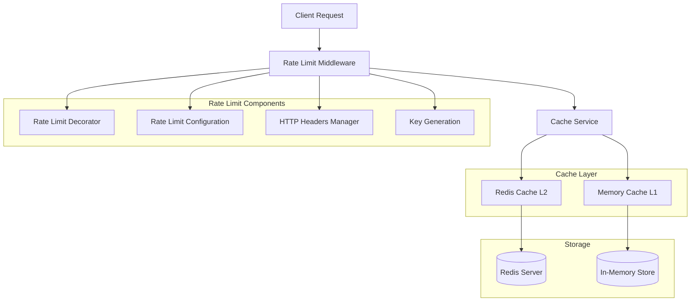

### Request Flow

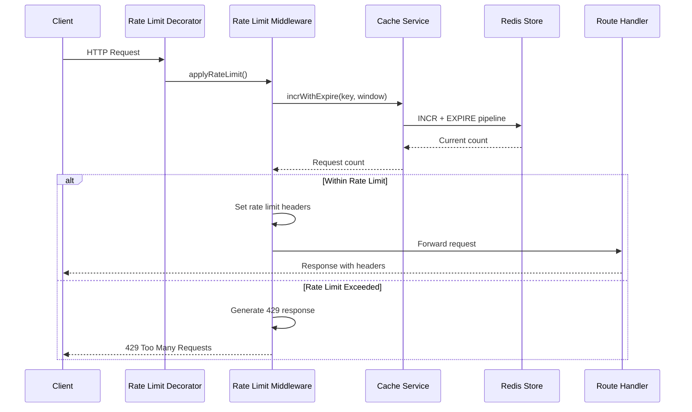

## Core Components

### Rate Limit Middleware

```typescript
@Service()
export class RateLimitMiddleware {
  constructor(private cacheService: CacheService) {}

  async applyRateLimit(
    request: Request,
    response: Response,
    options: IRateLimitOptions,
  ): Promise<boolean> {
    const key = this.generateKey(request, options);
    const windowMs = options.windowMs || 15 * 60 * 1000; // 15 minutes
    const maxRequests = options.maxRequests || 100;

    try {
      const currentCount = await this.cacheService.incrWithExpire(
        key,
        Math.ceil(windowMs / 1000),
      );

      this.setRateLimitHeaders(response, maxRequests, currentCount, windowMs);

      if (currentCount > maxRequests) {
        throw new TooManyRequestsException(
          `Rate limit exceeded. Try again in ${Math.ceil(windowMs / 1000)} seconds.`,
        );
      }

      return true;
    } catch (error) {
      if (error instanceof TooManyRequestsException) {
        throw error;
      }

      // Graceful degradation - allow request if cache fails
      return true;
    }
  }
}
```

### Rate Limit Decorator

```typescript
export function RateLimit(options: IRateLimitOptions) {
  return function (
    target: any,
    propertyName: string,
    descriptor: PropertyDescriptor,
  ) {
    const originalMethod = descriptor.value;

    descriptor.value = async function (...args: any[]) {
      const req = args.find((arg) => arg && arg.method) as Request;
      const res = args.find((arg) => arg && arg.status) as Response;

      if (!req || !res) {
        throw new Error(
          "Request or Response object not found in method arguments",
        );
      }

      const rateLimitMiddleware = Container.get(RateLimitMiddleware);
      await rateLimitMiddleware.applyRateLimit(req, res, options);

      return originalMethod.apply(this, args);
    };

    return descriptor;
  };
}
```

### Rate Limit Configuration Interface

```typescript
interface IRateLimitOptions {
  windowMs: number; // Time window in milliseconds
  maxRequests: number; // Maximum requests per window
  keyGenerator?: (req: Request) => string; // Custom key generation
  skipSuccessfulRequests?: boolean; // Skip counting successful requests
  skipFailedRequests?: boolean; // Skip counting failed requests
  onLimitReached?: (req: Request, res: Response) => void; // Callback on limit exceeded
}
```

## Rate Limiting Strategies

### Sliding Window Implementation

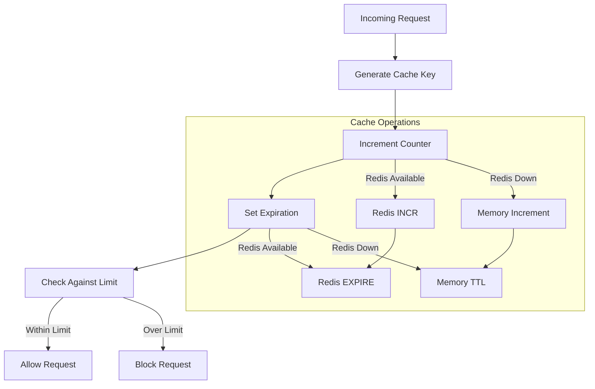

### Key Generation Strategy

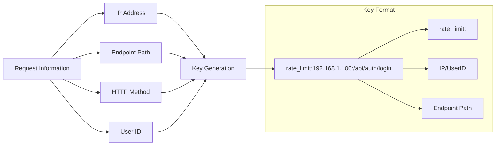

## Authentication Rate Limits

### Predefined Rate Limit Configurations

```typescript
export const authRateLimits = {
  register: {
    windowMs: 15 * 60 * 1000, // 15 minutes
    maxRequests: 5, // 5 registration attempts
  },
  login: {
    windowMs: 15 * 60 * 1000, // 15 minutes
    maxRequests: 10, // 10 login attempts
  },
  passwordReset: {
    windowMs: 15 * 60 * 1000, // 15 minutes
    maxRequests: 3, // 3 password reset requests
  },
  tokenRefresh: {
    windowMs: 15 * 60 * 1000, // 15 minutes
    maxRequests: 20, // 20 token refresh requests
  },
  emailVerification: {
    windowMs: 15 * 60 * 1000, // 15 minutes
    maxRequests: 10, // 10 verification attempts
  },
  resendVerification: {
    windowMs: 15 * 60 * 1000, // 15 minutes
    maxRequests: 3, // 3 resend requests
  },
};
```

### Rate Limit Application Matrix

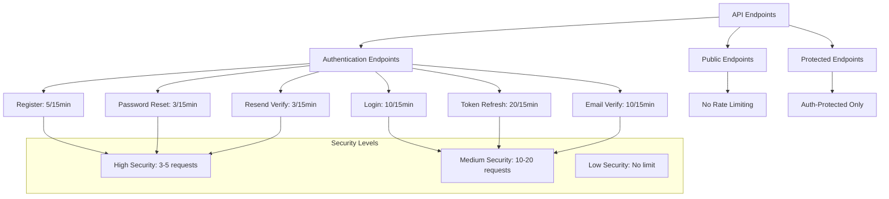

## HTTP Headers

### Rate Limit Headers

```typescript
interface RateLimitHeaders {
  "X-RateLimit-Limit": number; // Maximum requests allowed
  "X-RateLimit-Remaining": number; // Requests remaining in window
  "X-RateLimit-Window": number; // Time window in milliseconds
  "X-RateLimit-Reset": number; // Reset time for blocked requests
}
```

### Header Implementation

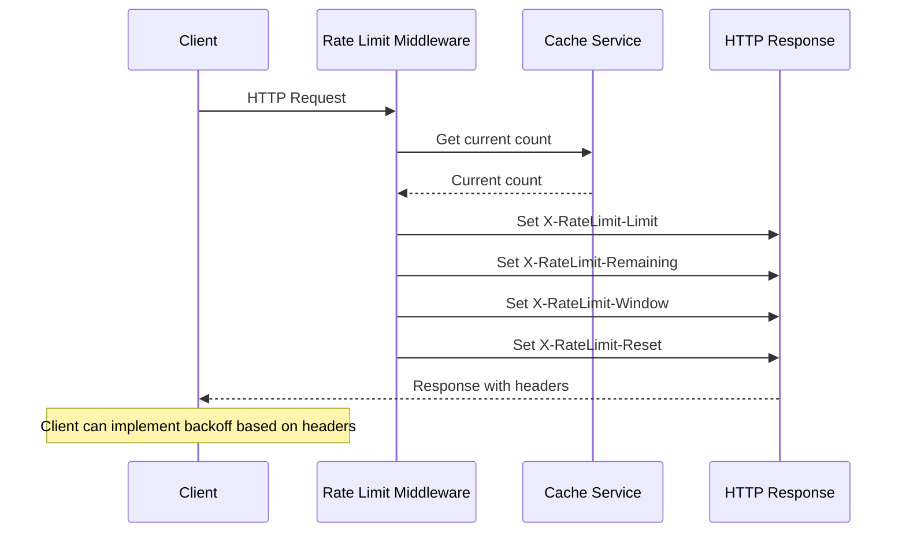

### Header Values Example

```http
HTTP/1.1 200 OK
X-RateLimit-Limit: 10
X-RateLimit-Remaining: 7
X-RateLimit-Window: 900000
X-RateLimit-Reset: 1640995200000
Content-Type: application/json
```

## Storage Architecture

### Cache Service Integration

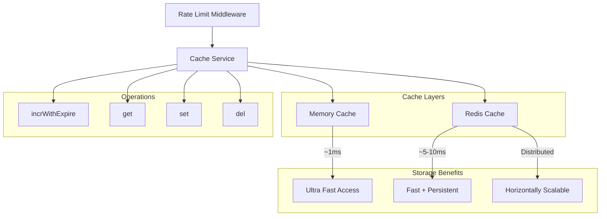

### Atomic Operations

```typescript
async incrWithExpire(key: string, ttl: number): Promise<number> {
  try {
    if (this.redisClient) {
      // Redis pipeline for atomic operations
      const pipeline = this.redisClient.pipeline();
      pipeline.incr(key);
      pipeline.expire(key, ttl);
      const results = await pipeline.exec();
      return results[0][1] as number;
    } else {
      // Memory fallback
      const current = await this.memoryCache.get(key) || 0;
      const newValue = current + 1;
      await this.memoryCache.set(key, newValue, ttl * 1000);
      return newValue;
    }
  } catch (error) {
    // Graceful degradation
    return 0;
  }
}
```

## Error Handling

### Rate Limit Exception

```typescript
export class TooManyRequestsException extends HttpException {
  constructor(message: string = "Too many requests") {
    super(message, 429);
    this.name = "TooManyRequestsException";
  }
}
```

### Error Response Format

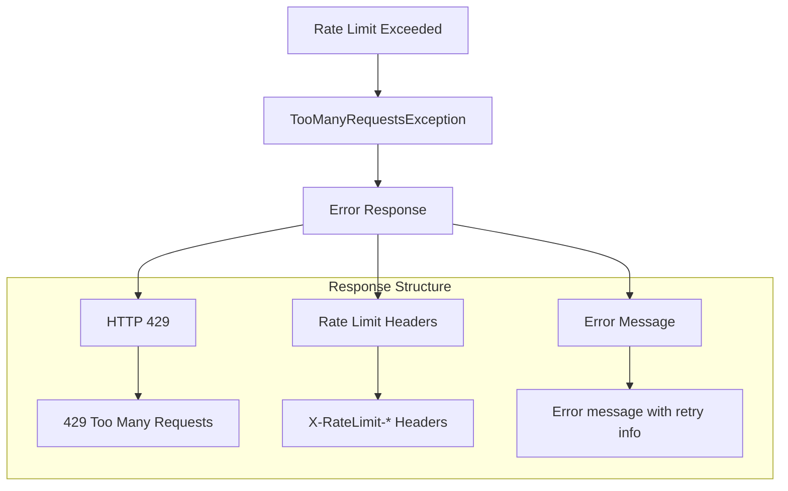

### Graceful Degradation

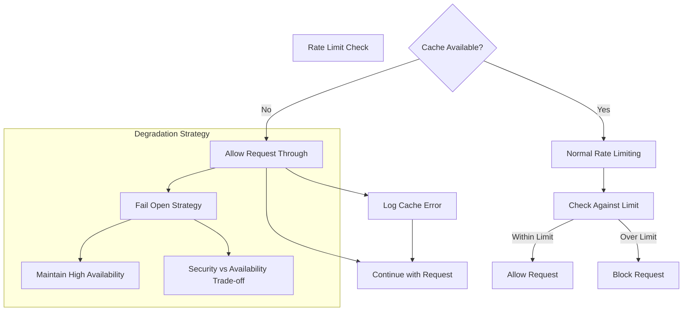

## Performance Optimization

### Caching Strategy

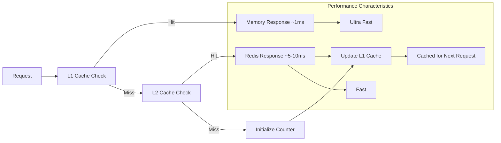

### Memory Management

```typescript
interface CacheConfiguration {
  maxSize: number; // Maximum cache size
  ttl: number; // Default TTL in seconds
  checkPeriod: number; // Cleanup check period
  deleteOnExpire: boolean; // Auto-delete expired entries
}

const rateLimitCacheConfig: CacheConfiguration = {
  maxSize: 10000, // 10k entries
  ttl: 900, // 15 minutes
  checkPeriod: 600, // 10 minutes cleanup
  deleteOnExpire: true, // Auto-cleanup
};
```

## Integration Patterns

### Controller Integration

```typescript
@Controller("/api/auth")
export class AuthController {
  @Post("/register")
  @RateLimit(authRateLimits.register)
  async register(@Body() registerDto: RegisterDto): Promise<AuthResponseDto> {
    // Registration logic
  }

  @Post("/login")
  @RateLimit(authRateLimits.login)
  async login(@Body() loginDto: LoginDto): Promise<AuthResponseDto> {
    // Login logic
  }

  @Post("/refresh")
  @RateLimit(authRateLimits.tokenRefresh)
  async refreshToken(
    @Body() refreshDto: RefreshTokenDto,
  ): Promise<AuthResponseDto> {
    // Token refresh logic
  }
}
```

### Custom Key Generation

```typescript
const customKeyGenerator = (req: Request): string => {
  const userId = req.user?.id;
  const ip = req.ip;
  const endpoint = req.path;

  // Use user ID if authenticated, otherwise fall back to IP
  const identifier = userId || ip;
  return `rate_limit:${identifier}:${endpoint}`;
};

@RateLimit({
  windowMs: 15 * 60 * 1000,
  maxRequests: 100,
  keyGenerator: customKeyGenerator
})
async someProtectedEndpoint() {
  // Endpoint logic
}
```

## Configuration Management

### Environment Variables

```env
# Rate Limiting Configuration
RATE_LIMIT_ENABLED=true
RATE_LIMIT_WINDOW_MS=900000
RATE_LIMIT_MAX_REQUESTS=100
RATE_LIMIT_KEY_PREFIX=rate_limit

# Cache Configuration (for rate limiting storage)
REDIS_URL=redis://localhost:6379
CACHE_PROVIDER=redis
CACHE_TTL=900

# Environment-specific overrides
RATE_LIMIT_ENABLED=false  # Disable in test environment
```

### Dynamic Configuration

```typescript
interface RateLimitConfig {
  enabled: boolean;
  windowMs: number;
  maxRequests: number;
  keyPrefix: string;
  gracefulDegradation: boolean;
}

const rateLimitConfig: RateLimitConfig = {
  enabled: process.env.RATE_LIMIT_ENABLED !== "false",
  windowMs: parseInt(process.env.RATE_LIMIT_WINDOW_MS || "900000"),
  maxRequests: parseInt(process.env.RATE_LIMIT_MAX_REQUESTS || "100"),
  keyPrefix: process.env.RATE_LIMIT_KEY_PREFIX || "rate_limit",
  gracefulDegradation: process.env.RATE_LIMIT_GRACEFUL_DEGRADATION !== "false",
};
```

## Security Features

### Brute Force Protection

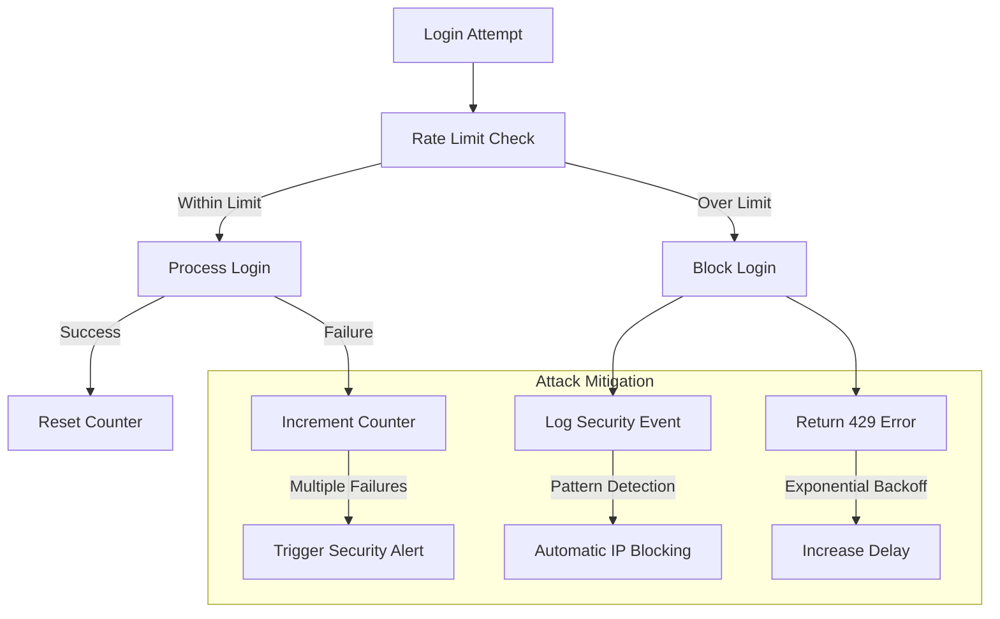

### IP-Based Identification

```typescript
function extractClientIdentifier(req: Request): string {
  // Priority order for client identification
  const forwarded = req.get("X-Forwarded-For");
  const realIp = req.get("X-Real-IP");
  const remoteIp = req.connection.remoteAddress;

  // Handle proxy scenarios
  if (forwarded) {
    return forwarded.split(",")[0].trim();
  }

  if (realIp) {
    return realIp;
  }

  return remoteIp || "unknown";
}
```

## Monitoring and Observability

### Rate Limit Metrics

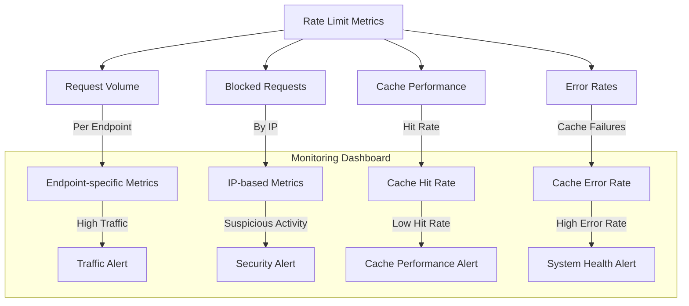

### Health Check Integration

```typescript
export class RateLimitHealthCheck {
  constructor(
    private cacheService: CacheService,
    private rateLimitMiddleware: RateLimitMiddleware,
  ) {}

  async checkHealth(): Promise<HealthStatus> {
    try {
      // Test cache connectivity
      const testKey = "health_check_rate_limit";
      await this.cacheService.set(testKey, "test", 5);
      const value = await this.cacheService.get(testKey);

      if (value !== "test") {
        throw new Error("Cache read/write test failed");
      }

      // Test rate limit functionality
      const mockRequest = { ip: "127.0.0.1", path: "/health" } as Request;
      const mockResponse = { set: jest.fn() } as any;

      await this.rateLimitMiddleware.applyRateLimit(mockRequest, mockResponse, {
        windowMs: 60000,
        maxRequests: 1000,
      });

      return {
        status: "healthy",
        details: {
          cache: "operational",
          rateLimit: "operational",
        },
      };
    } catch (error) {
      return {
        status: "unhealthy",
        error: error.message,
      };
    }
  }
}
```

## Testing

### Unit Testing

```typescript
describe("RateLimitMiddleware", () => {
  let middleware: RateLimitMiddleware;
  let mockCacheService: jest.Mocked<CacheService>;

  beforeEach(() => {
    mockCacheService = {
      incrWithExpire: jest.fn(),
      get: jest.fn(),
      set: jest.fn(),
    } as any;

    middleware = new RateLimitMiddleware(mockCacheService);
  });

  it("should allow requests within rate limit", async () => {
    mockCacheService.incrWithExpire.mockResolvedValue(5);

    const result = await middleware.applyRateLimit(
      { ip: "127.0.0.1", path: "/test" } as Request,
      { set: jest.fn() } as any,
      { windowMs: 60000, maxRequests: 10 },
    );

    expect(result).toBe(true);
    expect(mockCacheService.incrWithExpire).toHaveBeenCalledWith(
      "rate_limit:127.0.0.1:/test",
      60,
    );
  });

  it("should block requests over rate limit", async () => {
    mockCacheService.incrWithExpire.mockResolvedValue(11);

    await expect(
      middleware.applyRateLimit(
        { ip: "127.0.0.1", path: "/test" } as Request,
        { set: jest.fn() } as any,
        { windowMs: 60000, maxRequests: 10 },
      ),
    ).rejects.toThrow(TooManyRequestsException);
  });
});
```

### Integration Testing

```typescript
describe("Rate Limit Integration", () => {
  it("should enforce rate limits on auth endpoints", async () => {
    // Make requests up to the limit
    for (let i = 0; i < 5; i++) {
      await request(app)
        .post("/api/auth/register")
        .send(validRegistrationData)
        .expect(400); // Email already exists
    }

    // Next request should be rate limited
    await request(app)
      .post("/api/auth/register")
      .send(validRegistrationData)
      .expect(429)
      .expect((res) => {
        expect(res.headers["x-ratelimit-limit"]).toBe("5");
        expect(res.headers["x-ratelimit-remaining"]).toBe("0");
      });
  });
});
```

## Best Practices

### Rate Limit Configuration Guidelines

1. **Security-First Approach**: Stricter limits for sensitive endpoints
2. **User Experience**: Generous limits for normal usage patterns
3. **Graceful Degradation**: Allow requests through on cache failures
4. **Monitoring**: Track rate limit violations and adjust accordingly

### Implementation Guidelines

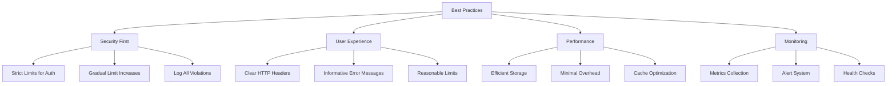

### Configuration Matrix

| Endpoint Type  | Window | Max Requests | Reasoning             |
| -------------- | ------ | ------------ | --------------------- |
| Authentication | 15 min | 3-10         | Prevent brute force   |
| Registration   | 15 min | 5            | Prevent spam accounts |
| Password Reset | 15 min | 3            | Prevent abuse         |
| API Endpoints  | 1 hour | 1000         | Normal usage          |
| File Upload    | 15 min | 10           | Resource intensive    |
| Email Sending  | 15 min | 5            | Prevent spam          |

## Troubleshooting

### Common Issues

1. **Rate Limits Not Working**
   - Check Redis connectivity
   - Verify decorator application
   - Review cache configuration

2. **False Positives**
   - Check key generation logic
   - Review IP extraction from proxy headers
   - Verify time window calculations

3. **Performance Issues**
   - Monitor cache hit rates
   - Check Redis latency
   - Review memory usage

4. **Configuration Problems**
   - Validate environment variables
   - Check rate limit values
   - Verify cache service initialization

### Debug Tools

```typescript
// Enable debug logging
process.env.LOG_LEVEL = "debug";

// Monitor rate limit operations
const debugMiddleware = new RateLimitMiddleware(cacheService);
debugMiddleware.enableDebugMode();

// Check cache health
const healthStatus = await cacheService.getHealthStatus();
console.log("Cache Health:", healthStatus);

// Monitor rate limit violations
app.use((req, res, next) => {
  res.on("finish", () => {
    if (res.statusCode === 429) {
      console.log("Rate limit violation:", {
        ip: req.ip,
        path: req.path,
        headers: req.headers,
      });
    }
  });
  next();
});
```

## Related Systems

- **Authentication System**: Brute force protection for login endpoints
- **Caching System**: Storage layer for rate limit counters
- **Logging System**: Security event logging and monitoring
- **Health Monitoring**: System health checks and alerting
- **Error Handling**: Graceful error responses and fallbacks

## Future Enhancements

1. **Advanced Algorithms**: Token bucket, leaky bucket implementations
2. **User-Based Limits**: Authenticated user-specific rate limits
3. **Geographic Awareness**: Location-based rate limiting
4. **Dynamic Configuration**: Runtime rate limit adjustments
5. **Machine Learning**: Adaptive rate limiting based on usage patterns
6. **Distributed Coordination**: Cross-service rate limiting
7. **Real-time Monitoring**: Live rate limit violation tracking
