# User Management System

## Overview

The user management system provides comprehensive user lifecycle management including creation, authentication, profile management, role-based access control, and integration with external services like Stripe. It implements a clean separation between authentication and user data management.

## System Architecture

### High-Level Architecture

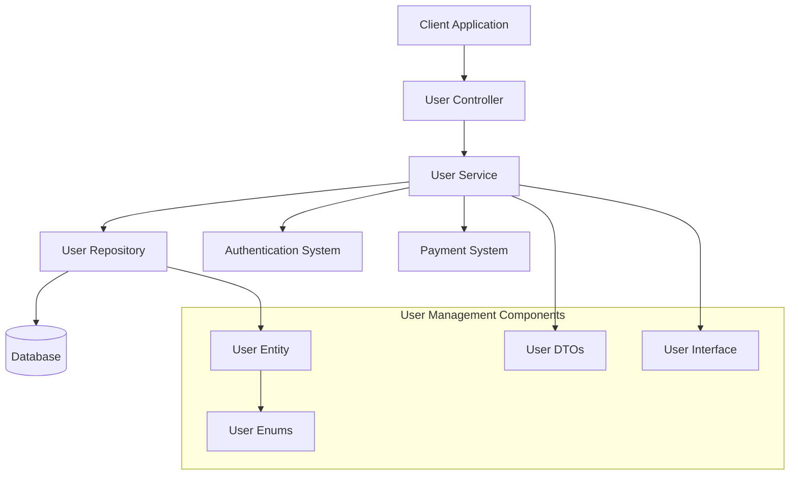

### User Data Flow

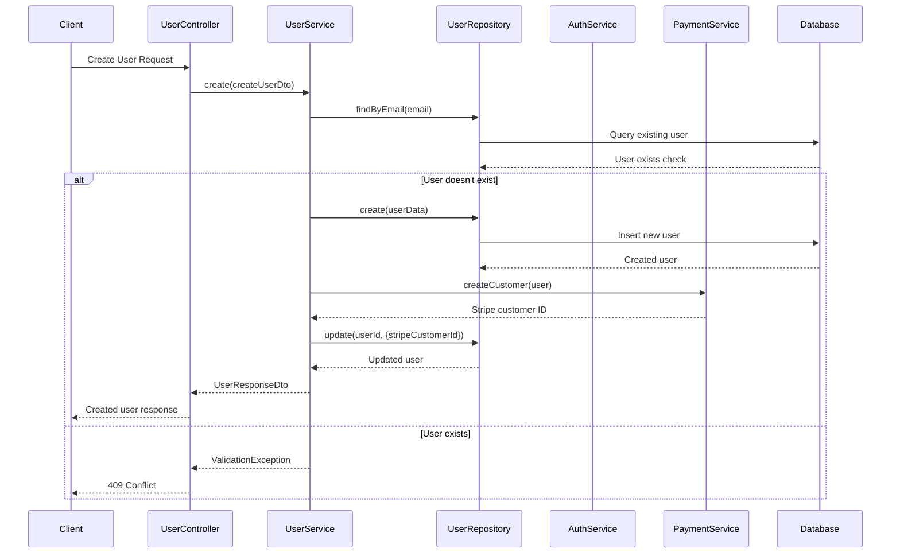

## Core Components

### User Entity

```typescript
export interface IUserEntity extends IBaseEntity {
  id: string;
  email: string;
  firstName: string;
  lastName: string;
  passwordHash: string;
  role: UserRole;
  status: UserStatus;
  emailVerified: boolean;
  phone?: string;
  avatarUrl?: string;
  lastLogin?: string;
  stripeCustomerId?: string;
  createdAt: string;
  updatedAt: string;
  deletedAt?: string;

  // Computed properties
  get fullName(): string;
  isActive(): boolean;
  isAdmin(): boolean;
  isModerator(): boolean;
  hasRole(role: UserRole): boolean;
  hasAnyRole(...roles: UserRole[]): boolean;
}
```

### User Roles and Status

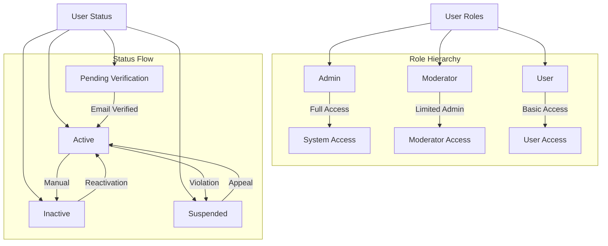

### User DTOs

```typescript
// Create User DTO
export class CreateUserDto {
  @IsEmail()
  @IsNotEmpty()
  email!: string;

  @IsString()
  @MinLength(2)
  @MaxLength(50)
  firstName!: string;

  @IsString()
  @MinLength(2)
  @MaxLength(50)
  lastName!: string;

  @IsOptional()
  @IsEnum(UserRole)
  role?: UserRole;

  @IsOptional()
  @IsPhoneNumber()
  phone?: string;
}

// Update User DTO
export class UpdateUserDto {
  @IsOptional()
  @IsEmail()
  email?: string;

  @IsOptional()
  @IsString()
  @MinLength(2)
  @MaxLength(50)
  firstName?: string;

  @IsOptional()
  @IsString()
  @MinLength(2)
  @MaxLength(50)
  lastName?: string;

  @IsOptional()
  @IsPhoneNumber()
  phone?: string;

  @IsOptional()
  @IsUrl()
  avatarUrl?: string;

  @IsOptional()
  @IsEnum(UserRole)
  role?: UserRole;

  @IsOptional()
  @IsEnum(UserStatus)
  status?: UserStatus;
}

// User Response DTO
export class UserResponseDto {
  @Expose()
  id!: string;

  @Expose()
  email!: string;

  @Expose()
  firstName!: string;

  @Expose()
  lastName!: string;

  @Expose()
  @Transform(({ obj }) => `${obj.firstName} ${obj.lastName}`)
  fullName!: string;

  @Expose()
  role!: UserRole;

  @Expose()
  status!: UserStatus;

  @Expose()
  emailVerified!: boolean;

  @Expose()
  phone?: string;

  @Expose()
  avatarUrl?: string;

  @Expose()
  lastLogin?: string;

  @Expose()
  createdAt!: string;

  @Expose()
  updatedAt!: string;
}
```

## User Operations

### User Creation Flow

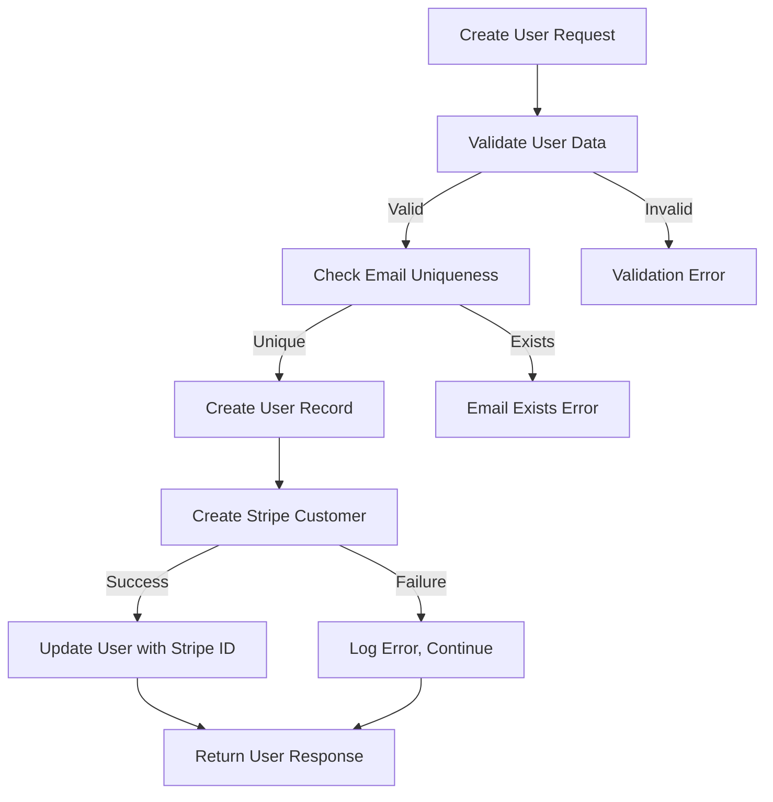

### User Update Flow

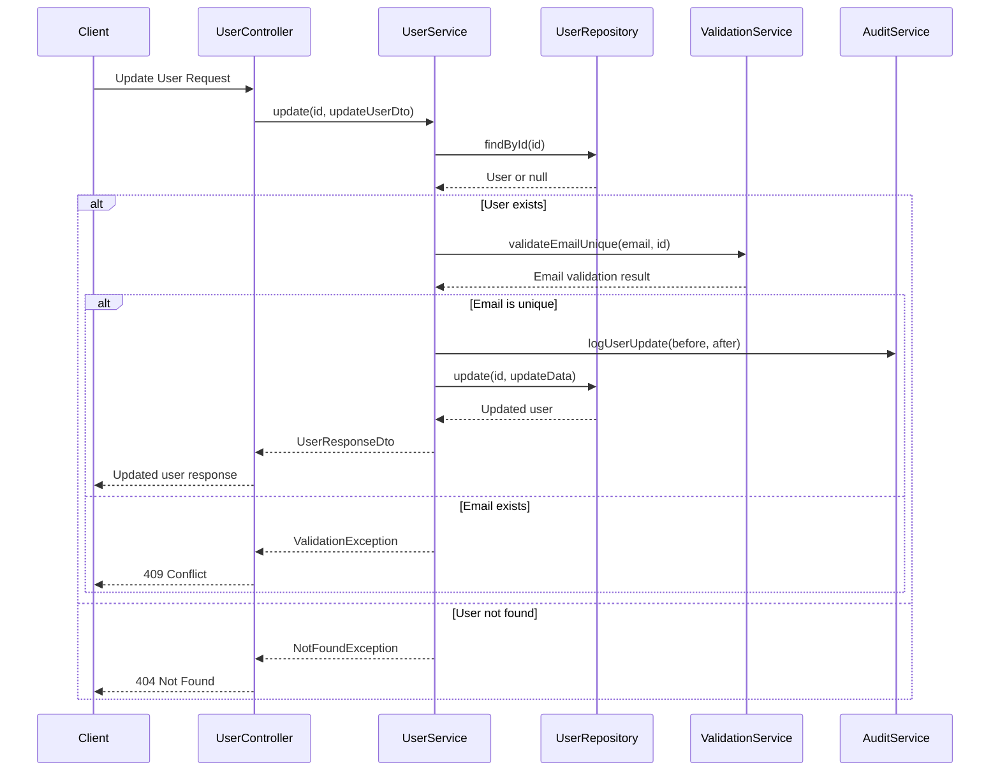

### User Profile Management

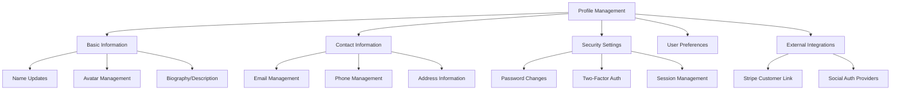

## Role-Based Access Control (RBAC)

### Permission Matrix

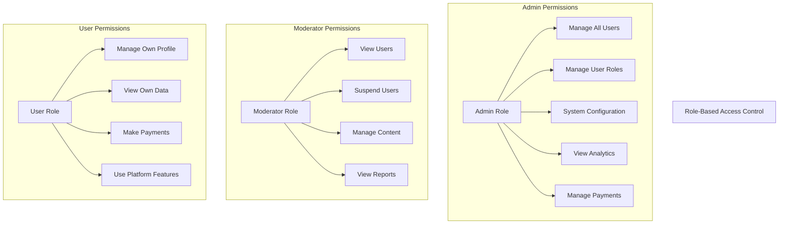

### Role Verification Flow

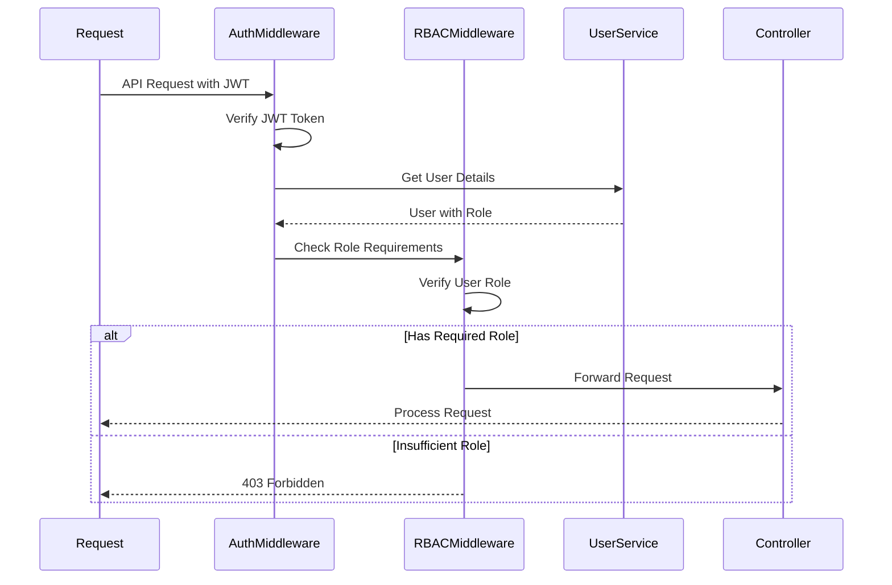

### Dynamic Role Assignment

```typescript
export class UserRoleService {
  constructor(
    private userService: UserService,
    private auditService: AuditService,
  ) {}

  async assignRole(
    userId: string,
    newRole: UserRole,
    assignedBy: string,
  ): Promise<void> {
    const user = await this.userService.findById(userId);
    const previousRole = user.role;

    // Validate role assignment permissions
    await this.validateRoleAssignment(assignedBy, newRole);

    // Update user role
    await this.userService.update(userId, { role: newRole });

    // Log role change
    await this.auditService.logRoleChange({
      userId,
      previousRole,
      newRole,
      assignedBy,
      timestamp: new Date(),
    });

    // Notify user of role change
    await this.notificationService.notifyRoleChange(userId, newRole);
  }

  private async validateRoleAssignment(
    assignerId: string,
    targetRole: UserRole,
  ): Promise<void> {
    const assigner = await this.userService.findById(assignerId);

    // Only admins can assign admin role
    if (targetRole === UserRole.Admin && !assigner.isAdmin()) {
      throw new ForbiddenException("Only admins can assign admin role");
    }

    // Only admins can assign moderator role
    if (targetRole === UserRole.Moderator && !assigner.isAdmin()) {
      throw new ForbiddenException("Only admins can assign moderator role");
    }
  }
}
```

## User Search and Filtering

### Search Implementation

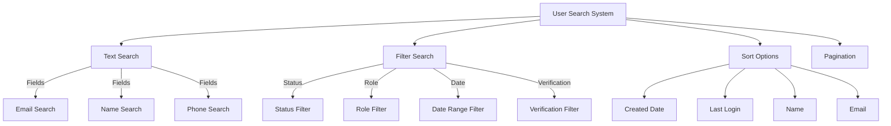

### Advanced Search Query

```typescript
export interface IUserFilters {
  search?: string; // Text search across name, email
  role?: UserRole; // Filter by role
  status?: UserStatus; // Filter by status
  emailVerified?: boolean; // Filter by email verification
  createdAfter?: Date; // Created after date
  createdBefore?: Date; // Created before date
  lastLoginAfter?: Date; // Last login after date
  hasStripeCustomer?: boolean; // Has Stripe customer ID
}

export class UserRepository extends BaseRepository<IUserEntity> {
  async findUsersPaginated(
    page: number,
    limit: number,
    filters?: IUserFilters,
  ): Promise<IPaginatedResult<IUserEntity>> {
    const queryFilters: IFilterOptions = {};

    // Text search
    if (filters?.search) {
      queryFilters.search = filters.search; // Searches across name and email
    }

    // Exact match filters
    if (filters?.role) queryFilters.role = filters.role;
    if (filters?.status) queryFilters.status = filters.status;
    if (filters?.emailVerified !== undefined) {
      queryFilters.emailVerified = filters.emailVerified;
    }

    // Date range filters
    if (filters?.createdAfter) {
      queryFilters.createdAfter = filters.createdAfter;
    }
    if (filters?.createdBefore) {
      queryFilters.createdBefore = filters.createdBefore;
    }

    // Stripe customer filter
    if (filters?.hasStripeCustomer !== undefined) {
      queryFilters.hasStripeCustomer = filters.hasStripeCustomer;
    }

    return this.findWithPagination({
      filters: queryFilters,
      orderBy: { field: "createdAt", direction: "desc" },
      pagination: { page, limit },
    });
  }
}
```

## User Profile Features

### Profile Update System

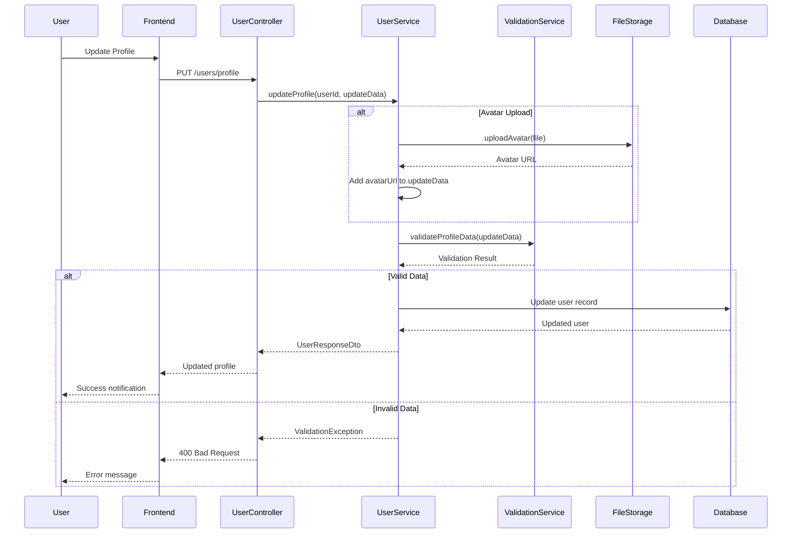

### Profile Privacy Settings

```typescript
export class UserPrivacyService {
  async updatePrivacySettings(
    userId: string,
    privacySettings: IUserPrivacySettings,
  ): Promise<void> {
    const user = await this.userService.findById(userId);

    const updatedSettings = {
      ...user.privacySettings,
      ...privacySettings,
    };

    await this.userRepository.update(userId, {
      privacySettings: updatedSettings,
    });

    // Log privacy settings change
    await this.auditService.logPrivacySettingsChange(userId, privacySettings);
  }

  async getVisibleUserData(
    requestingUserId: string,
    targetUserId: string,
  ): Promise<Partial<UserResponseDto>> {
    const targetUser = await this.userService.findById(targetUserId);
    const isOwnProfile = requestingUserId === targetUserId;
    const requestingUser = await this.userService.findById(requestingUserId);

    // Full access to own profile or admin access
    if (isOwnProfile || requestingUser.isAdmin()) {
      return this.userService.mapToResponseDto(targetUser);
    }

    // Apply privacy filters
    return this.applyPrivacyFilters(targetUser, requestingUser);
  }
}
```

## User Activity Tracking

### Activity Logging

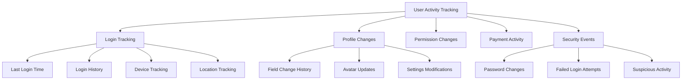

### User Audit Trail

```typescript
export interface IUserAuditEvent {
  id: string;
  userId: string;
  eventType: UserAuditEventType;
  details: object;
  performedBy?: string;
  ipAddress?: string;
  userAgent?: string;
  timestamp: Date;
}

export enum UserAuditEventType {
  PROFILE_UPDATED = "profile_updated",
  ROLE_CHANGED = "role_changed",
  STATUS_CHANGED = "status_changed",
  PASSWORD_CHANGED = "password_changed",
  EMAIL_VERIFIED = "email_verified",
  ACCOUNT_SUSPENDED = "account_suspended",
  ACCOUNT_REACTIVATED = "account_reactivated",
  STRIPE_CUSTOMER_LINKED = "stripe_customer_linked",
}

export class UserAuditService {
  async logUserEvent(
    event: Omit<IUserAuditEvent, "id" | "timestamp">,
  ): Promise<void> {
    const auditEvent: IUserAuditEvent = {
      ...event,
      id: generateId(),
      timestamp: new Date(),
    };

    await this.auditRepository.create(auditEvent);

    // Log to external audit system if configured
    if (config.audit.externalLogging) {
      await this.externalAuditService.log(auditEvent);
    }
  }

  async getUserAuditTrail(
    userId: string,
    options?: {
      eventTypes?: UserAuditEventType[];
      startDate?: Date;
      endDate?: Date;
      limit?: number;
    },
  ): Promise<IUserAuditEvent[]> {
    return this.auditRepository.findUserEvents(userId, options);
  }
}
```

## User Data Export and Privacy

### GDPR Compliance

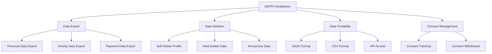

### Data Export Service

```typescript
export class UserDataExportService {
  async exportUserData(userId: string): Promise<IUserDataExport> {
    const user = await this.userService.findById(userId);
    const auditTrail = await this.auditService.getUserAuditTrail(userId);
    const payments = await this.paymentService.getUserPayments(userId);
    const subscriptions =
      await this.subscriptionService.getUserSubscriptions(userId);

    return {
      profile: {
        id: user.id,
        email: user.email,
        firstName: user.firstName,
        lastName: user.lastName,
        phone: user.phone,
        createdAt: user.createdAt,
        updatedAt: user.updatedAt,
        emailVerified: user.emailVerified,
        lastLogin: user.lastLogin,
      },
      activityLog: auditTrail,
      paymentHistory: payments.map((p) => ({
        id: p.id,
        amount: p.amount,
        currency: p.currency,
        status: p.status,
        createdAt: p.createdAt,
      })),
      subscriptions: subscriptions.map((s) => ({
        id: s.id,
        status: s.status,
        currentPeriodStart: s.currentPeriodStart,
        currentPeriodEnd: s.currentPeriodEnd,
        createdAt: s.createdAt,
      })),
      exportedAt: new Date(),
    };
  }

  async deleteUserData(
    userId: string,
    deletionType: "soft" | "hard" | "anonymize",
  ): Promise<void> {
    switch (deletionType) {
      case "soft":
        await this.softDeleteUser(userId);
        break;
      case "hard":
        await this.hardDeleteUser(userId);
        break;
      case "anonymize":
        await this.anonymizeUser(userId);
        break;
    }

    // Log deletion event
    await this.auditService.logUserEvent({
      userId,
      eventType: UserAuditEventType.ACCOUNT_DELETED,
      details: { deletionType },
    });
  }
}
```

## Integration with External Systems

### Stripe Customer Integration

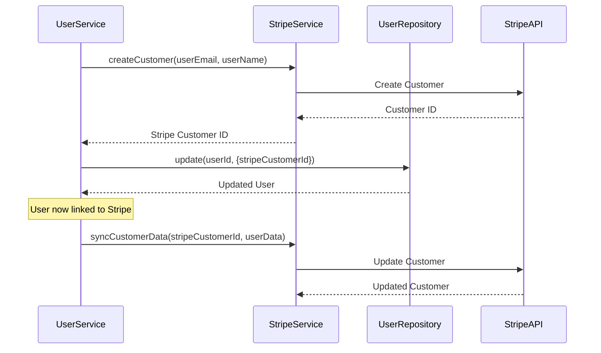

### Email Service Integration

```typescript
export class UserEmailService {
  constructor(
    private emailService: EmailService,
    private userService: UserService,
  ) {}

  async sendWelcomeEmail(userId: string): Promise<void> {
    const user = await this.userService.findById(userId);

    await this.emailService.send({
      to: user.email,
      template: "welcome",
      variables: {
        firstName: user.firstName,
        lastName: user.lastName,
        loginUrl: `${config.frontend.url}/login`,
      },
    });
  }

  async sendPasswordResetEmail(
    email: string,
    resetToken: string,
  ): Promise<void> {
    await this.emailService.send({
      to: email,
      template: "password-reset",
      variables: {
        resetUrl: `${config.frontend.url}/reset-password?token=${resetToken}`,
        expiresIn: "1 hour",
      },
    });
  }

  async sendEmailVerificationEmail(
    userId: string,
    verificationToken: string,
  ): Promise<void> {
    const user = await this.userService.findById(userId);

    await this.emailService.send({
      to: user.email,
      template: "email-verification",
      variables: {
        firstName: user.firstName,
        verificationUrl: `${config.frontend.url}/verify-email?token=${verificationToken}`,
      },
    });
  }
}
```

## User Management API

### REST Endpoints

```typescript
@JsonController("/api/users")
@Service()
export class UserController {
  constructor(private userService: UserService) {}

  @Post("/")
  @RequireRole(UserRole.Admin)
  async createUser(
    @Body() createUserDto: CreateUserDto,
  ): Promise<UserResponseDto> {
    return await this.userService.create(createUserDto);
  }

  @Get("/")
  @RequireRole(UserRole.Admin, UserRole.Moderator)
  async getUsers(
    @QueryParam("page") page: number = 1,
    @QueryParam("limit") limit: number = 10,
    @QueryParam("search") search?: string,
    @QueryParam("role") role?: UserRole,
    @QueryParam("status") status?: UserStatus,
  ): Promise<IPaginatedResult<UserResponseDto>> {
    const filters: IUserFilters = {};
    if (search) filters.search = search;
    if (role) filters.role = role;
    if (status) filters.status = status;

    return await this.userService.findAll(page, limit, filters);
  }

  @Get("/:id")
  @Authenticated()
  async getUser(
    @Param("id") id: string,
    @CurrentUser() currentUser: IAuthenticatedUser,
  ): Promise<UserResponseDto> {
    // Users can view their own profile, admins can view any profile
    if (id !== currentUser.id && !currentUser.isAdmin()) {
      throw new ForbiddenException("Cannot view other user profiles");
    }

    return await this.userService.findById(id);
  }

  @Put("/:id")
  @Authenticated()
  async updateUser(
    @Param("id") id: string,
    @Body() updateUserDto: UpdateUserDto,
    @CurrentUser() currentUser: IAuthenticatedUser,
  ): Promise<UserResponseDto> {
    // Users can update their own profile, admins can update any profile
    if (id !== currentUser.id && !currentUser.isAdmin()) {
      throw new ForbiddenException("Cannot update other user profiles");
    }

    // Only admins can change roles
    if (updateUserDto.role && !currentUser.isAdmin()) {
      delete updateUserDto.role;
    }

    return await this.userService.update(id, updateUserDto);
  }

  @Delete("/:id")
  @RequireRole(UserRole.Admin)
  async deleteUser(@Param("id") id: string): Promise<void> {
    await this.userService.delete(id);
  }

  @Post("/:id/status")
  @RequireRole(UserRole.Admin, UserRole.Moderator)
  async updateUserStatus(
    @Param("id") id: string,
    @Body() { status }: { status: UserStatus },
  ): Promise<UserResponseDto> {
    return await this.userService.updateStatus(id, status);
  }

  @Get("/:id/export")
  @Authenticated()
  async exportUserData(
    @Param("id") id: string,
    @CurrentUser() currentUser: IAuthenticatedUser,
  ): Promise<IUserDataExport> {
    // Users can export their own data
    if (id !== currentUser.id && !currentUser.isAdmin()) {
      throw new ForbiddenException("Cannot export other user data");
    }

    return await this.userDataExportService.exportUserData(id);
  }
}
```

### Profile Management Endpoints

```typescript
@JsonController("/api/profile")
@Service()
export class ProfileController {
  constructor(
    private userService: UserService,
    private userPrivacyService: UserPrivacyService,
  ) {}

  @Get("/")
  @Authenticated()
  async getProfile(
    @CurrentUser() user: IAuthenticatedUser,
  ): Promise<UserResponseDto> {
    return await this.userService.findById(user.id);
  }

  @Put("/")
  @Authenticated()
  async updateProfile(
    @Body() updateProfileDto: UpdateProfileDto,
    @CurrentUser() user: IAuthenticatedUser,
  ): Promise<UserResponseDto> {
    return await this.userService.update(user.id, updateProfileDto);
  }

  @Post("/avatar")
  @Authenticated()
  async uploadAvatar(
    @UploadedFile("avatar") file: Express.Multer.File,
    @CurrentUser() user: IAuthenticatedUser,
  ): Promise<{ avatarUrl: string }> {
    const avatarUrl = await this.fileUploadService.uploadAvatar(user.id, file);
    await this.userService.update(user.id, { avatarUrl });

    return { avatarUrl };
  }

  @Put("/privacy")
  @Authenticated()
  async updatePrivacySettings(
    @Body() privacySettings: IUserPrivacySettings,
    @CurrentUser() user: IAuthenticatedUser,
  ): Promise<void> {
    await this.userPrivacyService.updatePrivacySettings(
      user.id,
      privacySettings,
    );
  }
}
```

## Performance Optimization

### User Data Caching

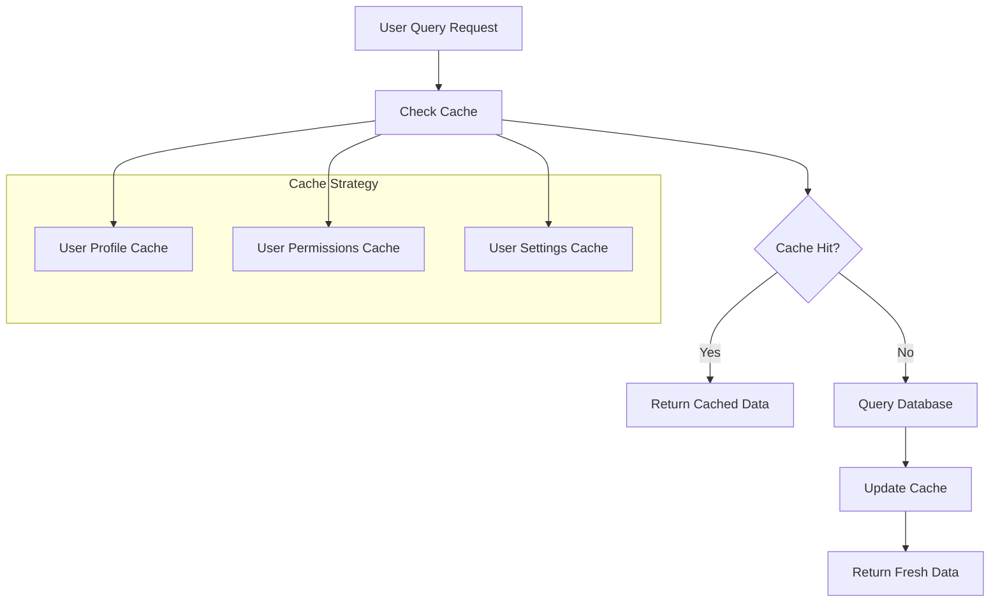

### Database Query Optimization

```typescript
export class OptimizedUserRepository extends BaseRepository<IUserEntity> {
  // Optimized user search with indexed fields
  async searchUsers(
    searchTerm: string,
    limit: number = 20,
  ): Promise<IUserEntity[]> {
    // Use indexed fields for efficient search
    return this.findMany({
      filters: {
        search: searchTerm, // Searches indexed email and name fields
      },
      orderBy: {
        field: "created_at", // Indexed field
        direction: "desc",
      },
      pagination: {
        page: 1,
        limit,
      },
    });
  }

  // Batch user loading for efficient data fetching
  async findUsersByIds(userIds: string[]): Promise<Map<string, IUserEntity>> {
    const users = await this.findMany({
      filters: {
        ids: userIds,
      },
    });

    return new Map(users.map((user) => [user.id, user]));
  }

  // Efficient role-based queries
  async findUsersByRole(
    role: UserRole,
    page: number = 1,
    limit: number = 20,
  ): Promise<IPaginatedResult<IUserEntity>> {
    return this.findWithPagination({
      filters: { role }, // Indexed field
      orderBy: { field: "created_at", direction: "desc" },
      pagination: { page, limit },
    });
  }
}
```

## Testing

### User Service Testing

```typescript
describe("UserService", () => {
  let userService: UserService;
  let userRepository: UserRepository;
  let stripeService: StripeService;

  beforeEach(() => {
    userRepository = createMockRepository();
    stripeService = createMockStripeService();
    userService = new UserService(userRepository, stripeService);
  });

  describe("User Creation", () => {
    it("should create user successfully", async () => {
      const createUserDto: CreateUserDto = {
        email: "test@example.com",
        firstName: "Test",
        lastName: "User",
      };

      userRepository.findByEmail.mockResolvedValue(null);
      userRepository.create.mockResolvedValue(mockUser);
      stripeService.createCustomer.mockResolvedValue({ id: "cus_123" });

      const result = await userService.create(createUserDto);

      expect(result.email).toBe(createUserDto.email);
      expect(userRepository.create).toHaveBeenCalled();
      expect(stripeService.createCustomer).toHaveBeenCalled();
    });

    it("should throw error for duplicate email", async () => {
      const createUserDto: CreateUserDto = {
        email: "existing@example.com",
        firstName: "Test",
        lastName: "User",
      };

      userRepository.findByEmail.mockResolvedValue(mockUser);

      await expect(userService.create(createUserDto)).rejects.toThrow(
        ValidationException,
      );
    });
  });

  describe("User Updates", () => {
    it("should update user profile", async () => {
      const updateDto: UpdateUserDto = {
        firstName: "Updated",
        lastName: "Name",
      };

      userRepository.findById.mockResolvedValue(mockUser);
      userRepository.update.mockResolvedValue({
        ...mockUser,
        ...updateDto,
      });

      const result = await userService.update(mockUser.id, updateDto);

      expect(result.firstName).toBe(updateDto.firstName);
      expect(result.lastName).toBe(updateDto.lastName);
    });

    it("should validate email uniqueness on update", async () => {
      const updateDto: UpdateUserDto = {
        email: "newemail@example.com",
      };

      userRepository.findById.mockResolvedValue(mockUser);
      userRepository.isEmailUnique.mockResolvedValue(false);

      await expect(userService.update(mockUser.id, updateDto)).rejects.toThrow(
        ValidationException,
      );
    });
  });
});
```

### Integration Testing

```typescript
describe("User Management Integration", () => {
  let app: Application;
  let authToken: string;

  beforeAll(async () => {
    app = await createTestApp();
    authToken = await getTestAuthToken();
  });

  describe("User CRUD Operations", () => {
    it("should create, read, update, and delete user", async () => {
      // Create user
      const createResponse = await request(app)
        .post("/api/users")
        .set("Authorization", `Bearer ${authToken}`)
        .send({
          email: "integration@test.com",
          firstName: "Integration",
          lastName: "Test",
        });

      expect(createResponse.status).toBe(201);
      const userId = createResponse.body.data.id;

      // Read user
      const readResponse = await request(app)
        .get(`/api/users/${userId}`)
        .set("Authorization", `Bearer ${authToken}`);

      expect(readResponse.status).toBe(200);
      expect(readResponse.body.data.email).toBe("integration@test.com");

      // Update user
      const updateResponse = await request(app)
        .put(`/api/users/${userId}`)
        .set("Authorization", `Bearer ${authToken}`)
        .send({
          firstName: "Updated",
        });

      expect(updateResponse.status).toBe(200);
      expect(updateResponse.body.data.firstName).toBe("Updated");

      // Delete user
      const deleteResponse = await request(app)
        .delete(`/api/users/${userId}`)
        .set("Authorization", `Bearer ${authToken}`);

      expect(deleteResponse.status).toBe(204);
    });
  });
});
```

## Security Considerations

### Data Protection

1. **Password Security**: Passwords handled by authentication system
2. **PII Protection**: Sensitive data encryption at rest
3. **Access Control**: Role-based access to user data
4. **Audit Trail**: Complete logging of user data changes
5. **Data Minimization**: Only collect necessary user data

### Privacy Compliance

1. **GDPR Compliance**: Data export and deletion capabilities
2. **Consent Management**: User consent tracking and withdrawal
3. **Data Retention**: Configurable data retention policies
4. **Cross-border Transfers**: Appropriate safeguards for international data transfers

## Related Systems

- **Authentication System**: User identity verification and session management
- **Payment System**: Stripe customer integration and billing
- **Logging System**: User activity and audit trail logging
- **Database System**: User data persistence and retrieval
- **Caching System**: User profile and permission caching

## Best Practices

1. **Separation of Concerns**: Clear separation between authentication and user management
2. **Data Validation**: Comprehensive input validation and sanitization
3. **Error Handling**: Consistent error responses and logging
4. **Performance**: Efficient queries and caching strategies
5. **Security**: Regular security audits and vulnerability assessments
6. **Privacy**: Privacy-by-design principles and GDPR compliance
7. **Testing**: Comprehensive unit and integration testing
8. **Documentation**: Clear API documentation and usage examples
